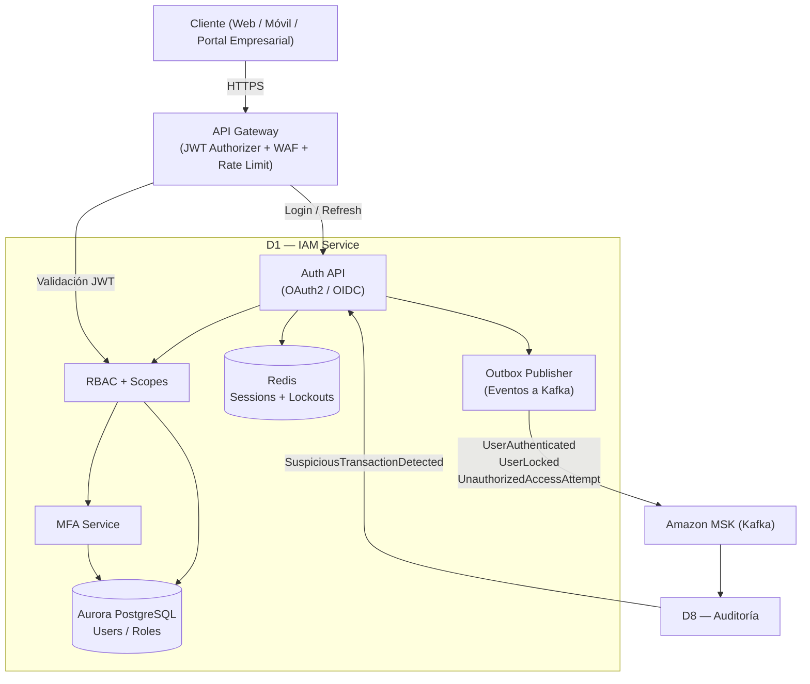

## 1.1 Descripción general

El Dominio 1 es el proveedor central de identidad del sistema Empresa X y el responsable de autenticación y autorización para todos los canales (web, móvil, tablet y portal empresarial).

Su contrato de existencia se resume en una regla fundamental:

> Ninguna petición puede acceder a los dominios D2–D8 sin un token JWT válido emitido por D1 y validado previamente por el API Gateway.

D1 asegura:

- Autenticación basada en OAuth2/OIDC  
- Emisión de tokens JWT firmados  
- Autorización por roles (RBAC) y scopes  
- MFA (autenticación multifactor) para roles críticos  
- Gestión de sesiones y revocación  
- Bloqueo por intentos fallidos y detección de abuso  
- Trazabilidad de accesos para auditoría y cumplimiento  

Por ser un dominio transversal, su indisponibilidad afecta todo el sistema; por ello su diseño prioriza disponibilidad 24/7, seguridad estatal y trazabilidad.

---

## 1.2 Consideraciones asignadas

| # | Consideración | Prioridad |
|---|--------------|-----------|
| RNF-01 | Disponibilidad 24/7 | Primario |
| RNF-04 | Seguridad (autenticación, cifrado, OWASP, IDS) | Primario |
| RNF-06 | Trazabilidad y cumplimiento regulatorio | Primario |

---

## 1.3 Actores y responsabilidades

| Actor | Rol en este dominio |
|--------|--------------------|
| Persona natural | Inicia sesión para operar transferencias, billetera y consultas |
| Empresa aliada | Accede al portal empresarial para operar pagos masivos (D7) |
| Administrador de seguridad | Administra roles, políticas y bloqueos |
| API Gateway | Valida JWT y aplica rate-limiting antes de enrutar |
| D2 — Usuarios | Confía en el JWT para proteger endpoints de cuentas |
| D4 — Transferencias | Valida roles/scopes para operaciones sensibles |
| D5 — Billetera | Valida identidad y permisos para débitos/créditos |
| D7 — Pagos Masivos | Restringe operaciones a payroll_manager / company_admin |
| D8 — Auditoría | Consume eventos de autenticación y accesos sospechosos |

---

## 1.4 Funciones clave

- Autenticación OAuth2/OIDC — flujo Authorization Code (web/móvil) y credenciales seguras.  
- Emisión de tokens JWT firmados — tokens con claims: sub, roles, scope, exp, iat, jti.  
- Autorización RBAC + scopes — control de acceso granular por rol y operación.  
- MFA (Multi-Factor Authentication) — requerido para roles críticos y accesos de alto riesgo.  
- Gestión de sesiones — revocación (logout global), expiración controlada, rotación de refresh tokens.  
- Protección anti-abuso — rate limiting, bloqueo por intentos fallidos, listas de IP sospechosas.  
- Auditoría de accesos — publicación de eventos a Kafka para trazabilidad (D8).  

---

## 1.5 Modelo de datos

Persistencia de usuarios y roles en Aurora PostgreSQL.  
Sesiones y contadores temporales (intentos fallidos, revocaciones) en Redis.

```plaintext
User {
  user_id       UUID (PK)
  username      String (único)
  password_hash String (Argon2/Bcrypt)
  status        Enum { ACTIVE, LOCKED, SUSPENDED }
  mfa_enabled   Boolean
  created_at    Timestamp
  updated_at    Timestamp
}

Role {
  role_id UUID (PK)
  name    String (único)
}

UserRole {
  user_id UUID (FK)
  role_id UUID (FK)
}

LoginAttempt {
  attempt_id UUID (PK)
  user_id    UUID (FK)
  ip_address String
  success    Boolean
  timestamp  Timestamp
}

TokenRevocation {
  jti        String (PK)
  user_id    UUID
  expires_at Timestamp
}
```
---
## 1.6 Eventos del dominio

### Eventos que produce (publica a Kafka)

| Evento | Disparador | Consumidores principales |
| --- | --- | --- |
| UserAuthenticated | Login exitoso | D8 (auditoría), D4 (correlación antifraude) |
| UserAuthenticationFailed | Login fallido | D8 |
| UserLocked | Exceso de intentos fallidos | D8 |
| UnauthorizedAccessAttempt | Token inválido/expirado o rol insuficiente | D8 |

### Eventos que consume

| Evento | Disparador | Acción en D1 |
| --- | --- | --- |
| SuspiciousTransactionDetected | D8 detecta patrón sospechoso asociado a user_id | Suspensión o requerir MFA reforzado |
---
## 1.7 Comunicación con otros dominios

Plain text

Cliente ──HTTPS──► API Gateway ──► D1: login / refresh  
API Gateway ──JWT Authorizer──► valida token antes de enrutar a D2–D8  
D2–D7 ──síncrono──► validan claims (roles/scopes) del JWT  
D1 ──asíncrono──► D8: eventos UserAuthenticated, UserLocked, UnauthorizedAccessAttempt  
D8 ──asíncrono──► D1: SuspiciousTransactionDetected (opcional)

---

## 1.8 RNF del dominio y funciones de ajuste

### RNF-D1-01 — Disponibilidad 24/7 del servicio IAM

| Campo | Detalle |
| --- | --- |
| Descripción | El servicio IAM debe operar 24/7; su indisponibilidad bloquea el acceso a todo el sistema. |
| Origen | RNF-01 (Primario) |
| Categoría RNF | Disponibilidad |

#### Funciones de ajuste (fitness functions)

| # | Función de ajuste | Mecanismo | Métrica objetivo |
| --- | --- | --- | --- |
| FF-D1-01-A | Uptime mensual del servicio IAM | Monitoreo en CloudWatch + SLO | ≥ 99.9% |
| FF-D1-01-B | Tiempo de recuperación ante fallo | Auto-healing EKS + Multi-AZ | < 60 s |
| FF-D1-01-C | Degradación en picos de login | Prueba de carga en ventana pico | P95 login < 1.5 s |

#### Tácticas

- Despliegue en Amazon EKS Multi-AZ con réplicas mínimas y HPA.
- Aurora PostgreSQL Multi-AZ para persistencia.
- Readiness/Liveness probes y reinicio automático por K8s.
- Protección en gateway para reducir presión de bots (rate limiting + WAF).

---

### RNF-D1-02 — Seguridad de autenticación y emisión de tokens

| Campo | Detalle |
| --- | --- |
| Descripción | El dominio debe implementar autenticación robusta, MFA y emisión segura de JWT firmados. |
| Origen | RNF-04 (Primario) |
| Categoría RNF | Seguridad |

#### Funciones de ajuste

| # | Función de ajuste | Mecanismo | Métrica objetivo |
| --- | --- | --- | --- |
| FF-D1-02-A | Fuerza criptográfica de tokens | JWT RS256 + rotación de claves KMS | 100% tokens firmados |
| FF-D1-02-B | Ventana de exposición del token | exp corto + refresh controlado | Access token ≤ 15 min |
| FF-D1-02-C | Canal seguro extremo a extremo | TLS 1.3 | 100% tráfico cifrado |

#### Tácticas

- Firma JWT con claves en AWS KMS (rotación planificada).
- TLS 1.3 en API Gateway y mTLS opcional inter-servicio (Istio).
- MFA obligatorio para roles críticos (ROLE_SECURITY_ADMIN, ROLE_PAYROLL_MANAGER).

---

### RNF-D1-03 — Protección contra fuerza bruta y abuso

| Campo | Detalle |
| --- | --- |
| Descripción | El sistema debe mitigar ataques de fuerza bruta y abuso del endpoint de login. |
| Origen | RNF-04 (Primario) |
| Categoría RNF | Seguridad / Resiliencia |

#### Funciones de ajuste

| # | Función de ajuste | Mecanismo | Métrica objetivo |
| --- | --- | --- | --- |
| FF-D1-03-A | Bloqueo por intentos fallidos | contador Redis por usuario/IP | Bloquear a los 5 intentos |
| FF-D1-03-B | Rate limiting | API Gateway throttling | < 1% requests rechazadas legítimas |
| FF-D1-03-C | Detección temprana de abuso | WAF rules + GuardDuty | alerta < 60 s |

#### Tácticas

- Contadores y ventanas temporales en ElastiCache Redis.
- AWS WAF con reglas OWASP + reputación IP.
- GuardDuty para señales de ataque (VPC/CloudTrail/DNS).

---

### RNF-D1-04 — Autorización granular (RBAC + scopes)

| Campo | Detalle |
| --- | --- |
| Descripción | El acceso a operaciones críticas debe controlarse por rol y alcance (scope). |
| Origen | RNF-04 (Primario) |
| Categoría RNF | Seguridad / Control de acceso |

#### Funciones de ajuste

| # | Función de ajuste | Mecanismo | Métrica objetivo |
| --- | --- | --- | --- |
| FF-D1-04-A | Cobertura de endpoints protegidos | pruebas automatizadas | 100% endpoints sensibles protegidos |
| FF-D1-04-B | Consistencia de permisos | pruebas RBAC por rol | 0 rutas expuestas sin rol |

#### Tácticas

- JWT con claims roles y scope.
- Validación en API Gateway (authorizer) y enforcement adicional en cada microservicio.
- Pruebas automatizadas por rol (CI/CD).

---

### RNF-D1-05 — Trazabilidad y cumplimiento de accesos

| Campo | Detalle |
| --- | --- |
| Descripción | Todo acceso (éxito/fallo) debe quedar trazado para auditoría, investigación y cumplimiento. |
| Origen | RNF-06 (Primario) |
| Categoría RNF | Trazabilidad / Cumplimiento |

#### Funciones de ajuste

| # | Función de ajuste | Mecanismo | Métrica objetivo |
| --- | --- | --- | --- |
| FF-D1-05-A | Cobertura de eventos de autenticación | integración D1→MSK→D8 | 100% eventos publicados |
| FF-D1-05-B | Latencia hacia auditoría | medición end-to-end | P95 < 500 ms |
| FF-D1-05-C | Retención de logs | política en D8/OpenSearch | ≥ 5 años (según política) |

#### Tácticas

- Publicación de eventos a Kafka con Outbox Pattern (entrega garantizada).
- Logs en CloudWatch con correlación por correlation_id.
- D8 persiste histórico append-only (cumplimiento).

---

## 1.9 Diagrama interno del dominio




---
## 1.10 Stack tecnológico recomendado para D1

Alineado con el stack global del proyecto (Sección 4). Proveedor de nube: AWS (sa-east-1 como región primaria).

| Componente | Tecnología propuesta | Justificación |
| --- | --- | --- |
| API del dominio | Node.js 20 + NestJS en Amazon EKS (Fargate para pods variables) | Alta concurrencia I/O y consistencia con otros dominios API |
| Base de datos | Amazon Aurora PostgreSQL (Multi-AZ, Serverless v2) + AWS KMS | Alta disponibilidad + cifrado nativo en reposo |
| Cache / sesiones | Amazon ElastiCache Redis (Multi-AZ) | Revocación de tokens, sesiones, contadores anti-abuso |
| Key management | AWS KMS | Firma/rotación de claves de JWT y cifrado |
| Message Broker | Amazon MSK (Kafka) | Publicación de eventos a D8 y desacoplamiento |
| Protección OWASP | AWS WAF + throttling en API Gateway | Mitigación de ataques (OWASP Top 10) |
| IDS / amenazas | Amazon GuardDuty + Security Hub | Detección y centralización de hallazgos |
| Observabilidad | CloudWatch + Managed Grafana + X-Ray (OpenTelemetry) | Métricas, trazas y logs unificados |

---

## 1.11 Pendientes / Decisiones abiertas

- Confirmar política final de MFA (solo roles críticos vs todos los usuarios)
- Definir duración exacta de access token y refresh token (ADR)
- Confirmar política de retención exacta para logs de autenticación (alineado a cumplimiento)
- Validar si se requiere mTLS inter-servicio obligatorio (Istio) o solo TLS en gateway
- Verificar requisitos de residencia de datos (sa-east-1) para identidad y autenticación

