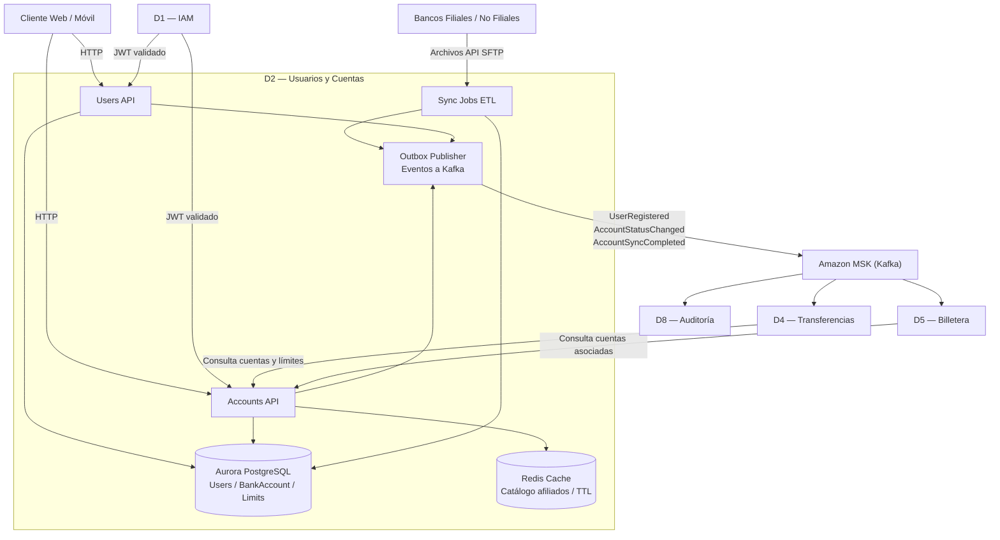

## 2.1 Descripción general

El Dominio 2 es la fuente de verdad de las personas naturales del sistema Empresa X y de sus cuentas bancarias asociadas (cuentas en bancos filiales y no filiales).

Su contrato de existencia se resume en:

> D2 mantiene el estado canónico de usuarios y sus cuentas; las sincronizaciones con bancos se realizan de forma idempotente y trazable, y los demás dominios consultan/consumen ese estado sin acoplarse a bancos específicos.

D2 soporta:

- Registro y gestión de usuarios  
- Asociación y consulta de cuentas bancarias  
- Carga masiva inicial de bancos y catálogos  
- Sincronización diaria con bancos (ETL/Jobs)  
- Exposición de endpoints de consulta para D4 (transferencias) y D5 (billetera)  
- Publicación de eventos para auditoría (D8) y procesos downstream  

---

## 2.2 Consideraciones asignadas

| # | Consideración | Prioridad |
|---|--------------|-----------|
| RNF-02 | Tiempo de respuesta < 2 s en operaciones de usuario | Primario |
| RNF-03 | Escalabilidad (≈ 25 millones de usuarios; picos 20K–30K tx en ventanas) | Primario |
| RNF-04 | Seguridad (autenticación/autorización, cifrado, OWASP) | Primario |
| RNF-06 | Trazabilidad y cumplimiento (histórico y reportes) | Primario |
| RNF-07 | Fiabilidad / consistencia en operaciones distribuidas (idempotencia) | Primario |

---

## 2.3 Actores y responsabilidades

| Actor | Rol en este dominio |
|--------|--------------------|
| Persona natural | Crea/gestiona su perfil y consulta sus cuentas |
| Administrador del sistema | Ejecuta cargas masivas iniciales (bancos/catálogos) y monitorea sincronizaciones |
| Bancos filiales / no filiales | Fuente externa para sincronización/validación de cuentas (vía procesos ETL) |
| D1 — IAM | Autoriza solicitudes (JWT + roles) |
| D4 — Transferencias | Consume cuentas/saldos/límites (lecturas de D2 y eventos) |
| D5 — Billetera | Consulta “saldo combinado” y cuentas asociadas |
| D7 — Pagos Masivos | Puede validar cuentas destino cuando el pago es a cuentas externas |
| D8 — Auditoría | Consume eventos de registro y sincronización para histórico y cumplimiento |

---

## 2.4 Funciones clave

- Registro y gestión de usuarios — alta/actualización de usuario y su perfil mínimo requerido por el sistema.  
- Gestión de cuentas bancarias — vincular y consultar cuentas por usuario (con validación de estado).  
- Carga masiva de bancos y catálogos — importación inicial (bancos, códigos, tipos de cuenta, países/monedas si aplica).  
- Sincronización diaria idempotente con bancos — actualización de estado de cuentas (activas, bloqueadas, canceladas) y datos operativos permitidos.  
- Consulta optimizada de cuentas — endpoints de lectura con caché (Redis) para responder < 2 s.  
- Publicación de eventos — UserRegistered, AccountLinked, AccountSyncCompleted para trazabilidad y desacoplamiento.  

---

## 2.5 Modelo de datos

Base de datos: Aurora PostgreSQL (cifrado KMS).  
Caché: Redis (ElastiCache) para lecturas frecuentes y registros de bancos filiales (TTL).

```plaintext id="rq1z2f"
User {
  user_id        UUID (PK)
  document_hash  String
  full_name      String
  email          String
  phone          String
  status         Enum { ACTIVE, SUSPENDED }
  created_at     Timestamp
  updated_at     Timestamp
}

Bank {
  bank_id        UUID (PK)
  bank_code      String (único)
  name           String
  is_affiliate   Boolean
  status         Enum { ACTIVE, INACTIVE }
  created_at     Timestamp
  updated_at     Timestamp
}

BankAccount {
  account_id     UUID (PK)
  user_id        UUID (FK)
  bank_id        UUID (FK)
  account_type   Enum { SAVINGS, CHECKING, OTHER }
  account_number String (cifrado en reposo)
  status         Enum { ACTIVE, BLOCKED, CLOSED }
  verified       Boolean
  created_at     Timestamp
  updated_at     Timestamp
}

AccountLimit {
  limit_id       UUID (PK)
  user_id        UUID (FK)
  daily_limit    Decimal
  monthly_limit  Decimal
  updated_at     Timestamp
}

SyncJob {
  sync_job_id    UUID (PK)
  bank_id        UUID (FK)
  type           Enum { DAILY_SYNC, MASS_IMPORT }
  status         Enum { RUNNING, SUCCESS, FAILED }
  started_at     Timestamp
  finished_at    Timestamp
  summary        JSONB
}
```


---
Notas:

- Campos sensibles (account_number, datos de contacto) deben ir cifrados en reposo con KMS.
- Respuestas de API deben evitar exponer identificadores sensibles y nunca devolver datos innecesarios.

---

## 2.6 Eventos del dominio

### Eventos que produce (publica a Kafka)

| Evento | Disparador | Consumidores principales |
| --- | --- | --- |
| UserRegistered | Alta de usuario | D8, D5, D4 |
| AccountLinked | Usuario vincula una cuenta | D4, D5, D8 |
| AccountStatusChanged | Cambia estado de cuenta | D4, D5, D8 |
| AccountSyncCompleted | Finaliza sincronización diaria | D8, D4, D5 |
| AffiliateBankRegistryUpdated | Se actualiza catálogo/afiliación | D4, D8 |

### Eventos que consume

| Evento | Fuente | Uso en D2 |
| --- | --- | --- |
| UnauthorizedAccessAttempt | D1 | Señal de seguridad (opcional) |
| SuspiciousTransactionDetected | D8 | Puede marcar usuario/cuenta para revisión (opcional) |

---

## 2.7 Comunicación con otros dominios

Plain text

D2 ◄──síncrono── D1: validar token / roles  
D4 ◄──síncrono── D2: consultar cuentas / límites / estado  
D5 ◄──síncrono── D2: consultar cuentas asociadas / saldo combinado  
D2 ──asíncrono─► D8: eventos UserRegistered, AccountSyncCompleted, AccountStatusChanged  
D2 ──asíncrono─► D4: AccountStatusChanged, AffiliateBankRegistryUpdated

---

## 2.8 RNF del dominio y funciones de ajuste

### RNF-D2-01 — Sincronización diaria idempotente con bancos

| Campo | Detalle |
| --- | --- |
| Descripción | La sincronización de cuentas con bancos debe ejecutarse diariamente de forma idempotente, con trazabilidad y sin duplicar registros. |
| Origen | RNF-07 |
| Categoría RNF | Fiabilidad / Consistencia |

#### Funciones de ajuste

| # | Función de ajuste | Mecanismo | Métrica objetivo |
| --- | --- | --- | --- |
| FF-D2-01-A | Idempotencia del job | Ejecutar misma carga 2 veces | 0 duplicados |
| FF-D2-01-B | Tasa de éxito del sync | % SUCCESS mensual | ≥ 99% |
| FF-D2-01-C | Latencia de actualización | Cambio en banco → reflejo | P95 < 10 min |

#### Tácticas

- Upsert por clave natural.
- Registro de SyncJob con resumen.
- Reintentos con backoff.

---

### RNF-D2-02 — Rendimiento de consultas (< 2 s)

| Campo | Detalle |
| --- | --- |
| Descripción | Operaciones de consulta deben responder en menos de 2 segundos. |
| Origen | RNF-02 |
| Categoría RNF | Rendimiento |

#### Funciones de ajuste

| # | Función de ajuste | Métrica objetivo |
| --- | --- | --- |
| FF-D2-02-A | Tiempo respuesta | P95 < 2 s |
| FF-D2-02-B | Cache hit rate | ≥ 80% |
| FF-D2-02-C | Degradación pico | 5xx < 0.1% |

#### Tácticas

- Redis para lecturas frecuentes.
- Índices por user_id y bank_id.
- Paginación server-side.

---

### RNF-D2-03 — Escalabilidad (25M usuarios)

| Campo | Detalle |
| --- | --- |
| Descripción | Debe soportar decenas de millones de usuarios y alto volumen concurrente. |
| Origen | RNF-03 |
| Categoría RNF | Escalabilidad |

#### Funciones de ajuste

| # | Función de ajuste | Métrica objetivo |
| --- | --- | --- |
| FF-D2-03-A | Escalado horizontal | Mantener P95 < 2 s |
| FF-D2-03-B | Concurrencia | Sin caída en picos |
| FF-D2-03-C | Crecimiento BD | Sin degradación crítica |

#### Tácticas

- EKS + HPA.
- Aurora Serverless v2.
- CQRS ligero.

---

### RNF-D2-04 — Seguridad y cumplimiento

| Campo | Detalle |
| --- | --- |
| Descripción | Protección de datos sensibles y control de acceso estricto. |
| Origen | RNF-04 |
| Categoría RNF | Seguridad |

#### Funciones de ajuste

| # | Función de ajuste | Métrica objetivo |
| --- | --- | --- |
| FF-D2-04-A | Cifrado en reposo | 100% tablas cifradas |
| FF-D2-04-B | Control de acceso | 0 endpoints expuestos |
| FF-D2-04-C | OWASP | 0 vulnerabilidades críticas |

#### Tácticas

- JWT validado por gateway.
- WAF + rate limiting.
- Auditoría de accesos.

---

### RNF-D2-05 — Trazabilidad de sincronizaciones

| Campo | Detalle |
| --- | --- |
| Descripción | Cada cambio de estado y sincronización debe ser trazable. |
| Origen | RNF-06 |
| Categoría RNF | Trazabilidad |

#### Funciones de ajuste

| # | Función de ajuste | Métrica objetivo |
| --- | --- | --- |
| FF-D2-05-A | Cobertura de eventos | 100% cambios publican evento |
| FF-D2-05-B | Latencia auditoría | P95 < 500 ms |
| FF-D2-05-C | Inmutabilidad | append-only en D8 |

#### Tácticas

- Outbox Pattern.
- Correlation ID.
- SyncJob.summary persistido.

---
## 2.9 Diagrama interno del dominio




---

## 2.10 Stack tecnológico recomendado para D2

Alineado con el stack global del proyecto.

| Componente | Tecnología propuesta | Justificación |
| --- | --- | --- |
| API REST | Node.js 20 + NestJS en EKS + Fargate | Alta concurrencia I/O |
| Base de datos | Aurora PostgreSQL + KMS | Alta disponibilidad + cifrado |
| Caché | ElastiCache Redis | Lecturas sub-ms |
| Mensajería | Amazon MSK (Kafka) | Publicación desacoplada |
| Batch | Jobs containerizados en EKS | Idempotencia y trazabilidad |
| Observabilidad | CloudWatch + Grafana + X-Ray | Métricas y trazas |

---

## 2.11 Pendientes / Decisiones abiertas

- Confirmar campos exactos del perfil de usuario permitidos.
- Definir formato y fuente de sincronización diaria.
- Confirmar política de cifrado de account_number.
- Decidir réplica de lectura Aurora.
- Definir TTLs finales de caché.