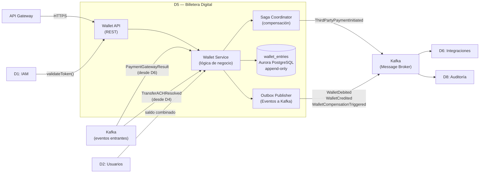

# Dominio 5 — Billetera Digital

> **Estado:** ✅ Borrador completo
> **Trazabilidad:** Consideraciones 3, 4, 5 → RNF-D5-01…02 → Componentes → Stack → Estrategias de evolución

---

## 5.1 Descripción general

El Dominio 5 es la **cuenta financiera propia de la Empresa X** asignada a cada usuario (persona natural). Actúa como una cuenta virtual emitida directamente por la plataforma, habilitando movimientos internos, pagos a terceros y transferencias a cuentas externas.

Su contrato de existencia se resume en:

> **La billetera es un ledger append-only de doble entrada: todo débito tiene su crédito contraparte en la misma transacción ACID. Ningún registro se modifica ni elimina; el saldo se calcula siempre como SUM(credit) − SUM(debit).**

D5 soporta:

- Acreditar y debitar saldo de la billetera
- Mover dinero entre la billetera y las cuentas activas del usuario (aplican las mismas reglas que una cuenta particular)
- Realizar pagos a terceros mediante pasarelas de pago (PSE, DRUO, Apple Pay, etc.) delegando a D6
- Compensación automática ante fallos de pasarela (Saga)
- Consulta de saldo en tiempo real

---

## 5.2 Consideraciones asignadas

| # | Consideración | Prioridad |
|---|---------------|-----------|
| 3 | Billetera virtual emitida por Empresa X | Primario |
| 4 | Movimientos desde la billetera (cuentas activas, externas, internacionales) | Primario |
| 5 | Pagos a terceros desde la billetera (pasarelas de pago) | Primario |

---

## 5.3 Actores y responsabilidades

| Actor | Rol en este dominio |
|-------|---------------------|
| Persona natural | Opera la billetera: consulta saldo, acredita, debita, paga a terceros |
| D1 — IAM | Autoriza solicitudes (JWT + roles) antes de procesar cualquier operación |
| D2 — Usuarios y Cuentas | Provee saldo combinado y cuentas asociadas para movimientos billetera ↔ cuenta bancaria |
| D4 — Transferencias | Invoca D5 cuando la billetera es origen o destino de una transferencia; D5 también puede iniciar transferencias delegando a D4 |
| D6 — Integraciones | Ejecuta pagos a terceros y pasarelas; retorna resultado vía evento Kafka |
| D8 — Auditoría | Consume todos los eventos de la billetera para histórico, trazabilidad y cumplimiento |

---

## 5.4 Funciones clave

1. **Consulta de saldo** — cálculo en tiempo real basado en `SUM(credit) - SUM(debit)` de `wallet_entries`.
2. **Acreditar billetera** — registrar entrada de fondos (desde cuenta bancaria, desde transferencia recibida, desde compensación).
3. **Debitar billetera** — registrar salida de fondos (hacia cuenta bancaria, hacia transferencia, hacia pago a tercero).
4. **Movimiento billetera ↔ cuentas activas** — aplican las mismas reglas de transferencia que una cuenta particular (validación de límites, antifraude, liquidación inmediata o diferida).
5. **Pago a terceros** — débito de la billetera → solicitud a D6 (pasarela de pago) → confirmación o compensación automática ante fallo.
6. **Compensación automática (Saga)** — si D6 reporta fallo de pasarela tras haberse debitado el saldo, se revierte el débito automáticamente sin intervención manual.
7. **Idempotencia** — todos los endpoints aceptan `idempotency_key` para evitar operaciones duplicadas ante reintentos del cliente.

---

## 5.5 Modelo de datos

Base de datos: Aurora PostgreSQL (append-only, cifrado KMS).
Caché de idempotencia: ElastiCache Redis (TTL 24 h).

```plaintext
Wallet {
  wallet_id      UUID (PK)
  user_id        UUID (FK → D2)
  status         Enum { ACTIVE, SUSPENDED, CLOSED }
  created_at     Timestamp
  updated_at     Timestamp
}

WalletEntry {
  entry_id       UUID (PK)
  wallet_id      UUID (FK)
  debit          Decimal (default 0)
  credit         Decimal (default 0)
  reference_type Enum { TRANSFER_IN, TRANSFER_OUT, THIRD_PARTY_PAYMENT, COMPENSATION, TOPUP }
  reference_id   UUID
  description    String
  created_at     Timestamp
  -- CONSTRAINT: CHECK (debit > 0 XOR credit > 0)
  -- NOTA: Esta tabla es append-only; nunca se modifica ni elimina un registro.
}

IdempotencyRecord {
  idempotency_key  String (PK)
  wallet_id        UUID
  entry_id         UUID
  created_at       Timestamp
  expires_at       Timestamp  -- TTL 24 h
}
```

Notas:
- El saldo se calcula siempre como: `SELECT SUM(credit) - SUM(debit) FROM wallet_entries WHERE wallet_id = ?`
- La tabla `wallet_entries` es la fuente de verdad del saldo; no existe un campo `balance` mutable.
- Los registros de idempotencia se almacenan en Redis para detección rápida de duplicados antes de tocar la base de datos.

---

## 5.6 Eventos del dominio

### Eventos que produce (publica a Kafka)

| Evento | Disparador | Consumidores principales |
|--------|-----------|--------------------------|
| `WalletCreated` | Alta de billetera para un usuario | D8 |
| `WalletCredited` | Acreditación exitosa (fondos recibidos) | D8 |
| `WalletDebited` | Débito exitoso (fondos salientes) | D8 |
| `ThirdPartyPaymentInitiated` | Pago a tercero solicitado (débito aplicado, pendiente confirmación de D6) | D6, D8 |
| `WalletCompensationTriggered` | Reversión automática por fallo de pasarela | D8 |

### Eventos que consume

| Evento | Origen | Acción en D5 |
|--------|--------|--------------|
| `PaymentGatewayResult` | D6 | Si éxito → confirma pago; si fallo → dispara compensación (crédito de reversión) |
| `TransferACHResolved` | D4 | Acredita o ajusta saldo de la billetera si era destino de transferencia diferida |
| `TransferSettled` | D4 | Acredita billetera si era destino de transferencia inmediata |

---

## 5.7 Comunicación con otros dominios

```
[Cliente] ──HTTPS──► API Gateway ──► D5: Wallet API
                                       │
                          ┌────────────┼──────────────────┐
                          │            │                  │
                  síncrono│    síncrono│          síncrono│
                          ▼            ▼                  ▼
                       D1-IAM    D2-Cuentas         D4-Transferencias
                       (authz)   (saldo combinado)  (si billetera es
                                                     origen/destino)

D5 ──asíncrono─► D6: ThirdPartyPaymentInitiated (pago a tercero)
D6 ──asíncrono─► D5: PaymentGatewayResult (resultado de pasarela)
D4 ──asíncrono─► D5: TransferSettled / TransferACHResolved
D5 ──asíncrono─► D8: WalletDebited, WalletCredited, WalletCompensationTriggered
```

---

## 5.8 RNF del dominio y funciones de ajuste

### RNF-D5-01 — Atomicidad del ledger (double-entry bookkeeping)

| Campo | Detalle |
|-------|---------|
| **Descripción** | Toda operación sobre el saldo de la billetera debe registrarse como movimiento de doble entrada; ningún débito o crédito puede quedar sin su contraparte en la tabla de movimientos. El saldo nunca se almacena como campo mutable. |
| **Origen** | Consideración 3 (Primario) / Restricción de integridad financiera |
| **Categoría RNF** | Consistencia / Integridad |

**Funciones de ajuste (fitness functions):**

| # | Función de ajuste | Mecanismo | Métrica objetivo |
|---|-------------------|-----------|-----------------|
| FF-D5-01-A | Integridad del ledger | Prueba de reconciliación automatizada: `SUM(credit) - SUM(debit) = saldo_actual` por cada `wallet_id` | 100% de billeteras reconciliadas sin diferencia |
| FF-D5-01-B | Inmutabilidad de registros | Test de intento de UPDATE/DELETE en `wallet_entries` | 0 operaciones de modificación permitidas |
| FF-D5-01-C | Constraint de doble entrada | `CHECK (debit > 0 XOR credit > 0)` en base de datos | 0 registros con ambos campos en 0 o ambos > 0 |
| FF-D5-01-D | Idempotencia de operaciones | Test: enviar misma operación con igual `idempotency_key` dos veces → 1 solo registro | 0 duplicados |

**Tácticas:**
- Tabla `wallet_entries` append-only con columnas `debit` / `credit` siempre emparejadas en la misma transacción ACID.
- Constraint de base de datos: `CHECK (debit > 0 XOR credit > 0)`.
- Trigger o política de tabla que impide `UPDATE` y `DELETE` sobre `wallet_entries`.
- Control de idempotencia en Redis (TTL 24 h) que rechaza operaciones duplicadas antes de tocar la base de datos.

---

### RNF-D5-02 — Compensación transaccional de billetera

| Campo | Detalle |
|-------|---------|
| **Descripción** | Si una pasarela de pago (D6) falla tras haberse debitado el saldo de la billetera, el monto debe revertirse automáticamente mediante el mecanismo de compensación de la Saga, sin intervención manual. |
| **Origen** | Consideración 5 (Primario) / RNF-07 (Fiabilidad) |
| **Categoría RNF** | Resiliencia / Fiabilidad |

**Funciones de ajuste:**

| # | Función de ajuste | Mecanismo | Métrica objetivo |
|---|-------------------|-----------|-----------------|
| FF-D5-02-A | Compensación exitosa ante fallo de pasarela | Test: simular `PaymentGatewayFailed` → verificar crédito de reversión en `wallet_entries` | 100% de fallos compensados |
| FF-D5-02-B | Tiempo máximo de compensación | Traza distribuida: desde `PaymentGatewayFailed` hasta `WalletCompensationTriggered` | < 5 s |
| FF-D5-02-C | Cobertura de DLQ para compensaciones fallidas | Verificar que toda falla en compensación aterriza en Dead Letter Queue | 100% trazables en DLQ |
| FF-D5-02-D | 0 débitos sin resolución | Job de reconciliación: detectar débitos con `reference_type = THIRD_PARTY_PAYMENT` sin crédito de confirmación ni compensación en > 10 min | 0 débitos huérfanos |

**Tácticas:**
- Patrón Saga coreografiado: `WalletDebited` → D6 procesa pago → `PaymentGatewayResult` (éxito o fallo).
- Si fallo: Saga Coordinator crea automáticamente un crédito de compensación en `wallet_entries` y publica `WalletCompensationTriggered`.
- Dead Letter Queue (DLQ) en Kafka para eventos de compensación que no puedan ser procesados, con alerta automática al equipo de operaciones.
- Job de reconciliación periódico (cada 5 min) que detecta débitos de pago a tercero sin resolución (ni confirmación ni compensación) y los escala.

---

### RNF-D5-03 — Rendimiento de consulta de saldo

| Campo | Detalle |
|-------|---------|
| **Descripción** | La consulta de saldo de la billetera debe responder en menos de 2 segundos, incluso con alto volumen de registros en el ledger. |
| **Origen** | RNF-02 (Primario) |
| **Categoría RNF** | Rendimiento |

**Funciones de ajuste:**

| # | Función de ajuste | Mecanismo | Métrica objetivo |
|---|-------------------|-----------|-----------------|
| FF-D5-03-A | Tiempo de respuesta de consulta de saldo | Prueba de carga: consultas concurrentes de saldo | P95 < 500 ms |
| FF-D5-03-B | Escalabilidad del cálculo | Prueba con billeteras de >100K movimientos | Sin degradación crítica |

**Tácticas:**
- Materialización periódica del saldo en caché Redis (actualización en cada operación).
- Índice compuesto por `wallet_id` + `created_at` en `wallet_entries`.
- CQRS ligero: las lecturas de saldo consultan la vista materializada; las escrituras van directo al ledger.

---

### RNF-D5-04 — Seguridad y control de acceso

| Campo | Detalle |
|-------|---------|
| **Descripción** | Solo el titular de la billetera puede operar sobre ella. Todas las operaciones requieren token JWT válido con el scope correspondiente. |
| **Origen** | RNF-04 (Primario) |
| **Categoría RNF** | Seguridad |

**Funciones de ajuste:**

| # | Función de ajuste | Mecanismo | Métrica objetivo |
|---|-------------------|-----------|-----------------|
| FF-D5-04-A | Control de acceso por titular | Test RBAC: usuario A no puede operar billetera de usuario B | 0 accesos cruzados |
| FF-D5-04-B | Cifrado en reposo | Verificación de configuración Aurora + KMS | 100% datos cifrados |
| FF-D5-04-C | Canal seguro | TLS 1.3 en todos los endpoints | 100% tráfico cifrado |

**Tácticas:**
- JWT validado por API Gateway con scope `wallet:read`, `wallet:write`, `wallet:pay`.
- Enforcement adicional en Wallet API: `wallet.user_id == token.sub`.
- Cifrado en reposo con AWS KMS para Aurora PostgreSQL.

---

### RNF-D5-05 — Trazabilidad de movimientos de billetera

| Campo | Detalle |
|-------|---------|
| **Descripción** | Todo movimiento de la billetera (débito, crédito, compensación) debe quedar registrado en el log de auditoría de D8 para cumplimiento regulatorio. |
| **Origen** | RNF-06 (Primario) |
| **Categoría RNF** | Trazabilidad / Cumplimiento |

**Funciones de ajuste:**

| # | Función de ajuste | Mecanismo | Métrica objetivo |
|---|-------------------|-----------|-----------------|
| FF-D5-05-A | Cobertura de eventos publicados | Test de integración: cada operación genera evento correspondiente | 100% de operaciones trazadas |
| FF-D5-05-B | Latencia del evento al log | Tiempo entre publicación en Kafka y persistencia en D8 | P95 < 500 ms |
| FF-D5-05-C | Inmutabilidad del log | Verificar que registros en D8 son append-only | 0 modificaciones permitidas |

**Tácticas:**
- Publicación de eventos con Outbox Pattern (misma transacción ACID que la operación).
- Correlation ID propagado en todos los eventos para trazabilidad end-to-end.
- D8 consume y persiste en append-only store.

---

## 5.9 Diagrama interno del dominio



---

## 5.10 Stack tecnológico recomendado para D5

> Alineado con el stack global del proyecto (Sección 4). Proveedor de nube: **AWS** (`sa-east-1` como región primaria).

| Componente | Tecnología propuesta | Justificación |
|------------|---------------------|---------------|
| API REST del dominio | Node.js 20 + NestJS en **Amazon EKS + Fargate** | Alta concurrencia I/O para operaciones de billetera; Fargate elimina gestión de nodos para pods de escala variable; consistente con D1, D2, D6 |
| Base de datos del ledger | **Amazon Aurora PostgreSQL** (Multi-AZ, Serverless v2) + **AWS KMS** | Tabla `wallet_entries` append-only con ACID estricto; alta disponibilidad con failover automático; cifrado en reposo con KMS |
| Coordinador de la Saga | **NestJS** con consumidores Kafka (mismo lenguaje que el resto de D5) | Orquesta los pasos del pago a tercero: débito → espera D6 → confirmación o compensación; usa el mismo stack Node.js para no agregar complejidad tecnológica |
| Control de idempotencia | **Amazon ElastiCache for Redis** (Multi-AZ, TTL 24 h) | Detección rápida de operaciones duplicadas antes de tocar la base de datos; evita dobles débitos ante reintentos del cliente |
| Message Broker | **Amazon MSK** (Managed Streaming for Apache Kafka) | Publicación desacoplada de eventos; integración nativa con IAM y CloudWatch; entrega garantizada de eventos a D6 y D8 |
| Observabilidad | OpenTelemetry SDK + **AWS X-Ray** + **Amazon CloudWatch** + **Amazon Managed Grafana** | Trazas distribuidas para sagas de pago a tercero; métricas y logs unificados con el resto del proyecto |

---

## 5.11 Pendientes / Decisiones abiertas

- [ ] Confirmar si la billetera se crea automáticamente al registrar usuario o si es opt-in
- [ ] Definir límites operativos de la billetera (monto máximo de saldo, límite diario de transacciones)
- [ ] Confirmar política de saldo negativo (¿permitido o prohibido?)
- [ ] Decidir si la materialización del saldo en Redis es en cada operación o periódica (trade-off consistencia vs rendimiento)
- [ ] Definir formato del extracto de movimientos de billetera para el reporte trimestral (alineado con D8)
