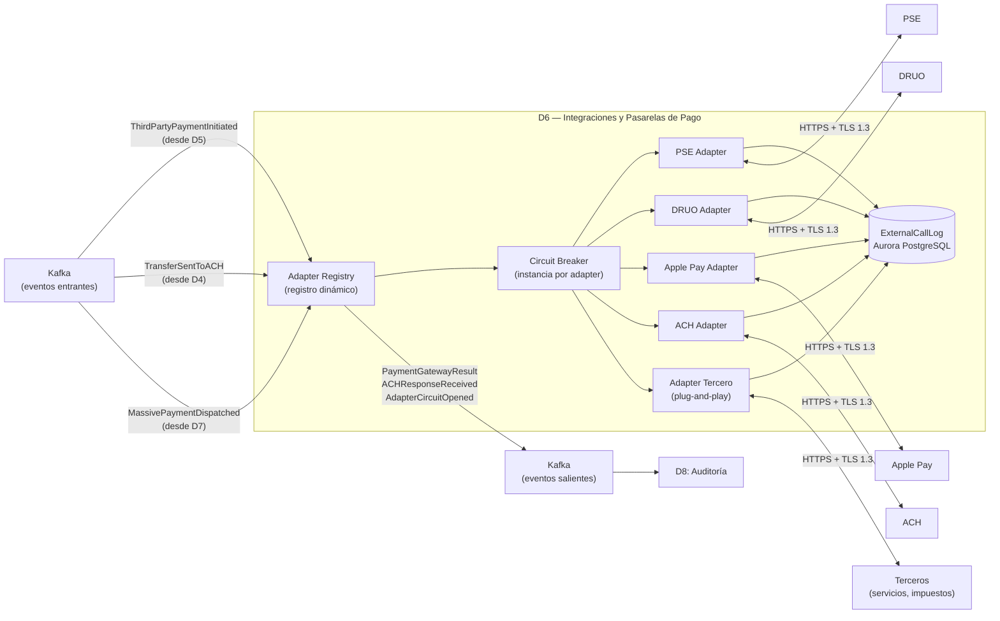

# Dominio 6 — Integraciones y Pasarelas de Pago

> **Estado:** ✅ Borrador completo
> **Trazabilidad:** Consideraciones 9, 12, 13, 14, 26 → RNF-D6-01…02 → Componentes → Stack → Estrategias de evolución

---

## 6.1 Descripción general

El Dominio 6 es la **capa anti-corrupción (ACL)** del sistema hacia todos los sistemas externos: pasarelas de pago (PSE, DRUO, Apple Pay), el sistema ACH, APIs de empresas aliadas y cualquier tercero futuro (servicios públicos, impuestos, transporte, etc.).

Su contrato de existencia se resume en:

> **Ningún dominio interno se comunica directamente con un sistema externo. Toda interacción con el exterior pasa por D6, que traduce protocolos, gestiona reintentos, aísla fallos y permite agregar nuevos terceros sin afectar el núcleo del sistema.**

D6 soporta:

- Adaptación de protocolo por pasarela/tercero (patrón Adapter)
- Registro dinámico de nuevos adapters sin redespliegue del servicio
- Aislamiento de fallos por adapter (Circuit Breaker independiente)
- Reintentos con backoff exponencial e idempotencia
- Recepción de callbacks de sistemas externos (ACH, pasarelas)
- Envío de reportes regulatorios a bancos y Superintendencia (delegado desde D8)

---

## 6.2 Consideraciones asignadas

| # | Consideración | Prioridad |
|---|---------------|-----------|
| 12 | Terceros a demanda (plug-and-play) | Primario |
| 13 | Transparencia en integración de APIs externas | Primario |
| 14 | Pasarelas de pago (PSE, DRUO, Apple Pay, etc.) | Primario |
| 9 | Integración obligatoria con ACH | Primario |
| 26 | Canales de comunicación seguros (interno y terceros) | Secundario (transversal) |

---

## 6.3 Actores y responsabilidades

| Actor | Rol en este dominio |
|-------|---------------------|
| D4 — Transferencias | Envía transferencias hacia ACH y bancos no filiales; recibe callbacks de resultado |
| D5 — Billetera | Solicita pagos a terceros vía pasarelas (PSE, DRUO, Apple Pay); recibe resultado |
| D7 — Pagos Masivos | Envía pagos masivos que requieren ACH o bancos no filiales |
| D3 — Empresas y Empleados | Solicita resolución de datos de empleado vía API de la empresa aliada |
| D2 — Usuarios y Cuentas | Procesos batch de sincronización con bancos filiales/no filiales |
| D8 — Auditoría | Consume logs de integración, latencias, errores y reintentos; recibe reportes para envío a bancos y Superfinanciera |
| PSE, DRUO, Apple Pay, ACH | Sistemas externos que exponen APIs con protocolos y autenticación heterogéneos |
| Terceros (servicios, impuestos) | Nuevos sistemas que se integran a demanda sin modificar el núcleo |

---

## 6.4 Funciones clave

1. **Adapter Registry (registro dinámico)** — registro de adapters activos en base de datos; nuevos adapters se activan/desactivan en caliente sin reiniciar el servicio.
2. **Adapter por pasarela/tercero** — cada sistema externo tiene su propio adapter que traduce el contrato interno al protocolo de la pasarela (REST, SOAP, webhooks, etc.).
3. **Circuit Breaker por adapter** — instancia independiente de circuit breaker; si PSE falla, solo se corta el circuito de PSE; DRUO, ACH y Apple Pay siguen funcionando.
4. **Reintentos con backoff e idempotencia** — cada llamada externa lleva una clave de idempotencia para evitar duplicados ante reintentos.
5. **Recepción de callbacks** — endpoint dedicado para recibir callbacks de ACH (procedente/rechazada), pasarelas (éxito/fallo) y terceros.
6. **Envío de reportes regulatorios** — recibe reportes generados por D8 y los envía a bancos filiales (extracto trimestral) y Superintendencia Financiera (reporte semestral) vía HTTPS/SFTP.
7. **Integración plug-and-play** — un nuevo tercero se integra desplegando un nuevo contenedor adapter y registrándolo en el Adapter Registry, sin modificar los adapters existentes.

---

## 6.5 Modelo de datos

Base de datos: Aurora PostgreSQL (registro de adapters y log de transacciones externas).
Credenciales: AWS Secrets Manager (una clave por pasarela, rotación automática).

```plaintext
AdapterConfig {
  adapter_id       UUID (PK)
  name             String (único)  -- ej: "PSE", "DRUO", "ACH", "ApplePay"
  type             Enum { PAYMENT_GATEWAY, ACH, THIRD_PARTY_SERVICE, BANK_SYNC, COMPANY_API }
  base_url         String
  auth_type        Enum { API_KEY, OAUTH2, MTLS, HMAC }
  secret_arn       String  -- ARN de Secrets Manager
  circuit_breaker  JSONB   -- { error_threshold: 50, timeout_ms: 30000, half_open_max: 3 }
  status           Enum { ACTIVE, INACTIVE, DEGRADED }
  created_at       Timestamp
  updated_at       Timestamp
}

ExternalCallLog {
  call_id          UUID (PK)
  adapter_id       UUID (FK)
  direction        Enum { OUTBOUND, INBOUND_CALLBACK }
  idempotency_key  String
  request_payload  JSONB (cifrado en reposo)
  response_payload JSONB (cifrado en reposo)
  http_status      Int
  latency_ms       Int
  status           Enum { SUCCESS, FAILED, TIMEOUT, CIRCUIT_OPEN }
  correlation_id   String
  created_at       Timestamp
}
```

Notas:
- Las credenciales de cada pasarela se almacenan en AWS Secrets Manager, nunca en la base de datos.
- El `ExternalCallLog` sirve para trazabilidad y análisis de latencia; es consultado por D8.
- Los payloads se cifran en reposo con KMS para proteger datos sensibles de transacciones.

---

## 6.6 Eventos del dominio

### Eventos que produce (publica a Kafka)

| Evento | Disparador | Consumidores principales |
|--------|-----------|--------------------------|
| `PaymentGatewayResult` | Respuesta de pasarela (PSE, DRUO, Apple Pay) tras pago | D5 (billetera) |
| `ACHResponseReceived` | Callback de ACH (procedente/rechazada) | D4 (transferencias) |
| `ThirdPartyServiceResponse` | Respuesta de tercero (servicio público, impuesto, etc.) | D5 |
| `AdapterRegistered` | Nuevo adapter registrado en caliente | D8 (auditoría) |
| `AdapterCircuitOpened` | Circuit breaker de un adapter se abrió por errores consecutivos | D8 (alerta) |
| `AdapterCircuitClosed` | Circuit breaker de un adapter se recuperó | D8 |

### Eventos que consume

| Evento | Origen | Acción en D6 |
|--------|--------|--------------|
| `ThirdPartyPaymentInitiated` | D5 (billetera) | Seleccionar adapter de pasarela → invocar API externa → retornar resultado |
| `TransferSentToACH` | D4 (transferencias) | Seleccionar ACH adapter → enviar transacción a ACH |
| `MassivePaymentDispatched` | D7 (pagos masivos) | Procesar pagos que requieren ACH o bancos no filiales |

---

## 6.7 Comunicación con otros dominios

```
D4 ──asíncrono─► D6: TransferSentToACH (envío a ACH)
D6 ──asíncrono─► D4: ACHResponseReceived (callback de ACH)

D5 ──asíncrono─► D6: ThirdPartyPaymentInitiated (pago a tercero)
D6 ──asíncrono─► D5: PaymentGatewayResult (resultado de pasarela)

D7 ──asíncrono─► D6: MassivePaymentDispatched (pagos masivos a bancos no filiales)

D3 ──síncrono──► D6: resolución de datos del empleado (D6 invoca API de empresa aliada)

D2 ──batch──────► D6: sincronización con bancos (SFTP / API)

D8 ──batch──────► D6: envío de reportes a bancos (HTTPS/SFTP) y Superfinanciera (HTTPS/SFTP)

D6 ──asíncrono─► D8: logs de integración, latencias, errores, alertas de circuit breaker
```

---

## 6.8 RNF del dominio y funciones de ajuste

### RNF-D6-01 — Aislamiento de adapters (fault isolation)

| Campo | Detalle |
|-------|---------|
| **Descripción** | Un fallo o degradación en un adapter externo (ej. DRUO fuera de servicio) no puede impactar la disponibilidad ni el rendimiento de los demás adapters (PSE, ACH, Apple Pay, terceros). |
| **Origen** | Consideración 12 (Primario) / RNF-01 (Disponibilidad) |
| **Categoría RNF** | Resiliencia / Disponibilidad |

**Funciones de ajuste (fitness functions):**

| # | Función de ajuste | Mecanismo | Métrica objetivo |
|---|-------------------|-----------|-----------------|
| FF-D6-01-A | Aislamiento de fallos entre adapters | Test de caos: simular caída de PSE → verificar que DRUO, ACH y Apple Pay no se ven afectados | 0 impacto cruzado |
| FF-D6-01-B | Tiempo de detección de adapter caído | Circuit breaker: tiempo entre primera falla y apertura del circuito | < 5 s |
| FF-D6-01-C | Alerta ante circuit breaker abierto | Evento `AdapterCircuitOpened` + alerta en Grafana | Alerta en < 30 s |
| FF-D6-01-D | Recuperación automática (half-open) | Circuit breaker pasa a HALF-OPEN tras timeout configurado | Recuperación sin intervención manual |
| FF-D6-01-E | Sin saturación cruzada | Prueba de carga: saturar adapter A → latencia de adapter B no aumenta | 0 degradación cruzada |

**Tácticas:**
- Cada adapter se despliega como un pod independiente en EKS (fallo de un pod ≠ fallo del servicio completo).
- Circuit breaker por adapter con `opossum` (Node.js), configuración independiente de umbral de error y tiempo de apertura.
- Bulkhead pattern: thread pool / event loop separado por adapter para evitar saturación cruzada.
- Métricas del estado del circuit breaker expuestas a CloudWatch, visibles en dashboard de D8.

---

### RNF-D6-02 — Integración de nuevos terceros sin downtime

| Campo | Detalle |
|-------|---------|
| **Descripción** | Registrar y activar un nuevo tercero o pasarela de pago no debe generar indisponibilidad en los adapters existentes ni requerir redespliegue del núcleo del servicio de integraciones. |
| **Origen** | Consideración 12, 13 (Primario) / RNF-05 (Extensibilidad) |
| **Categoría RNF** | Extensibilidad / Disponibilidad |

**Funciones de ajuste:**

| # | Función de ajuste | Mecanismo | Métrica objetivo |
|---|-------------------|-----------|-----------------|
| FF-D6-02-A | Registro de adapter sin reinicio | Test: registrar nuevo adapter en caliente → verificar que el servicio no se reinicia | 0 downtime |
| FF-D6-02-B | Tiempo de activación de nuevo tercero | Test end-to-end: desde despliegue del contenedor hasta primera transacción exitosa | < 1 día hábil |
| FF-D6-02-C | Health check de adapters existentes post-deploy | Smoke test automatizado en CI/CD | 100% de adapters existentes respondiendo |
| FF-D6-02-D | Prueba de contrato del nuevo adapter | Consumer-driven contract test (OpenAPI + WireMock) | 0 regresiones en adapters existentes |

**Tácticas:**
- Adapter Registry dinámico: los adapters se registran en caliente vía configuración en base de datos sin reinicio de la aplicación.
- Despliegue del nuevo adapter como contenedor independiente (sin tocar el contenedor del núcleo de D6).
- Smoke test automatizado post-deploy que valida que todos los adapters existentes siguen respondiendo.
- Contratos OpenAPI 3.x por cada pasarela/tercero; validación automática en CI con WireMock.

---

### RNF-D6-03 — Seguridad en comunicación con sistemas externos

| Campo | Detalle |
|-------|---------|
| **Descripción** | Toda comunicación con sistemas externos debe usar canales cifrados (TLS 1.3 mínimo), con autenticación mutua cuando el tercero lo soporte, y las credenciales deben rotarse automáticamente. |
| **Origen** | Consideración 26 (Secundario) / RNF-04 (Seguridad) |
| **Categoría RNF** | Seguridad |

**Funciones de ajuste:**

| # | Función de ajuste | Mecanismo | Métrica objetivo |
|---|-------------------|-----------|-----------------|
| FF-D6-03-A | Canal cifrado | Verificar TLS en todas las conexiones salientes | 100% tráfico cifrado (TLS 1.3) |
| FF-D6-03-B | Rotación de credenciales | Secrets Manager rotation schedule | Rotación automática cada 90 días |
| FF-D6-03-C | Validación de callbacks | Firma HMAC de callbacks de ACH y pasarelas | 100% callbacks validados |
| FF-D6-03-D | No exposición de credenciales | Auditoría de logs: 0 credenciales en payloads o logs | 0 fugas |

**Tácticas:**
- TLS 1.3 obligatorio en todas las conexiones salientes; mTLS cuando el tercero lo soporte.
- Credenciales almacenadas en AWS Secrets Manager con rotación automática (una clave por pasarela).
- Validación de firma HMAC en todos los callbacks entrantes de ACH y pasarelas.
- Sanitización de logs: los payloads registrados en `ExternalCallLog` no contienen credenciales ni tokens.

---

### RNF-D6-04 — Trazabilidad de integraciones

| Campo | Detalle |
|-------|---------|
| **Descripción** | Toda interacción con sistemas externos (éxito, fallo, timeout, circuit open) debe quedar registrada con latencia, correlation_id y resultado para auditoría y diagnóstico. |
| **Origen** | RNF-06 (Trazabilidad) / RNF-09 (Observabilidad) |
| **Categoría RNF** | Trazabilidad / Observabilidad |

**Funciones de ajuste:**

| # | Función de ajuste | Mecanismo | Métrica objetivo |
|---|-------------------|-----------|-----------------|
| FF-D6-04-A | Cobertura de logs de integración | Test: cada llamada externa genera un `ExternalCallLog` | 100% de llamadas trazadas |
| FF-D6-04-B | Latencia publicada a D8 | Tiempo entre llamada y registro en D8 | P95 < 500 ms |
| FF-D6-04-C | Correlación end-to-end | `correlation_id` presente en todos los registros | 100% de registros con correlation_id |

**Tácticas:**
- Registro de cada llamada externa en `ExternalCallLog` con latencia, estado y correlation_id.
- Publicación de eventos de integración a Kafka para consumo de D8.
- Dashboards de latencia por adapter en Grafana para detección proactiva de degradación.

---

## 6.9 Diagrama interno del dominio



---

## 6.10 Stack tecnológico recomendado para D6

> Alineado con el stack global del proyecto (Sección 4). Proveedor de nube: **AWS** (`sa-east-1` como región primaria).

| Componente | Tecnología propuesta | Justificación |
|------------|---------------------|---------------|
| API / Core del dominio | Node.js 20 + NestJS en **Amazon EKS + Fargate** | Alta concurrencia I/O para llamadas externas concurrentes; Fargate para escala variable; consistente con D1, D2, D5 |
| Registro de pasarelas | **NestJS con patrón Strategy** (cada pasarela es un módulo independiente activable en caliente, config en Aurora) | Permite agregar o quitar una pasarela sin apagar el servicio; la configuración se guarda en Aurora |
| Circuit Breaker | **`opossum`** (librería circuit breaker para Node.js), una instancia por adapter | Si PSE falla, solo se corta PSE; DRUO, ACH y Apple Pay siguen operando. Librería más usada del ecosistema Node.js |
| Credenciales | **AWS Secrets Manager** (una clave por pasarela, rotación automática cada 90 días) | Rotación automática sin reiniciar pods; si se revoca una pasarela, sus credenciales no afectan a las demás |
| Pruebas de integración | **OpenAPI 3.x** (contrato por pasarela) + **WireMock** (simulación en CI) | Tests de integración sin conexión real a PSE o ACH; detección automática de cambios en API de terceros |
| Base de datos | **Amazon Aurora PostgreSQL** (Multi-AZ) + **AWS KMS** | Almacena `AdapterConfig` y `ExternalCallLog`; cifrado en reposo |
| Message Broker | **Amazon MSK** (Managed Streaming for Apache Kafka) | Recepción y publicación desacoplada de eventos; integración nativa con IAM |
| Observabilidad | OpenTelemetry SDK + **AWS X-Ray** + **Amazon CloudWatch** + **Amazon Managed Grafana** | Trazas distribuidas de llamadas externas; dashboards de latencia por adapter |

---

## 6.11 Pendientes / Decisiones abiertas

- [ ] Confirmar el esquema de firma HMAC de callbacks de ACH con el proveedor
- [ ] Definir SLA mínimo esperado por cada pasarela (PSE, DRUO, Apple Pay) para configurar timeouts del circuit breaker
- [ ] Confirmar si los adapters de empresas aliadas (para resolución de empleados) viven como módulos dentro de D6 o como contenedores separados
- [ ] Definir política de retry máximo por adapter antes de marcar la transacción como FAILED
- [ ] Confirmar formato de envío de reportes regulatorios (HTTPS vs SFTP) con bancos y Superintendencia
- [ ] Decidir si se requiere un adapter dedicado para cada banco filial o si la sincronización usa un adapter genérico
