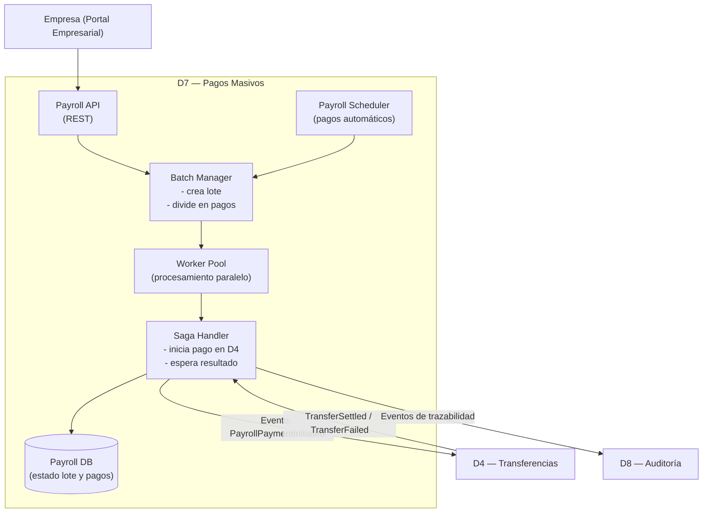

# Dominio 7 — Pagos Masivos a Empleados

---

## 7.1 Descripción general

El Dominio 7 es el **orquestador de la nómina empresarial** dentro de la plataforma. Su responsabilidad principal es ejecutar pagos individuales y masivos a empleados de empresas aliadas, garantizando escalabilidad, trazabilidad e independencia entre pagos.

Su contrato de existencia se resume en la siguiente regla de negocio:

> **Cada pago dentro de un lote de nómina es una unidad independiente, trazable y compensable, cuyo fallo no puede afectar la ejecución del resto del lote ni la estabilidad del sistema.**

Este dominio procesa picos transaccionales predecibles (20K–30K pagos en fechas críticas) y debe operar bajo alta disponibilidad y rendimiento constante.

---

## 7.2 Consideraciones asignadas

| # | Consideración | Prioridad |
|---|---------------|-----------|
| 6 | Pagos empresariales (individual, masivo, manual y programado) | Primario |
| 21 | Pagos masivos en fechas críticas (20K–30K transacciones) | Primario |
| 22 | Ventanas específicas (14–16 y 29–31) | Primario |
| 23 | Capacidad de pagos masivos cualquier día | Primario |
| 24 | Escalabilidad sostenida ante alta transaccionalidad | Primario |

---

## 7.3 Actores y responsabilidades

| Actor | Rol en este dominio |
|-------|---------------------|
| Empresa aliada | Inicia pagos manuales o configura pagos programados |
| Payroll Manager | Usuario autorizado para ejecutar nómina |
| D1 — IAM | Autoriza operaciones empresariales |
| D3 — Empresas y Empleados | Provee lista de empleados activos |
| D4 — Transferencias | Ejecuta cada pago como transferencia individual |
| D8 — Auditoría | Registra trazabilidad de lotes y pagos individuales |
| D6 — Integración | Interviene si el pago requiere ACH o banco no filial |

---

## 7.4 Funciones clave

1. **Ejecución de pago individual** — permite a la empresa realizar pagos aislados a empleados específicos.
2. **Ejecución de pago masivo (manual)** — procesamiento inmediato de un lote completo.
3. **Ejecución programada de nómina** — disparo automático según calendario configurado.
4. **División del lote en pagos independientes** — cada pago es procesado como unidad atómica.
5. **Orquestación vía Saga** — cada pago delega la operación financiera a D4.
6. **Trazabilidad completa por lote y por empleado**.
7. **Escalado automático bajo picos de carga**.

---

---
title: "ChatGPT"
source: "https://chatgpt.com/g/g-p-699ca56e659c8191b7e45f9bff7566e7-proyecto-de-arquitecturas-evolutivas/c/699ca89a-5c68-8331-a4af-a9ae81de20e1"
author:
  - "[[ChatGPT]]"
published:
created: 2026-02-26
description: "ChatGPT es tu chatbot de IA para el uso diario. Chatea con la IA más avanzada para explorar ideas, resolver problemas y aprender más rápido."
tags:
  - "clippings"

---

## 7.5 Modelo de datos  

PayrollBatch {  
payroll_batch_id UUID (PK)  
company_id UUID (FK)  
status Enum { CREATED, PROCESSING, COMPLETED, FAILED_PARTIAL }  
type Enum { MANUAL, AUTOMATIC }  
scheduled_date Date  
created_at Timestamp  
updated_at Timestamp  
}

PayrollPayment {  
payroll_payment_id UUID (PK)  
payroll_batch_id UUID (FK)  
employee_ref_id UUID (FK → D3)  
amount Decimal  
status Enum { PENDING, PROCESSING, SUCCEEDED, FAILED }  
transfer_id UUID (FK → D4)  
created_at Timestamp  
updated_at Timestamp  
}

Código

  
**Propiedades importantes:**  
- Cada pago es independiente.  
- No se almacenan datos bancarios del empleado.  
- La referencia financiera final se obtiene en D4.  
  
---

## 7.6 Eventos del dominio

### Eventos que produce (publica a Kafka)

| Evento | Disparador | Consumidores principales |
|--------|-----------|--------------------------|
| `PayrollBatchCreated` | Creación de lote manual o automático | D8 |
| `PayrollBatchStarted` | Inicio de procesamiento | D8 |
| `PayrollPaymentInitiated` | Inicio de pago individual | D4 |
| `PayrollPaymentSucceeded` | Pago liquidado exitosamente | D8 |
| `PayrollPaymentFailed` | Pago fallido | D8 |
| `PayrollBatchCompleted` | Lote finalizado | D8 |

---

### Eventos que consume

| Evento | Origen | Acción |
|--------|--------|--------|
| `TransferSettled` | D4 | Marca pago como SUCCEEDED |
| `TransferFailed` | D4 | Marca pago como FAILED |

---

D7 ──síncrono──► D1: validación de autorización empresarial  
D7 ──síncrono──► D3: consulta empleados activos  
D7 ──asíncrono─► D4: iniciar transferencia individual  
D7 ◄──asíncrono── D4: resultado de transferencia  
D7 ──asíncrono─► D8: trazabilidad completa del lote

---

## 7.8 RNF del dominio y funciones de ajuste

---

### RNF-D7-01 — Escalabilidad bajo picos de nómina

| Campo | Detalle |
|-------|---------|
| **Descripción** | El dominio debe soportar 20K–30K pagos en ventanas críticas sin degradar el SLA global. |
| **Origen** | Consideraciones 21, 22, 23, 24 |
| **Categoría RNF** | Escalabilidad |

**Funciones de ajuste (fitness functions):**

| # | Función de ajuste | Métrica objetivo |
|---|-------------------|-----------------|
| FF-D7-01-A | Tiempo total de procesamiento de 30K pagos | < 15 minutos |
| FF-D7-01-B | SLA general durante pico | P95 < 2 s |
| FF-D7-01-C | Escalado automático | Nuevos pods activos < 60 s |
| FF-D7-01-D | Pérdida de mensajes | 0 mensajes perdidos |

**Tácticas:**
- Queue-based load leveling con Kafka.
- Worker Pool escalable horizontalmente (HPA).
- Particionamiento por empresa.
- Pruebas de carga periódicas.

---

### RNF-D7-02 — Independencia y fiabilidad de pagos individuales

| Campo | Detalle |
|-------|---------|
| **Descripción** | El fallo de un pago no puede afectar el resto del lote. |
| **Categoría RNF** | Fiabilidad |

**Funciones de ajuste:**

| # | Función de ajuste | Métrica objetivo |
|---|-------------------|-----------------|
| FF-D7-02-A | Pagos duplicados | 0 duplicados |
| FF-D7-02-B | Pagos perdidos | 0 pagos perdidos |
| FF-D7-02-C | Tiempo máximo de compensación | < 5 s |
| FF-D7-02-D | Transacciones huérfanas | 0 en producción |

**Tácticas:**
- Idempotency key por `payroll_payment_id`.
- Saga por pago individual.
- Dead Letter Queue.
- Job reconciliador.

---

### RNF-D7-03 — Trazabilidad por lote y por empleado

| Campo | Detalle |
|-------|---------|
| **Descripción** | Cada pago debe ser trazable individualmente y como parte de su lote padre. |
| **Categoría RNF** | Trazabilidad |

**Funciones de ajuste:**

| # | Función de ajuste | Métrica objetivo |
|---|-------------------|-----------------|
| FF-D7-03-A | Cobertura de eventos | 100% pagos generan evento |
| FF-D7-03-B | Latencia de auditoría | < 500 ms |
| FF-D7-03-C | Consulta de lote | < 2 s |

**Tácticas:**
- `payroll_batch_id` como Correlation ID.
- Event Sourcing en D8.
- Registro append-only.

---

### RNF-D7-04 — Automatización de nómina programada

| Campo | Detalle |
|-------|---------|
| **Descripción** | Los pagos programados deben ejecutarse automáticamente y solo una vez por fecha configurada. |
| **Categoría RNF** | Automatización |

**Funciones de ajuste:**

| # | Función de ajuste | Métrica objetivo |
|---|-------------------|-----------------|
| FF-D7-04-A | Ejecución única | 100% sin duplicados |
| FF-D7-04-B | Precisión horaria | Desviación < 1 min |
| FF-D7-04-C | Tolerancia a reinicio | No duplicar ejecución |

**Tácticas:**
- Scheduler transaccional.
- Lock distribuido.
- Registro de ejecución por fecha.

---

### RNF-D7-05 — Aislamiento de fallos por empresa

| Campo | Detalle |
|-------|---------|
| **Descripción** | El fallo en la nómina de una empresa no debe impactar las demás. |
| **Categoría RNF** | Resiliencia |

**Funciones de ajuste:**

| # | Función de ajuste | Métrica objetivo |
|---|-------------------|-----------------|
| FF-D7-05-A | Impacto cruzado | 0 impacto entre empresas |
| FF-D7-05-B | Detección de API caída | < 5 s |
| FF-D7-05-C | Recuperación automática | Sin intervención manual |

**Tácticas:**
- Colas separadas por empresa.
- Circuit breaker por empresa.
- Bulkhead pattern.

---

## 7.9 Diagrama interno del dominio  

---

## 7.10 Stack tecnológico recomendado para D7

> Alineado con el stack global del proyecto.

| Componente | Tecnología propuesta | Justificación |
|------------|---------------------|---------------|
| API REST | Java 21 + Spring Boot 3 en EKS | Consistencia con D4 |
| Base de datos | Aurora PostgreSQL (Multi-AZ) | ACID + alta disponibilidad |
| Message Broker | Amazon MSK (Kafka) | Desacoplamiento y escalabilidad |
| Escalado | HPA en Kubernetes | Soporta picos 20K–30K |
| Observabilidad | CloudWatch + X-Ray + Grafana | Trazabilidad distribuida |

---

## 7.11 Pendientes / Decisiones abiertas

- [ ] Definir tamaño máximo de lote permitido.
- [ ] Confirmar ventana SLA máxima de ejecución.
- [ ] Definir política de reintentos por empresa.
- [ ] Confirmar si notificaciones al usuario se manejan en este dominio o en uno separado.