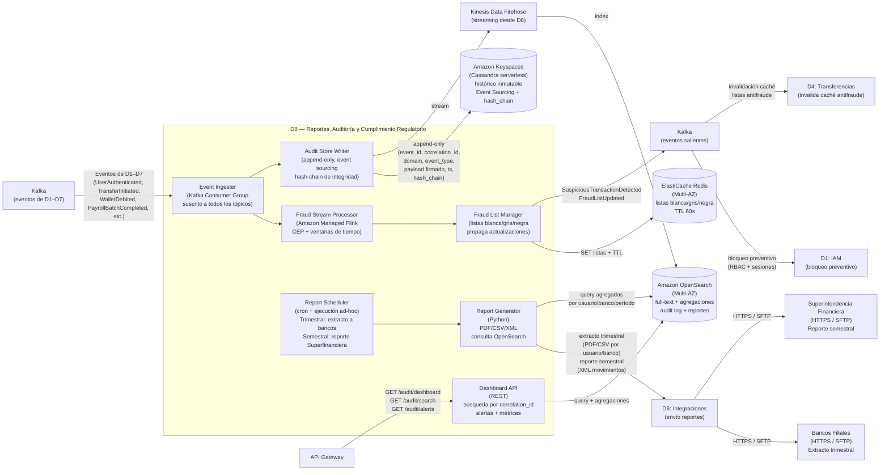

# Dominio 8 — Reportes, Auditoría y Cumplimiento Regulatorio

> **Estado:** ✅ Borrador completo
> **Trazabilidad:** Consideraciones 7, 11, 25, 30, 33, 34, 35 → RNF-D8-01…05 → Componentes → Stack → Estrategias de evolución

---

## 8.1 Descripción general

El Dominio 8 es el **observador pasivo universal** del sistema y el **generador de obligaciones regulatorias**. Consume eventos de todos los demás dominios (D1–D7) sin modificar su flujo, los persiste de forma inmutable y los analiza en tiempo real para detección de fraude y cumplimiento normativo.

Su contrato de existencia se resume en:

> **D8 nunca rechaza ni modifica una transacción de forma directa. Observa, registra, analiza y alerta. Toda evidencia es append-only, firmada digitalmente y encadenada con hash para garantizar integridad. Los reportes regulatorios se generan y envían en los plazos exigidos por la normativa colombiana.**

D8 soporta:

- Ingesta y persistencia inmutable de todos los eventos del sistema (Event Sourcing)
- Detección de fraude en tiempo real mediante procesamiento de streams (CEP)
- Gestión de listas blanca/gris/negra para retroalimentar D1 y D4
- Generación y envío de extracto trimestral a bancos filiales
- Generación y envío de reporte semestral a la Superintendencia Financiera
- Dashboard operacional para búsqueda, alertas y métricas de cumplimiento

---

## 8.2 Consideraciones asignadas

| # | Consideración | Prioridad |
|---|---------------|-----------|
| 7 | Trazabilidad de nómina (pagos a empleados) | Primario |
| 11 | Histórico completo de transacciones | Primario |
| 25 | Cifrado y firmado en todo el ciclo de vida | Secundario (transversal; anclado aquí por cumplimiento) |
| 30 | Monitoreo de actividad (auditoría de acciones/eventos/logs) | Primario |
| 33 | Extractos trimestrales a bancos filiales | Primario |
| 34 | Reporte semestral a Superintendencia Financiera | Primario |
| 35 | Automatización del calendario regulatorio | Primario |

---

## 8.3 Actores y responsabilidades

| Actor | Rol en este dominio |
|-------|---------------------|
| Sistema (scheduler) | Dispara generación automática de reportes regulatorios según calendario |
| Administrador de seguridad | Consulta dashboards, alertas de fraude y métricas de cumplimiento |
| Bancos filiales | Destinatarios del extracto trimestral de movimientos por usuario |
| Superintendencia Financiera | Destinataria del reporte semestral de todos los movimientos |
| D1 — IAM | Produce eventos de autenticación; consume alertas de fraude para bloqueo preventivo |
| D2 — Usuarios y Cuentas | Produce eventos de registro, sincronización y cambios de estado de cuentas |
| D3 — Empresas y Empleados | Produce eventos de carga masiva y cambios en referencias de empleados |
| D4 — Transferencias | Produce eventos de transferencia; consulta listas antifraude replicadas desde D8 |
| D5 — Billetera | Produce eventos de movimientos de billetera y pagos a terceros |
| D6 — Integraciones | Produce logs de integración, latencias, errores; envía reportes a destinos externos |
| D7 — Pagos Masivos | Produce eventos de lotes de nómina y pagos individuales |

---

## 8.4 Funciones clave

1. **Event Ingester** — consumer group de Kafka suscrito a todos los tópicos de eventos de D1–D7. Normaliza cada evento con `correlation_id`, timestamp y `source_domain`. Garantiza at-least-once con idempotencia en escritura (deduplicación por `event_id`).
2. **Audit Store Writer** — escribe cada evento en Amazon Keyspaces de forma append-only. Cada registro incluye: `event_id`, `correlation_id`, `domain`, `event_type`, `payload` (firmado digitalmente), `timestamp` y `hash_chain` (hash del registro anterior para garantizar integridad). En paralelo, envía el evento a OpenSearch vía Kinesis Data Firehose para indexación full-text.
3. **Fraud Stream Processor** — procesador stateful desplegado en Amazon Managed Flink. Aplica reglas CEP (Complex Event Processing) sobre ventanas de tiempo deslizantes: detecta patrones como >5 transferencias al mismo destino en 10 min, montos atípicos respecto al historial del usuario, o actividad desde cuentas en lista gris. Emite `SuspiciousTransactionDetected` en tiempo real.
4. **Fraud List Manager** — mantiene y actualiza las listas blanca/gris/negra en ElastiCache Redis con TTL de 60 s. Se alimenta de las detecciones de Flink y de fuentes regulatorias externas. Publica `FraudListUpdated` para que D1 y D4 sincronicen su caché local.
5. **Report Scheduler** — cron configurable que dispara la generación de reportes regulatorios: extracto trimestral a bancos (cada 3 meses, por usuario y banco) y reporte semestral a la Superintendencia Financiera (cada 6 meses, detalle de todos los movimientos). Soporta ejecución manual para auditorías ad-hoc.
6. **Report Generator** — script Python que consulta OpenSearch con queries de agregación por usuario/banco/período. Genera el extracto o reporte en el formato requerido (PDF/CSV para bancos, XML para Superfinanciera). Envía el resultado a D6 para distribución.
7. **Dashboard API** — endpoint REST para consultas operacionales internas. Permite buscar transacciones por `correlation_id`, consultar alertas de fraude activas, ver estado de lotes de nómina y métricas de cumplimiento. Consume OpenSearch como backend.

---

## 8.5 Modelo de datos

Almacenamiento primario: Amazon Keyspaces (Cassandra serverless, append-only).
Indexación y búsqueda: Amazon OpenSearch (ingesta vía Kinesis Data Firehose).
Listas antifraude: ElastiCache Redis (TTL 60 s).

```plaintext
AuditEvent {
  event_id         UUID (PK)
  correlation_id   String
  source_domain    String  -- ej: "D4", "D1", "D5"
  event_type       String  -- ej: "TransferSettled", "UserAuthenticated"
  payload          JSONB (firmado digitalmente)
  payload_signature String  -- firma digital del payload
  timestamp        Timestamp
  hash_chain       String  -- SHA-256(prev_hash + event_id + payload)
  -- NOTA: append-only; nunca se modifica ni elimina un registro.
}

FraudAlert {
  alert_id         UUID (PK)
  rule_id          String  -- ej: "RULE_MULTI_TRANSFER_10MIN"
  severity         Enum { LOW, MEDIUM, HIGH, CRITICAL }
  source_event_ids UUID[]
  user_id          UUID
  account_id       UUID (nullable)
  description      String
  status           Enum { OPEN, ACKNOWLEDGED, RESOLVED, FALSE_POSITIVE }
  created_at       Timestamp
  resolved_at      Timestamp (nullable)
}

FraudList {
  list_type        Enum { WHITELIST, GREYLIST, BLACKLIST }
  entity_type      Enum { ACCOUNT, USER, IP }
  entity_id        String
  reason           String
  added_by         String  -- "FLINK_RULE" o "REGULATORY_IMPORT"
  added_at         Timestamp
  expires_at       Timestamp (nullable)
  -- Almacenado en Redis (SET por list_type, TTL 60 s)
  -- Persistido también en Keyspaces para histórico
}

RegulatoryReport {
  report_id        UUID (PK)
  type             Enum { QUARTERLY_BANK_STATEMENT, SEMIANNUAL_SUPERFINANCIERA }
  period_start     Date
  period_end       Date
  target           String  -- ej: "Banco Bogotá", "Superfinanciera"
  format           Enum { PDF, CSV, XML }
  status           Enum { SCHEDULED, GENERATING, GENERATED, SENT, FAILED }
  file_location    String  -- S3 path
  generated_at     Timestamp (nullable)
  sent_at          Timestamp (nullable)
  created_at       Timestamp
}
```

Notas:
- `AuditEvent` es la tabla central de Event Sourcing; el `hash_chain` garantiza que ningún registro puede ser alterado sin romper la cadena.
- Las listas antifraude se mantienen en Redis para consulta de baja latencia (< 1 ms) y se persisten en Keyspaces para histórico.
- Los reportes generados se almacenan en S3 con cifrado KMS antes de enviarse vía D6.

---

## 8.6 Eventos del dominio

### Eventos que produce (publica a Kafka)

| Evento | Disparador | Consumidores principales |
|--------|-----------|--------------------------|
| `SuspiciousTransactionDetected` | Flink detecta patrón anómalo (CEP) | D1 (bloqueo preventivo de sesión/usuario), D4 (alerta) |
| `FraudListUpdated` | Flink o importación regulatoria actualiza listas B/G/N | D4 (invalidación de caché antifraude), D1 (bloqueo por lista negra) |
| `QuarterlyStatementGenerated` | Report Generator finaliza extracto trimestral | D6 (envío a bancos vía HTTPS/SFTP) |
| `SemiannualReportGenerated` | Report Generator finaliza reporte semestral | D6 (envío a Superfinanciera vía HTTPS/SFTP) |

### Eventos que consume

| Evento | Origen | Acción en D8 |
|--------|--------|--------------|
| `UserAuthenticated` | D1 | Registrar acceso exitoso; alimentar Flink para detección de patrones |
| `UserAuthenticationFailed` | D1 | Registrar intento fallido; Flink evalúa frecuencia de fallos |
| `UserLocked` | D1 | Registrar bloqueo de usuario |
| `UnauthorizedAccessAttempt` | D1 | Registrar acceso no autorizado; Flink evalúa patrón |
| `UserRegistered` | D2 | Registrar alta de usuario |
| `AccountLinked` / `AccountStatusChanged` | D2 | Registrar cambios de cuenta |
| `AccountSyncCompleted` | D2 | Registrar resultado de sincronización |
| `CompanyImported` | D3 | Registrar carga masiva de empresas |
| `EmployeeRefCreated` / `EmployeeRefUpdated` | D3 | Registrar cambios en referencias de empleados |
| `TransferInitiated` / `TransferApproved` | D4 | Registrar inicio de transferencia; alimentar Flink |
| `TransferRejected` | D4 | Registrar rechazo; Flink evalúa patrón de rechazos |
| `TransferSentToACH` | D4 | Registrar envío a ACH |
| `TransferSettled` / `TransferFailed` | D4 | Registrar resultado final |
| `FraudCheckFlagged` | D4 | Registrar decisión antifraude; Flink correlaciona |
| `WalletCredited` / `WalletDebited` | D5 | Registrar movimientos de billetera |
| `WalletCompensationTriggered` | D5 | Registrar compensación |
| `ThirdPartyPaymentInitiated` | D5 | Registrar pago a tercero |
| `PaymentGatewayResult` | D6 | Registrar resultado de pasarela |
| `ACHResponseReceived` | D6 | Registrar respuesta de ACH |
| `AdapterCircuitOpened` / `AdapterCircuitClosed` | D6 | Registrar estado de circuit breakers |
| `PayrollBatchCreated` / `PayrollBatchStarted` | D7 | Registrar inicio de lote de nómina |
| `PayrollPaymentInitiated` | D7 | Registrar inicio de pago individual |
| `PayrollPaymentSucceeded` / `PayrollPaymentFailed` | D7 | Registrar resultado de pago |
| `PayrollBatchCompleted` | D7 | Registrar finalización de lote |

---

## 8.7 Comunicación con otros dominios

```
D1, D2, D3, D4, D5, D6, D7 ──asíncrono (Kafka)──► D8: Event Ingester
                                                      │
                                          ┌───────────┼───────────┐
                                          │           │           │
                                          ▼           ▼           ▼
                                    Audit Store   Fraud Stream   Report
                                    Writer        Processor      Scheduler
                                          │           │           │
                                          ▼           ▼           ▼
                                    Keyspaces     Redis         Report
                                    + OpenSearch  (listas B/G/N) Generator
                                                    │           │
                                                    │           ▼
                                              Kafka saliente   D6 ──► Bancos / Superfinanciera
                                                    │
                                              ┌─────┴─────┐
                                              ▼           ▼
                                           D1 (bloqueo)  D4 (invalidar caché)

API Gateway ──síncrono──► Dashboard API ──► OpenSearch (búsqueda, alertas, métricas)
```

---

## 8.8 RNF del dominio y funciones de ajuste

### RNF-D8-01 — Inmutabilidad y integridad del registro de auditoría

| Campo | Detalle |
|-------|---------|
| **Descripción** | Todo evento registrado en el audit store debe ser inmutable (append-only). Ningún registro puede ser modificado, eliminado ni reordenado. La integridad se garantiza mediante encadenamiento de hashes y firma digital del payload. |
| **Origen** | Consideración 11, 30 (Primario) / RNF-06 (Trazabilidad) |
| **Categoría RNF** | Integridad / Trazabilidad |

**Funciones de ajuste (fitness functions):**

| # | Función de ajuste | Mecanismo | Métrica objetivo |
|---|-------------------|-----------|-----------------|
| FF-D8-01-A | Inmutabilidad del store | Test de intento de UPDATE/DELETE en Keyspaces → rechazado | 0 modificaciones permitidas |
| FF-D8-01-B | Integridad del hash chain | Verificación periódica: recalcular cadena de hashes → match con registros | 100% integridad verificada |
| FF-D8-01-C | Firma digital de payloads | Verificar firma de N registros aleatorios diariamente | 100% firmas válidas |
| FF-D8-01-D | Cobertura de eventos | % de eventos de D1–D7 registrados en D8 vs publicados | 100% de eventos persistidos |
| FF-D8-01-E | Deduplicación | Test: enviar mismo evento 2 veces → 1 solo registro | 0 duplicados |

**Tácticas:**
- Amazon Keyspaces configurado como store append-only: solo operaciones INSERT; no se permiten UPDATE ni DELETE a nivel de IAM de la tabla.
- Cada registro incluye `hash_chain = SHA-256(prev_hash + event_id + payload)` para garantizar integridad secuencial.
- Payload firmado digitalmente con clave de AWS KMS dedicada para D8.
- Deduplicación por `event_id` en el Event Ingester antes de la escritura.

---

### RNF-D8-02 — Detección de fraude en tiempo real

| Campo | Detalle |
|-------|---------|
| **Descripción** | El sistema debe detectar patrones sospechosos (transferencias frecuentes al mismo destino, montos atípicos, actividad desde cuentas en lista gris) en tiempo real mediante procesamiento de streams, y emitir alertas antes de que la transacción se complete. |
| **Origen** | Consideración 30 (Primario) / RNF-04 (Seguridad) |
| **Categoría RNF** | Seguridad / Detección de fraude |

**Funciones de ajuste:**

| # | Función de ajuste | Mecanismo | Métrica objetivo |
|---|-------------------|-----------|-----------------|
| FF-D8-02-A | Latencia de detección | Tiempo desde evento de transferencia hasta emisión de `SuspiciousTransactionDetected` | P95 < 5 s |
| FF-D8-02-B | Cobertura de reglas CEP | % de patrones documentados implementados en Flink | 100% de reglas activas |
| FF-D8-02-C | Tasa de falsos positivos | % de alertas marcadas como FALSE_POSITIVE | < 5% |
| FF-D8-02-D | Propagación de listas a D4 | Tiempo desde actualización de lista hasta invalidación de caché en D4 | < 60 s |

**Tácticas:**
- Amazon Managed Flink con reglas CEP sobre ventanas de tiempo deslizantes (ej. 10 min, 1 hora, 24 horas).
- Reglas configurables: frecuencia de transferencias por destino, desviación estándar de montos vs historial, actividad geográfica atípica.
- Alertas emitidas a Kafka en tiempo real; D1 puede bloquear sesión preventivamente y D4 puede rechazar transferencias.
- Fraud List Manager propaga actualizaciones a Redis (TTL 60 s) y publica `FraudListUpdated` para invalidación de caché en D4.

---

### RNF-D8-03 — Generación y envío de reportes regulatorios en plazo

| Campo | Detalle |
|-------|---------|
| **Descripción** | El sistema debe generar y enviar automáticamente: (a) extracto trimestral de movimientos a cada banco filial, por usuario; (b) reporte semestral a la Superintendencia Financiera con el detalle de todos los movimientos. Ambos reportes deben cumplir con los plazos y formatos exigidos. |
| **Origen** | Consideraciones 33, 34, 35 (Primario) / RNF-06 (Cumplimiento) |
| **Categoría RNF** | Cumplimiento regulatorio |

**Funciones de ajuste:**

| # | Función de ajuste | Mecanismo | Métrica objetivo |
|---|-------------------|-----------|-----------------|
| FF-D8-03-A | Generación del extracto trimestral | Scheduler dispara generación cada 3 meses; verificar archivo generado | 100% trimestres cubiertos |
| FF-D8-03-B | Generación del reporte semestral | Scheduler dispara generación cada 6 meses; verificar archivo generado | 100% semestres cubiertos |
| FF-D8-03-C | Envío exitoso a bancos | Verificar confirmación de recepción (vía D6) | 100% bancos notificados |
| FF-D8-03-D | Envío exitoso a Superfinanciera | Verificar confirmación de recepción (vía D6) | 100% reportes enviados en plazo |
| FF-D8-03-E | Formato correcto | Validación del schema del archivo generado (PDF/CSV/XML) | 0 errores de formato |
| FF-D8-03-F | Completitud de datos | Verificar que el reporte incluye todos los movimientos del período | 0 movimientos faltantes |

**Tácticas:**
- Report Scheduler con cron configurable: disparos automáticos en las fechas de vencimiento.
- Report Generator en Python consulta OpenSearch con queries de agregación por usuario/banco/período.
- Formatos: PDF/CSV para extracto a bancos; XML para reporte a Superfinanciera.
- Archivos generados se almacenan en S3 (cifrado KMS) antes de enviarse a D6 para distribución.
- Soporte para ejecución manual (ad-hoc) para auditorías extraordinarias.

---

### RNF-D8-04 — Observabilidad del sistema completo

| Campo | Detalle |
|-------|---------|
| **Descripción** | D8 debe proveer dashboards operacionales que permitan buscar transacciones por correlation_id, consultar alertas de fraude activas, ver estado de lotes de nómina y métricas de cumplimiento en tiempo real. |
| **Origen** | RNF-09 (Observabilidad, hipótesis) / Consideración 30 |
| **Categoría RNF** | Observabilidad |

**Funciones de ajuste:**

| # | Función de ajuste | Mecanismo | Métrica objetivo |
|---|-------------------|-----------|-----------------|
| FF-D8-04-A | Tiempo de búsqueda por correlation_id | Consulta en OpenSearch | P95 < 2 s |
| FF-D8-04-B | Latencia de indexación | Tiempo desde evento en Kafka hasta disponibilidad en OpenSearch | P95 < 30 s |
| FF-D8-04-C | Disponibilidad del dashboard | Health check de Dashboard API | 99.9% uptime |
| FF-D8-04-D | Alertas automáticas ante umbrales críticos | Configuración de alertas en Grafana sobre métricas de D8 | Alerta en < 60 s |

**Tácticas:**
- Amazon OpenSearch Service (Multi-AZ) como backend de búsqueda full-text y agregaciones.
- Ingesta vía Kinesis Data Firehose desde el Audit Store Writer (streaming).
- Dashboard API expuesto vía API Gateway para consultas operacionales internas (protegido por D1).
- Amazon Managed Grafana para dashboards de métricas: latencia de ingesta, volumen de eventos, alertas de fraude activas, estado de reportes regulatorios.

---

### RNF-D8-05 — Retención y cifrado de datos de auditoría

| Campo | Detalle |
|-------|---------|
| **Descripción** | Los datos de auditoría deben retenerse según la normativa vigente (mínimo 5 años para transacciones financieras). Todo dato en reposo debe estar cifrado. |
| **Origen** | Consideración 25 (Secundario) / RNF-04 (Seguridad) / RNF-06 (Cumplimiento) |
| **Categoría RNF** | Cumplimiento / Seguridad |

**Funciones de ajuste:**

| # | Función de ajuste | Mecanismo | Métrica objetivo |
|---|-------------------|-----------|-----------------|
| FF-D8-05-A | Retención mínima | Verificar que registros de > 5 años existen y son consultables | 100% registros retenidos |
| FF-D8-05-B | Cifrado en reposo | Verificar configuración de Keyspaces + OpenSearch con KMS | 100% datos cifrados |
| FF-D8-05-C | Cifrado de reportes | Verificar cifrado de archivos en S3 | 100% archivos cifrados |
| FF-D8-05-D | Política de TTL en OpenSearch | Configurar política de lifecycle | Datos > 2 años migran a almacenamiento frío; nunca se eliminan antes de 5 años |

**Tácticas:**
- Amazon Keyspaces con TTL deshabilitado para registros de auditoría (retención indefinida, mínimo 5 años).
- Amazon OpenSearch con política de Index Lifecycle Management: hot tier (0–6 meses), warm tier (6 meses–2 años), cold tier (2–5+ años).
- Cifrado en reposo con AWS KMS en Keyspaces, OpenSearch y S3.
- Reportes generados almacenados en S3 con cifrado de servidor (SSE-KMS) y versionado habilitado.

---

## 8.9 Diagrama interno del dominio



---

## 8.10 Stack tecnológico recomendado para D8

> Alineado con el stack global del proyecto (Sección 4). Proveedor de nube: **AWS** (`sa-east-1` como región primaria).

| Componente | Tecnología propuesta | Justificación |
|------------|---------------------|---------------|
| Event Ingester | Node.js 20 + NestJS (Kafka consumer group) en **Amazon EKS + Fargate** | Alta concurrencia I/O para ingesta masiva de eventos; deduplicación por `event_id`; consistente con otros dominios API |
| Fraud Stream Processor | **Amazon Managed Service for Apache Flink** (sobre MSK) | Procesamiento stateful con ventanas de tiempo para CEP; escala automática sin gestión de cluster; métricas nativas en CloudWatch |
| Audit Store (Event Sourcing) | **Amazon Keyspaces** (Apache Cassandra serverless) + **AWS KMS** | Append-only con escala automática; TTL nativo para retención; escrituras masivas sin gestión de cluster; cifrado en reposo con KMS |
| Indexación y búsqueda | **Amazon OpenSearch Service** (Multi-AZ) + **Amazon Kinesis Data Firehose** | Full-text search sobre el audit log; OpenSearch Dashboards para reportes de cumplimiento; ingesta streaming vía Firehose |
| Listas antifraude (caché) | **Amazon ElastiCache for Redis** (cluster mode, Multi-AZ, TTL 60 s) | Latencia sub-milisegundo para consulta de listas B/G/N; replicación Multi-AZ con failover automático |
| Report Generator | **Python 3.12** (script containerizado en EKS) | Consulta OpenSearch con queries de agregación; genera PDF/CSV/XML; integración nativa con boto3 para S3 y D6 |
| Report Scheduler | **EventBridge Scheduler** (cron serverless) | Disparos automáticos según calendario regulatorio; sin infraestructura que gestionar; soporta ejecución ad-hoc |
| Dashboard API | Node.js 20 + NestJS en **Amazon EKS + Fargate** | Endpoint REST para consultas operacionales; consume OpenSearch como backend |
| Almacenamiento de reportes | **Amazon S3** (cifrado SSE-KMS, versionado) | Almacenamiento duradero y cifrado de reportes generados antes de envío |
| Message Broker | **Amazon MSK** (Managed Streaming for Apache Kafka) | Ingesta y publicación desacoplada; integración nativa con Flink y Firehose |
| Observabilidad | OpenTelemetry SDK + **AWS X-Ray** + **Amazon CloudWatch** + **Amazon Managed Grafana** | Trazas distribuidas de ingesta; dashboards de métricas de cumplimiento; alertas automáticas |

---

## 8.11 Pendientes / Decisiones abiertas

- [ ] Confirmar política de retención exacta (5 años mínimo vs indefinida) alineada con normativa colombiana
- [ ] Definir formato exacto del extracto trimestral a bancos (PDF, CSV o ambos) — validar con bancos filiales
- [ ] Confirmar schema XML del reporte semestral requerido por la Superintendencia Financiera
- [ ] Definir reglas CEP iniciales para Flink (umbrales de frecuencia, montos, patrones geográficos)
- [ ] Confirmar si las listas negras/grises provienen exclusivamente de Flink o si también se importan de fuentes regulatorias externas (ej. UIAF, OFAC)
- [ ] Decidir si el Dashboard API es solo para administradores de seguridad o si tiene acceso parcial para otros roles
- [ ] Definir SLA de generación de reportes (tiempo máximo desde disparo hasta archivo generado)
- [ ] Confirmar si los reportes regulatorios requieren firma digital adicional (certificado de la empresa) antes del envío
