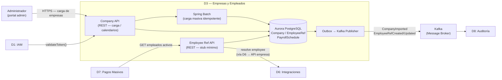
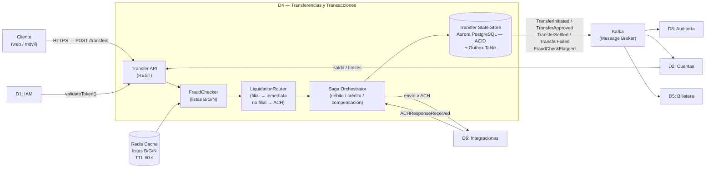
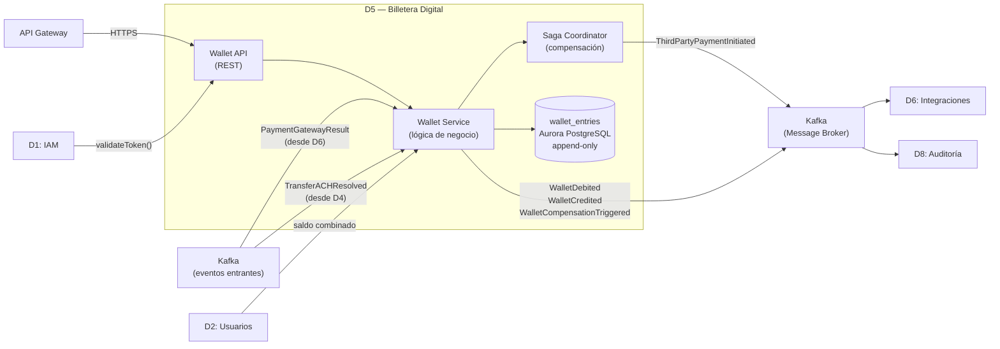
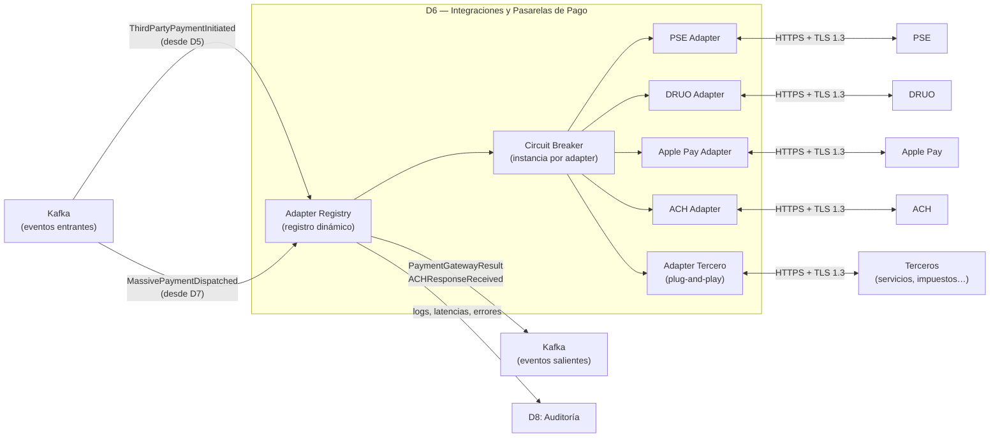

# Sección 3 — Diagrama de la arquitectura (Figura 1)

> **Estado:** 🔄 En construcción  
> **Estilo:** C4 Model — Level 2 (Container Diagram) en Mermaid  
> **Trazabilidad:** Dominios D1–D8 (Sección 1) → RNF (Sección 2) → Stack (Sección 4)

---

## Figura 1 — Diagrama de contenedores (C4 Level 2)

```mermaid
C4Container
    title Figura 1 — Arquitectura del sistema Empresa X (C4 Level 2)

    Person(user_natural, "Persona Natural", "Usuario con cuenta bancaria y/o billetera")
    Person(user_empresa, "Empresa Aliada", "Gestiona nómina y pagos a empleados")

    System_Boundary(empresaX, "Sistema Empresa X") {

        Container(api_gateway, "API Gateway", "Kong / AWS API GW", "Enrutamiento, autenticación, TLS, rate-limiting")

        Container(iam, "D1: IAM Service", "Node.js / Keycloak", "Autenticación OAuth2+JWT, MFA, RBAC, políticas OWASP")

        Container(usuarios, "D2: Usuarios y Cuentas", "Java / Spring Boot", "Carga masiva de bancos, sincronización diaria, consulta de cuentas")

        Container(empresas, "D3: Empresas y Empleados", "Java / Spring Boot", "Registro de empresas aliadas, referencia mínima de empleados")

        Container(transferencias, "D4: Transferencias y Tx", "Java / Spring Boot", "Transferencias inmediatas (filiales) y vía ACH, patrón Saga")

        Container(billetera, "D5: Billetera Digital", "Java / Spring Boot", "Cuenta emitida por Empresa X, movimientos, pagos a terceros")

        Container(integraciones, "D6: Integraciones y Pasarelas", "Node.js", "Adapters para PSE, DRUO, Apple Pay, ACH y terceros a demanda")

        Container(nomina, "D7: Pagos Masivos", "Java / Spring Boot", "Nómina empresarial, lotes 20K–30K tx, trazabilidad por empleado")

        Container(auditoria, "D8: Reportes y Auditoría", "Python / Flink", "Histórico inmutable, reportes regulatorios, monitoreo fraude")

        Container(broker, "Message Broker", "Apache Kafka", "Event streaming — desacopla todos los dominios")

        ContainerDb(db_usuarios, "DB Usuarios", "PostgreSQL", "Datos de usuarios y cuentas")
        ContainerDb(db_empresas, "DB Empresas", "PostgreSQL", "Referencia empresas y empleados")
        ContainerDb(db_tx, "DB Transacciones", "PostgreSQL + EventStore", "Registro ACID de transferencias")
        ContainerDb(db_billetera, "DB Billetera", "PostgreSQL", "Saldo y movimientos de billetera")
        ContainerDb(db_auditoria, "DB Auditoría", "Cassandra / S3", "Histórico append-only, Event Sourcing")
        ContainerDb(cache, "Caché", "Redis", "Sesiones, saldos frecuentes, rate-limiting")
    }

    System_Ext(bancos, "Bancos Filiales", "Proveen datos de usuarios vía carga masiva e integración")
    System_Ext(ach, "Sistema ACH", "Autoriza transferencias a bancos no filiales e internacionales")
    System_Ext(pasarelas, "Pasarelas de Pago", "PSE, DRUO, Apple Pay")
    System_Ext(terceros, "Terceros (Servicios)", "Servicios públicos, impuestos, transporte, etc.")
    System_Ext(superfinanciera, "Superfinanciera", "Recibe reportes semestrales regulatorios")
    System_Ext(empresa_api, "API Empresa Aliada", "Provee datos de empleados en tiempo de pago")

    Rel(user_natural, api_gateway, "HTTPS — web, móvil, tablet")
    Rel(user_empresa, api_gateway, "HTTPS — portal empresarial")

    Rel(api_gateway, iam, "Valida token")
    Rel(api_gateway, usuarios, "GET /accounts, saldos")
    Rel(api_gateway, transferencias, "POST /transfers")
    Rel(api_gateway, billetera, "POST /wallet")
    Rel(api_gateway, nomina, "POST /payroll")

    Rel(iam, cache, "Sesiones y tokens")
    Rel(usuarios, db_usuarios, "Lee/escribe")
    Rel(empresas, db_empresas, "Lee/escribe")
    Rel(transferencias, db_tx, "Lee/escribe (ACID)")
    Rel(billetera, db_billetera, "Lee/escribe")
    Rel(auditoria, db_auditoria, "Append-only write")

    Rel(transferencias, broker, "Publica TransferInitiated, TransferCompleted…")
    Rel(billetera, broker, "Publica WalletCredited, ThirdPartyPaymentInitiated…")
    Rel(nomina, broker, "Publica PayrollJobScheduled, MassivePaymentDispatched…")
    Rel(usuarios, broker, "Publica UserRegistered, AccountSyncCompleted…")
    Rel(iam, broker, "Publica UnauthorizedAccessAttempt…")

    Rel(auditoria, broker, "Consume todos los eventos de transacción")
    Rel(integraciones, broker, "Consume + Publica PaymentGatewayResult, ACHResponseReceived…")
    Rel(transferencias, broker, "Consume ACHResponseReceived")
    Rel(billetera, broker, "Consume PaymentGatewayResult")
    Rel(nomina, broker, "Consume PaymentGatewayResult")
    Rel(iam, broker, "Consume SuspiciousTransactionDetected")

    Rel(usuarios, bancos, "ETL carga masiva / sincronización diaria")
    Rel(integraciones, ach, "HTTPS — envío y recepción de respuesta ACH")
    Rel(integraciones, pasarelas, "HTTPS — PSE, DRUO, Apple Pay")
    Rel(integraciones, terceros, "HTTPS — Adapter por tercero")
    Rel(nomina, empresa_api, "HTTPS — consulta datos empleado en tiempo real")
    Rel(auditoria, superfinanciera, "HTTPS / SFTP — reporte semestral")
    Rel(auditoria, bancos, "HTTPS / SFTP — extracto trimestral")
```

> Generado con Mermaid. Para exportar a imagen: usar <https://mermaid.live>

---

## Descripción de componentes

### API Gateway
- **Rol:** Único punto de entrada para todos los clientes (web, móvil, tablet).
- **Responsabilidades:** terminación TLS, rate-limiting, enrutamiento a microservicios, inyección de headers de correlación.
- **RNF:** Seguridad (RNF-04), Disponibilidad (RNF-01), Rendimiento (RNF-02).

### D1 — IAM Service
- **Rol:** Proveedor de identidad central.
- **Responsabilidades:** Login MFA, emisión de JWT, gestión de sesiones, RBAC, bloqueo por listas negras.
- **RNF:** Seguridad (RNF-04), Disponibilidad (RNF-01).

### D2 — Usuarios y Cuentas
- **Rol:** Fuente de verdad de personas naturales y sus cuentas bancarias.
- **Responsabilidades:** ETL de bancos, sincronización diaria idempotente, consulta de estado de cuentas.
- **RNF:** Fiabilidad (RNF-07), Consistencia eventual.

### D3 — Empresas y Empleados
- **Rol:** Registro mínimo de empresas aliadas y referencia de sus empleados.
- **Responsabilidades:** Carga masiva de empresas, proxy a API de cada empresa para datos de empleados en tiempo de pago.
- **RNF:** Seguridad / mínimo PII (RNF-04), Fiabilidad (RNF-07).

### D4 — Transferencias y Transacciones
- **Rol:** Núcleo de movimientos de dinero.
- **Responsabilidades:** Transferencias inmediatas entre filiales (síncrono), envío a ACH (asíncrono), coordinación Saga.
- **RNF:** Consistencia (RNF-07), Disponibilidad (RNF-01), Rendimiento < 2 s (RNF-02).

### D5 — Billetera Digital
- **Rol:** Cuenta financiera propia de la Empresa X por usuario.
- **Responsabilidades:** Operaciones de saldo, pagos a terceros, movimientos a cuentas externas.
- **RNF:** Consistencia (RNF-07), Seguridad (RNF-04), Rendimiento (RNF-02).

### D6 — Integraciones y Pasarelas de Pago
- **Rol:** Capa antiCorrupción hacia todos los sistemas externos.
- **Responsabilidades:** Adapter por pasarela/tercero, reintentos, timeout, registro dinámico de adaptadores.
- **RNF:** Extensibilidad (RNF-05), Resiliencia (RNF-07).

### D7 — Pagos Masivos a Empleados
- **Rol:** Procesador de nómina empresarial.
- **Responsabilidades:** Programación y ejecución de lotes, escalado ante picos, trazabilidad por empleado.
- **RNF:** Escalabilidad (RNF-03), Fiabilidad (RNF-07), Trazabilidad (RNF-06).

### D8 — Reportes, Auditoría y Cumplimiento
- **Rol:** Observador pasivo de todos los eventos + generador de obligaciones regulatorias.
- **Responsabilidades:** Event Sourcing, detección de fraude en stream, reportes a bancos y Superfinanciera.
- **RNF:** Trazabilidad/Cumplimiento (RNF-06), Seguridad (RNF-04), Observabilidad (RNF-09).

### Message Broker (Kafka)
- **Rol:** Columna vertebral de comunicación asíncrona.
- **Responsabilidades:** Desacoplamiento entre dominios, garantía de entrega, replay de eventos, particionamiento por volumen.
- **RNF:** Escalabilidad (RNF-03), Fiabilidad (RNF-07), Extensibilidad (RNF-05).

---

---

## Figura 2 — Detalle interno de D3 (Empresas y Empleados)

Este diagrama amplía la Figura 1 mostrando los componentes internos del dominio D3 y sus canales de comunicación con el resto del sistema.

### Descripción de componentes — D3

| Componente | Responsabilidad |
|---|---|
| **Company API** | Punto de entrada REST para el registro y carga masiva de empresas aliadas. Recibe el archivo estructurado, delega la importación a Spring Batch y gestiona el calendario de nómina por empresa. |
| **Employee Ref API** | Gestiona el stub mínimo del empleado (`employee_ref_id`, `company_id`, `status`). Responde consultas de D7 (lista de empleados activos). Para resolver datos completos en tiempo de pago, invoca D6 sincrónicamente; D6 llama al API de la empresa aliada y retorna los datos en memoria (sin persistirlos). |
| **Spring Batch** | Procesa la carga masiva en chunks de 500 registros con commit transaccional por chunk e idempotencia (`upsert` por `external_emp_id + company_id`). Genera informe de resultado (OK / rechazados / erróneos) mediante el evento `CompanyImported`. |
| **Aurora PostgreSQL (D3)** | Almacena `Company`, `EmployeeRef` y `PayrollSchedule`. Los campos sensibles (`tax_id`, `auth_config`) están cifrados en reposo con AWS KMS. No contiene ninguna columna de PII de empleados (RNF-D3-03). |
| **Outbox → Kafka** | Garantiza entrega *at-least-once* de eventos a D8 (`CompanyImported`, `EmployeeRefCreated/Updated`) dentro de la misma transacción ACID de la operación que los origina, evitando pérdida de eventos ante fallos. |

**Comunicación clave:**
- **Entrante síncrono:** Admin (carga de empresas), D7 (consulta empleados activos), D1 (autorización)
- **Saliente síncrono a D6:** Employee Ref API invoca D6 para resolver datos completos del empleado en tiempo real; D6 llama al API de la empresa aliada y retorna los datos a D3 en memoria (sin persistirlos)
- **Saliente asíncrono (Kafka):** `CompanyImported`, `EmployeeRefCreated/Updated` → consumidos por D8

---

## Figura 3 — Detalle interno de D4 (Transferencias y Transacciones)

Este diagrama amplía la Figura 1 mostrando los componentes internos del dominio D4 y sus canales de comunicación con el resto del sistema.

### Descripción de componentes — D4

| Componente | Responsabilidad |
|---|---|
| **Transfer API** | Punto de entrada REST para instrucciones de transferencia (P2P, interbancaria, múltiples destinos). Valida token con D1 y consulta saldo/límites en D2. Retorna confirmación al usuario al llegar a estado `APPROVED`, sin esperar la liquidación. |
| **FraudChecker** | Evalúa en tiempo real las listas blanca/gris/negra desde la caché Redis (TTL 60 s). Lista negra → `REJECTED` inmediato; lista gris → aprueba con flag y alerta a D8/D1; lista blanca → flujo normal (RNF-D4-05). |
| **LiquidationRouter** | Determina el canal de liquidación consultando el registro de bancos filiales (caché Redis, TTL 5 min). Destino filial → `SETTLING` inmediato; destino no filial/internacional → `SENT_TO_ACH` diferido vía ACH (RNF-D4-02). |
| **Saga Orchestrator** | Coordina los pasos del pago (débito en D2, liquidación, crédito en destino) con compensación automática ante cualquier fallo. Registra el progreso en `transfer_saga_state` con lock optimista para evitar race conditions (RNF-D4-01). |
| **Transfer State Store (Aurora)** | Almacena el estado ACID de cada transacción y la tabla outbox. Las transacciones en estado `SETTLED` son inmutables; las devoluciones son nuevas transferencias inversas. La tabla outbox garantiza publicación de eventos con la misma transacción ACID. |

**Comunicación clave:**
- **Entrante síncrono:** Cliente (instrucción de transferencia), D1 (autorización), D2 (saldo y límites), Redis (listas antifraude)
- **Entrante asíncrono:** `ACHResponseReceived` desde D6 → Saga Orchestrator transiciona estado de `SENT_TO_ACH` a `SETTLED` o `FAILED`
- **Saliente síncrono:** Saga Orchestrator → D6 para envío de transferencia a ACH
- **Saliente asíncrono (Kafka):** `TransferInitiated`, `TransferApproved`, `TransferSettled`, `TransferFailed`, `FraudCheckFlagged` → consumidos por D8 (auditoría), D2 (ajuste de saldo), D5 (si billetera es destino)

## Figura 4 — Detalle interno de D5 (Billetera Digital)

Este diagrama amplía la Figura 1 mostrando los componentes internos del dominio D5 y sus canales de comunicación con el resto del sistema.

### Descripción de componentes — D5

| Componente | Responsabilidad |
|---|---|
| **Wallet API** | Punto de entrada REST para operaciones de billetera (acreditar, debitar, consultar saldo, pagar a tercero). Valida el token con D1 antes de procesar. |
| **Wallet Service** | Lógica de negocio: verifica saldo disponible, escribe en `wallet_entries` con doble entrada, publica eventos en Kafka. |
| **Saga Coordinator** | Coordina el flujo de pago a tercero: débito → solicitud a D6 → confirmación o compensación automática ante fallo de pasarela (RNF-D5-02). |
| **wallet_entries (Aurora)** | Tabla append-only con columnas `debit` / `credit`. Fuente de verdad del saldo — nunca se modifica ni elimina (RNF-D5-01). |

**Comunicación clave:**
- **Entrante síncrono:** API Gateway (usuario), D1 (autorización), D2 (saldo combinado)
- **Entrante asíncrono (Kafka):** `PaymentGatewayResult` desde D6, `TransferACHResolved` desde D4
- **Saliente asíncrono (Kafka):** `WalletDebited`, `WalletCredited`, `ThirdPartyPaymentInitiated`, `WalletCompensationTriggered` → consumidos por D6 y D8

---

## Figura 5 — Detalle interno de D6 (Integraciones y Pasarelas de Pago)

Este diagrama amplía la Figura 1 mostrando los componentes internos del dominio D6 y sus canales de comunicación con el resto del sistema.

### Descripción de componentes — D6

| Componente | Responsabilidad |
|---|---|
| **Adapter Registry** | Registro dinámico de adapters activos. Recibe eventos de Kafka, selecciona el adapter correcto y lo invoca. Nuevos adapters se registran en caliente sin reiniciar el servicio (RNF-D6-02). |
| **Circuit Breaker** | Instancia independiente por adapter. Ante errores consecutivos de una pasarela abre el circuito y detiene solicitudes a esa pasarela sin afectar a las demás (RNF-D6-01). |
| **PSE / DRUO / Apple Pay / ACH Adapters** | Traducen el contrato interno del sistema al protocolo de cada pasarela. Manejan reintentos, timeouts e idempotencia del payload. |
| **Adapter Tercero (plug-and-play)** | Plantilla para nuevas integraciones. Se despliega como contenedor independiente y se registra en el Adapter Registry sin modificar los adapters existentes. |

**Comunicación clave:**
- **Entrante asíncrono (Kafka):** `ThirdPartyPaymentInitiated` (desde D5), `MassivePaymentDispatched` (desde D7)
- **Saliente externo:** llamadas HTTPS/TLS 1.3 a PSE, DRUO, Apple Pay, ACH y terceros; recibe callbacks de resultado
- **Saliente asíncrono (Kafka):** `PaymentGatewayResult`, `ACHResponseReceived` → consumidos por D5 y D4
- **Saliente a D8:** logs de integración, latencias, errores y reintentos para auditoría

---

## Pendientes

- [ ] Renderizar el diagrama Mermaid y adjuntar imagen en el reporte final (usar mermaid.live o plugin VS Code)
- [ ] Confirmar tecnologías definitivas por componente (alineado con Sección 4)
- [ ] Agregar diagrama C4 Level 1 (System Context) si lo requiere el profesor
- [ ] Validar que todos los dominios de Sección 1 aparecen en el diagrama
