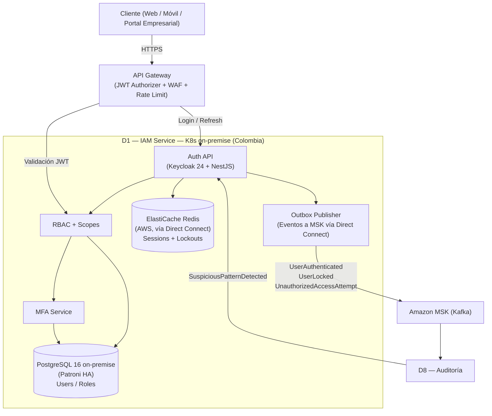
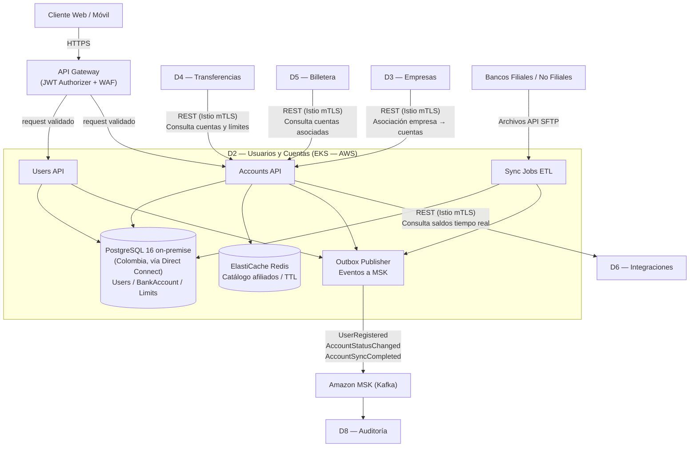
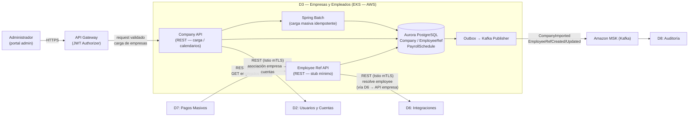
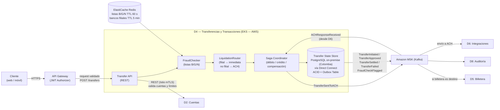
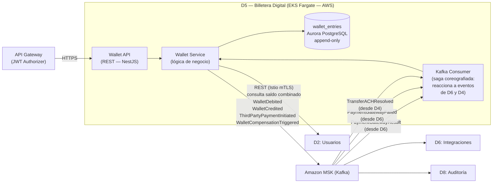
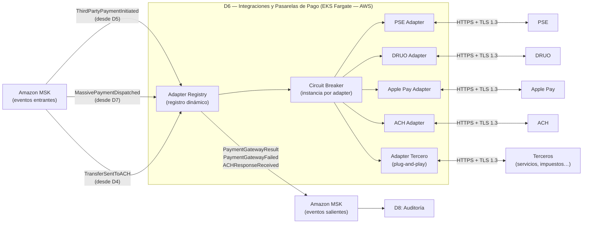
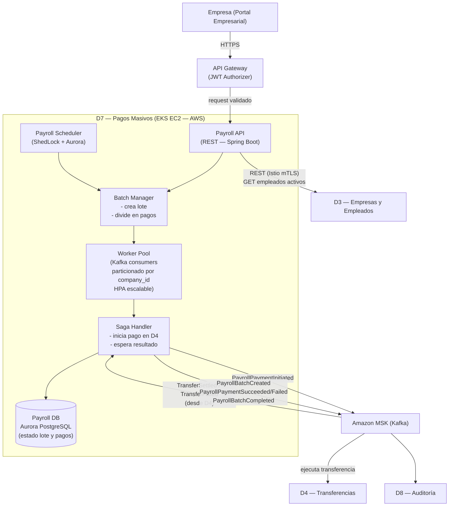
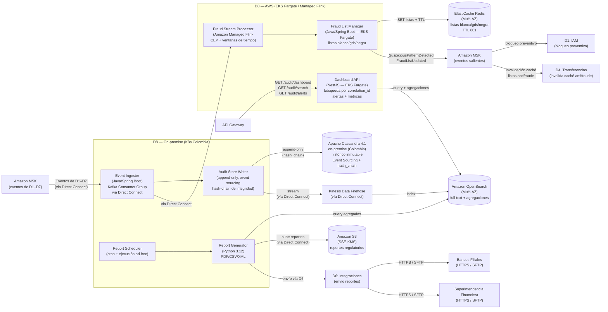

# Sección 3 — Diagrama de la arquitectura (Figura 1)

---

## Figura 1 — Diagrama de contexto (C4 Level 2)

---

## Descripción de componentes

### API Gateway (Amazon API Gateway — AWS)
- **Rol:** Único punto de entrada para todos los clientes externos (web, móvil, tablet, portal empresarial).
- **Responsabilidades:** terminación TLS, rate-limiting, **validación JWT** (JWT Authorizer conectado al JWKS de Keycloak on-premise), WAF (OWASP Top 10), enrutamiento a microservicios, inyección de headers de correlación (X-Ray). Las llamadas entre microservicios **no** pasan por el API Gateway; usan Istio mTLS (Service Mesh).
- **RNF:** Seguridad (RNF-04), Disponibilidad (RNF-01), Rendimiento (RNF-02).

### D1 — IAM Service (K8s on-premise — Colombia)
- **Rol:** Proveedor de identidad central. Desplegado on-premise para cumplimiento de soberanía de datos.
- **Responsabilidades:** Keycloak 24 (OAuth2/OIDC, MFA, gestión de sesiones), NestJS thin API (RBAC custom, publicación de eventos a MSK vía Direct Connect), bloqueo por listas negras.
- **RNF:** Seguridad (RNF-04), Disponibilidad (RNF-01), Cumplimiento normativo.

### D2 — Usuarios y Cuentas (EKS — AWS; BD on-premise)
- **Rol:** Fuente de verdad de personas naturales y jurídicas y sus cuentas bancarias.
- **Responsabilidades:** ETL de bancos, sincronización diaria idempotente, consulta de estado de cuentas, consulta de saldos en tiempo real vía D6. BD PostgreSQL on-premise (Colombia) conectada vía Direct Connect.
- **RNF:** Fiabilidad (RNF-07), Consistencia eventual.

### D3 — Empresas y Empleados (EKS — AWS)
- **Rol:** Registro mínimo de empresas aliadas y referencia de sus empleados.
- **Responsabilidades:** Carga masiva de empresas, proxy a API de cada empresa (vía D6, Istio mTLS) para datos de empleados en tiempo de pago.
- **RNF:** Seguridad / mínimo PII (RNF-04), Fiabilidad (RNF-07).

### D4 — Transferencias y Transacciones (EKS — AWS; BD on-premise)
- **Rol:** Núcleo de movimientos de dinero.
- **Responsabilidades:** Transferencias inmediatas entre filiales, envío a ACH (vía Kafka → D6), coordinación Saga con compensación. BD PostgreSQL on-premise (Colombia) conectada vía Direct Connect.
- **RNF:** Consistencia (RNF-07), Disponibilidad (RNF-01), Rendimiento < 2 s (RNF-02).

### D5 — Billetera Digital (EKS Fargate — AWS)
- **Rol:** Cuenta financiera propia de la Empresa X por usuario.
- **Responsabilidades:** Operaciones de saldo, pagos a terceros (saga coreografiada vía Kafka con D6), movimientos a cuentas externas.
- **RNF:** Consistencia (RNF-07), Seguridad (RNF-04), Rendimiento (RNF-02).

### D6 — Integraciones y Pasarelas de Pago (EKS Fargate — AWS)
- **Rol:** Capa antiCorrupción hacia todos los sistemas externos.
- **Responsabilidades:** Adapter por pasarela/tercero, reintentos, timeout, registro dinámico de adaptadores. Consume eventos de D4, D5 y D7 vía Kafka.
- **RNF:** Extensibilidad (RNF-05), Resiliencia (RNF-07).

### D7 — Pagos Masivos a Empleados (EKS EC2 — AWS)
- **Rol:** Procesador de nómina empresarial.
- **Responsabilidades:** Programación y ejecución de lotes (ShedLock + Aurora), workers Kafka particionados por `company_id`, escalado ante picos (HPA), trazabilidad por empleado.
- **RNF:** Escalabilidad (RNF-03), Fiabilidad (RNF-07), Trazabilidad (RNF-06).

### D8 — Reportes, Auditoría y Cumplimiento (híbrido: on-premise + AWS)
- **Rol:** Observador pasivo de todos los eventos + generador de obligaciones regulatorias.
- **Responsabilidades:** Event Ingester y Report Generator on-premise (Colombia) co-localizados con Cassandra; Fraud Stream Processor (Managed Flink), Fraud List Manager y Dashboard API en AWS (EKS).
- **RNF:** Trazabilidad/Cumplimiento (RNF-06), Seguridad (RNF-04), Observabilidad (RNF-09).

### Message Broker — Amazon MSK (Kafka) — AWS
- **Rol:** Columna vertebral de comunicación asíncrona entre todos los dominios.
- **Responsabilidades:** Desacoplamiento entre dominios, garantía de entrega, replay de eventos, particionamiento por volumen. D1 y D8 (on-premise) conectan vía Direct Connect.
- **RNF:** Escalabilidad (RNF-03), Fiabilidad (RNF-07), Extensibilidad (RNF-05).

---

## Figura 2 — Detalle interno de D1 (IAM Service)

Este diagrama amplía la Figura 1 mostrando los componentes internos del dominio D1 y sus canales de comunicación con el resto del sistema.

### Descripción de componentes — D1

| Componente | Responsabilidad |
|---|---|
| **Auth API (Keycloak 24 + NestJS)** | Keycloak 24 desplegado en K8s on-premise (Colombia) como proveedor OAuth2/OIDC. NestJS thin API publica eventos a MSK vía Direct Connect y gestiona políticas RBAC custom. Emite JWT firmados con claims: `sub`, `roles`, `scope`, `exp`, `iat`, `jti`. |
| **RBAC + Scopes** | Control de acceso granular por rol y operación. Valida que el token incluya los roles y scopes requeridos para cada endpoint protegido. Los roles se persisten en PostgreSQL on-premise. |
| **MFA Service** | Autenticación multifactor requerida para roles críticos (`ROLE_SECURITY_ADMIN`, `ROLE_PAYROLL_MANAGER`) y accesos de alto riesgo. |
| **PostgreSQL 16 on-premise (Users/Roles)** | Almacena usuarios, roles, asignaciones usuario-rol, intentos de login y revocaciones de token. Cifrado por columna con pgcrypto + claves en HashiCorp Vault on-premise. HA con Patroni + pgBackRest. |
| **ElastiCache Redis (Sessions + Lockouts)** | Gestiona sesiones activas, contadores de intentos fallidos (ventana temporal), revocación de tokens (`jti` → blacklist) y bloqueo por IP sospechosa. Reside en AWS; D1 conecta vía Direct Connect. |
| **Outbox Publisher** | Publica eventos de autenticación a MSK (AWS) con Outbox Pattern vía Direct Connect (entrega garantizada). Eventos: `UserAuthenticated`, `UserLocked`, `UnauthorizedAccessAttempt`. |

**Comunicación clave:**
- **Entrante síncrono:** Cliente (login/refresh vía API Gateway), API Gateway (validación JWT vía JWKS de Keycloak para enrutar a D2–D8)
- **Saliente asíncrono (Kafka vía Direct Connect):** `UserAuthenticated`, `UserLocked`, `UnauthorizedAccessAttempt` → consumidos por D8 (auditoría)
- **Entrante asíncrono (Kafka vía Direct Connect):** `SuspiciousPatternDetected` desde D8 → suspensión o MFA reforzado

---

## Figura 3 — Detalle interno de D2 (Usuarios y Cuentas)

Este diagrama amplía la Figura 1 mostrando los componentes internos del dominio D2 y sus canales de comunicación con el resto del sistema.

### Descripción de componentes — D2

| Componente | Responsabilidad |
|---|---|
| **Users API** | Punto de entrada REST para alta y gestión de perfil de usuario (persona natural y jurídica). Protegido por JWT validado en API Gateway (JWT Authorizer → Keycloak JWKS). Publica `UserRegistered` vía Outbox. |
| **Accounts API** | Gestiona la vinculación y consulta de cuentas bancarias por usuario (persona natural y jurídica). Provee endpoints de lectura con caché Redis para responder en < 2 s. Consumido sincrónicamente (Istio mTLS) por D4 (saldo/límites), D5 (cuentas asociadas) y D3 (asociación empresa → cuentas). Consulta saldos en tiempo real a bancos filiales vía D6. |
| **Sync Jobs ETL** | Procesos batch containerizados que ejecutan la sincronización diaria idempotente con bancos (vía archivos/API/SFTP). Upsert por clave natural; genera `AccountSyncCompleted` al finalizar. |
| **PostgreSQL 16 on-premise (D2)** | Almacena `User`, `Bank`, `BankAccount`, `AccountLimit` y `SyncJob`. Reside en datacenter Colombia; D2 (EKS) conecta vía Direct Connect (~15–25 ms, mitigado por caché Redis). Cifrado por columna con pgcrypto + claves en HashiCorp Vault. HA con Patroni. |
| **ElastiCache Redis** | Caché de catálogo de bancos afiliados y lecturas frecuentes de cuentas (TTL configurable). Objetivo: cache hit rate ≥ 80% para mantener P95 < 2 s. Mitiga latencia de Direct Connect hacia PostgreSQL on-premise. |
| **Outbox Publisher** | Publica eventos (`UserRegistered`, `AccountStatusChanged`, `AccountSyncCompleted`, `AffiliateBankRegistryUpdated`) con entrega garantizada at-least-once dentro de la misma transacción ACID contra PostgreSQL on-premise. |

**Comunicación clave:**
- **Entrante síncrono:** Cliente (gestión de perfil/cuentas vía API Gateway), D4 (consulta saldo/límites, Istio mTLS), D5 (consulta cuentas asociadas, Istio mTLS), D3 (asociación empresa → cuentas, Istio mTLS)
- **Saliente síncrono:** D6 (consulta de saldos en tiempo real a bancos filiales, Istio mTLS)
- **Entrante batch:** Bancos filiales/no filiales (sincronización diaria vía archivos/API/SFTP)
- **Saliente asíncrono (Kafka):** `UserRegistered`, `AccountStatusChanged`, `AccountSyncCompleted` → consumidos por D8 (auditoría)

---

## Figura 4 — Detalle interno de D3 (Empresas y Empleados)

Este diagrama amplía la Figura 1 mostrando los componentes internos del dominio D3 y sus canales de comunicación con el resto del sistema.

### Descripción de componentes — D3

| Componente | Responsabilidad |
|---|---|
| **Company API** | Punto de entrada REST para el registro y carga masiva de empresas aliadas. Protegido por JWT validado en API Gateway (JWT Authorizer → Keycloak JWKS). Recibe el archivo estructurado, delega la importación a Spring Batch y gestiona el calendario de nómina por empresa. Llama a D2 (Istio mTLS) para resolver la asociación empresa → cuentas bancarias registradas (cuenta origen para pagos de nómina). |
| **Employee Ref API** | Gestiona el stub mínimo del empleado (`employee_ref_id`, `company_id`, `status`). Responde consultas de D7 (lista de empleados activos, Istio mTLS). Para resolver datos completos en tiempo de pago, invoca D6 sincrónicamente (Istio mTLS); D6 llama al API de la empresa aliada y retorna los datos en memoria (sin persistirlos). |
| **Spring Batch** | Procesa la carga masiva en chunks de 500 registros con commit transaccional por chunk e idempotencia (`upsert` por `external_emp_id + company_id`). Genera informe de resultado (OK / rechazados / erróneos) mediante el evento `CompanyImported`. |
| **Aurora PostgreSQL (D3)** | Almacena `Company`, `EmployeeRef` y `PayrollSchedule`. Los campos sensibles (`tax_id`, `auth_config`) están cifrados en reposo con AWS KMS. No contiene ninguna columna de PII de empleados (RNF-D3-03). D3 permanece completamente en AWS. |
| **Outbox → Kafka** | Garantiza entrega *at-least-once* de eventos a D8 (`CompanyImported`, `EmployeeRefCreated/Updated`) dentro de la misma transacción ACID de la operación que los origina, evitando pérdida de eventos ante fallos. |

**Comunicación clave:**
- **Entrante síncrono:** Admin (carga de empresas vía API Gateway), D7 (consulta empleados activos, Istio mTLS)
- **Saliente síncrono a D2:** Company API invoca D2 (Istio mTLS) para resolver la asociación empresa → cuentas bancarias registradas (cuenta origen para pagos de nómina)
- **Saliente síncrono a D6:** Employee Ref API invoca D6 (Istio mTLS) para resolver datos completos del empleado en tiempo real; D6 llama al API de la empresa aliada y retorna los datos a D3 en memoria (sin persistirlos)
- **Saliente asíncrono (Kafka):** `CompanyImported`, `EmployeeRefCreated/Updated` → consumidos por D8

---

## Figura 5 — Detalle interno de D4 (Transferencias y Transacciones)

Este diagrama amplía la Figura 1 mostrando los componentes internos del dominio D4 y sus canales de comunicación con el resto del sistema.

### Descripción de componentes — D4

| Componente | Responsabilidad |
|---|---|
| **Transfer API** | Punto de entrada REST para instrucciones de transferencia (P2P, interbancaria, múltiples destinos). Protegido por JWT validado en API Gateway (JWT Authorizer → Keycloak JWKS). Consulta saldo/límites en D2 (Istio mTLS). Retorna confirmación al usuario al llegar a estado `APPROVED`, sin esperar la liquidación. |
| **FraudChecker** | Evalúa en tiempo real las listas blanca/gris/negra desde ElastiCache Redis (TTL 60 s). Lista negra → `REJECTED` inmediato; lista gris → aprueba con flag y alerta a D8; lista blanca → flujo normal (RNF-D4-05). |
| **LiquidationRouter** | Determina el canal de liquidación consultando el registro de bancos filiales (ElastiCache Redis, TTL 5 min). Destino filial → `SETTLING` inmediato; destino no filial/internacional → `SENT_TO_ACH` diferido vía ACH (RNF-D4-02). |
| **Saga Coordinator** | Coordina los pasos del pago (débito, liquidación, crédito en destino) con compensación automática ante cualquier fallo. Registra el progreso en `transfer_saga_state` con lock optimista para evitar race conditions. Comunica con D6 vía Kafka (MSK) para ACH (RNF-D4-01). |
| **Transfer State Store (PostgreSQL on-premise)** | Almacena el estado ACID de cada transacción y la tabla outbox en PostgreSQL 16 on-premise (Colombia). D4 (EKS) conecta vía Direct Connect (~15–25 ms, mitigado por caché Redis). Las transacciones en estado `SETTLED` son inmutables; las devoluciones son nuevas transferencias inversas. La tabla outbox garantiza publicación de eventos con la misma transacción ACID. |

**Comunicación clave:**
- **Entrante síncrono:** Cliente (instrucción de transferencia vía API Gateway)
- **Saliente síncrono:** D2 (valida cuentas y límites, Istio mTLS), ElastiCache Redis (listas antifraude y bancos filiales)
- **Entrante asíncrono (Kafka):** `ACHResponseReceived` desde D6 → Saga Coordinator transiciona estado de `SENT_TO_ACH` a `SETTLED` o `FAILED`; `FraudListUpdated` desde D8 → invalidación de caché Redis
- **Saliente asíncrono (Kafka):** `TransferInitiated`, `TransferApproved`, `TransferSettled`, `TransferFailed`, `FraudCheckFlagged`, `TransferSentToACH` → consumidos por D8 (auditoría), D6 (ACH), D5 (si billetera es destino)

## Figura 6 — Detalle interno de D5 (Billetera Digital)

Este diagrama amplía la Figura 1 mostrando los componentes internos del dominio D5 y sus canales de comunicación con el resto del sistema.

### Descripción de componentes — D5

| Componente | Responsabilidad |
|---|---|
| **Wallet API** | Punto de entrada REST para operaciones de billetera (acreditar, debitar, consultar saldo, pagar a tercero). Protegido por JWT validado en API Gateway (JWT Authorizer → Keycloak JWKS). |
| **Wallet Service** | Lógica de negocio: verifica saldo disponible, escribe en `wallet_entries` con doble entrada, publica eventos en Kafka. Consulta D2 para saldo combinado (Istio mTLS). |
| **Kafka Consumer (saga coreografiada)** | Implementa el patrón saga coreografiada: consume eventos de D6 (`PaymentGatewayResult`, `PaymentGatewayFailed`) y D4 (`TransferACHResolved`). Si D6 publica `PaymentGatewayFailed`, revierte el débito automáticamente publicando `WalletCompensationTriggered`. No hay coordinador central; cada servicio escucha y reacciona de forma independiente (RNF-D5-02). |
| **wallet_entries (Aurora PostgreSQL)** | Tabla append-only con columnas `debit` / `credit` en Aurora PostgreSQL (AWS). Fuente de verdad del saldo — nunca se modifica ni elimina (RNF-D5-01). |

**Comunicación clave:**
- **Entrante síncrono:** API Gateway (usuario)
- **Saliente síncrono:** D2 (consulta saldo combinado, Istio mTLS)
- **Entrante asíncrono (Kafka — saga coreografiada):** `PaymentGatewayResult` / `PaymentGatewayFailed` desde D6, `TransferACHResolved` desde D4 → Kafka Consumer reacciona y ejecuta compensación si aplica
- **Saliente asíncrono (Kafka):** `WalletDebited`, `WalletCredited`, `ThirdPartyPaymentInitiated`, `WalletCompensationTriggered` → consumidos por D6 (reacciona al pago) y D8 (auditoría)

---

## Figura 7 — Detalle interno de D6 (Integraciones y Pasarelas de Pago)

Este diagrama amplía la Figura 1 mostrando los componentes internos del dominio D6 y sus canales de comunicación con el resto del sistema.

### Descripción de componentes — D6

| Componente | Responsabilidad |
|---|---|
| **Adapter Registry** | Registro dinámico de adapters activos. Recibe eventos de Kafka, selecciona el adapter correcto y lo invoca. Nuevos adapters se registran en caliente sin reiniciar el servicio (RNF-D6-02). |
| **Circuit Breaker** | Instancia independiente por adapter. Ante errores consecutivos de una pasarela abre el circuito y detiene solicitudes a esa pasarela sin afectar a las demás (RNF-D6-01). |
| **PSE / DRUO / Apple Pay / ACH Adapters** | Traducen el contrato interno del sistema al protocolo de cada pasarela. Manejan reintentos, timeouts e idempotencia del payload. |
| **Adapter Tercero (plug-and-play)** | Plantilla para nuevas integraciones. Se despliega como contenedor independiente y se registra en el Adapter Registry sin modificar los adapters existentes. |

**Comunicación clave:**
- **Entrante asíncrono (Kafka):** `ThirdPartyPaymentInitiated` (desde D5), `MassivePaymentDispatched` (desde D7), `TransferSentToACH` (desde D4)
- **Saliente externo:** llamadas HTTPS/TLS 1.3 a PSE, DRUO, Apple Pay, ACH y terceros; recibe callbacks de resultado
- **Saliente asíncrono (Kafka):** `PaymentGatewayResult`, `PaymentGatewayFailed`, `ACHResponseReceived` → consumidos por D5, D4 y D8 (auditoría)

---

## Figura 8 — Detalle interno de D7 (Pagos Masivos a Empleados)

Este diagrama amplía la Figura 1 mostrando los componentes internos del dominio D7 y sus canales de comunicación con el resto del sistema.

### Descripción de componentes — D7

| Componente | Responsabilidad |
|---|---|
| **Payroll API** | Punto de entrada REST para que la empresa aliada inicie pagos manuales o consulte estado de lotes. Protegido por JWT validado en API Gateway (JWT Authorizer → Keycloak JWKS) con rol `payroll_manager` o `company_admin`. Consulta D3 (Istio mTLS) para obtener empleados activos. |
| **Payroll Scheduler** | Dispara automáticamente la ejecución de nómina según el calendario configurado por empresa (días 14–16 y 29–31, o cualquier día del mes). Usa ShedLock (lock distribuido sobre Aurora PostgreSQL en AWS) para garantizar ejecución única por fecha. |
| **Batch Manager** | Crea el lote (`PayrollBatch`) y lo divide en pagos individuales independientes (`PayrollPayment`). Cada pago es una unidad atómica con su propia saga. Publica pagos a particiones Kafka por `company_id`. |
| **Worker Pool** | Kafka consumers que procesan los pagos individuales en paralelo desde particiones MSK (particionado por `company_id`). Escala horizontalmente vía HPA con métricas de lag de Kafka. EC2 node groups permiten instancias de mayor capacidad en días de pago (14–16, 29–31). Resilience4j circuit breaker por empresa. |
| **Saga Handler** | Inicia cada pago como transferencia individual en D4 (`PayrollPaymentInitiated` vía Kafka) y espera el resultado (`TransferSettled` / `TransferFailed` vía Kafka). Publica eventos de trazabilidad a D8 por cada pago y al completar el lote. |
| **Payroll DB (Aurora PostgreSQL)** | Almacena estado de lotes (`PayrollBatch`) y pagos individuales (`PayrollPayment`) en Aurora PostgreSQL (AWS). No almacena datos bancarios del empleado; la referencia financiera final se obtiene en D4. D7 permanece completamente en AWS. |

**Comunicación clave:**
- **Entrante síncrono:** Empresa (portal empresarial → API Gateway → Payroll API)
- **Saliente síncrono:** D3 (consulta empleados activos, Istio mTLS)
- **Saliente asíncrono (Kafka):** `PayrollPaymentInitiated` → D4 (ejecuta transferencia individual)
- **Entrante asíncrono (Kafka):** `TransferSettled` / `TransferFailed` desde D4 → Saga Handler actualiza estado del pago
- **Saliente asíncrono (Kafka):** `PayrollBatchCreated`, `PayrollPaymentSucceeded/Failed`, `PayrollBatchCompleted` → D8 (trazabilidad)

---

## Figura 9 — Detalle interno de D8 (Reportes, Auditoría y Cumplimiento)

Este diagrama amplía la Figura 1 mostrando los componentes internos del dominio D8 y sus canales de comunicación con el resto del sistema.

### Descripción de componentes — D8

| Componente | Ubicación | Responsabilidad |
|---|---|---|
| **Event Ingester** | **K8s on-premise (Colombia)** | Consumer group de MSK (vía Direct Connect) suscrito a todos los tópicos de eventos de D1–D7. Normaliza cada evento con correlation_id, timestamp y source_domain. Garantiza at-least-once con idempotencia en escritura (deduplicación por event_id). Persiste en Apache Cassandra on-premise (append-only) y reenvía a Fraud Stream Processor (AWS) vía Direct Connect. Co-localizado con Cassandra para evitar cruce inter-DC en la escritura. |
| **Audit Store Writer** | **K8s on-premise (Colombia)** | Escribe cada evento recibido en Apache Cassandra 4.1 on-premise de forma append-only (nunca se modifica ni elimina un registro). Cada registro incluye: event_id, correlation_id, domain, event_type, payload (firmado digitalmente), timestamp y hash_chain (hash del registro anterior para garantizar integridad). En paralelo, envía el evento a OpenSearch (AWS) vía Kinesis Data Firehose a través de Direct Connect para indexación full-text. |
| **Fraud Stream Processor (Flink)** | **Amazon Managed Flink (AWS)** | Procesador stateful. Aplica reglas CEP (Complex Event Processing) sobre ventanas de tiempo deslizantes: detecta patrones como >5 transferencias al mismo destino en 10 min, montos atípicos respecto al historial del usuario, o actividad desde cuentas en lista gris. Emite `SuspiciousPatternDetected` en tiempo real hacia MSK. |
| **Fraud List Manager** | **Amazon EKS Fargate (AWS)** | Mantiene y actualiza las listas blanca/gris/negra en ElastiCache Redis con TTL de 60 s. Se alimenta de las detecciones de Flink y de fuentes regulatorias externas. Publica `FraudListUpdated` a MSK para que D1 (bloqueo preventivo en RBAC) y D4 (evaluación antifraude pre-transferencia) sincronicen su caché. Separado del Event Ingester para co-localizarse con Flink y Redis en AWS sin cruce de Direct Connect. |
| **Report Scheduler** | **K8s on-premise (Colombia)** | Cron configurable que dispara la generación de reportes regulatorios: extracto trimestral a bancos (cada 3 meses, por usuario y banco) y reporte semestral a la Superintendencia Financiera (cada 6 meses, detalle de todos los movimientos). Soporta ejecución manual para auditorías ad-hoc. |
| **Report Generator** | **K8s on-premise (Colombia)** | Python 3.12 que consulta OpenSearch (AWS, vía Direct Connect) con queries de agregación por usuario/banco/período. Genera el extracto o reporte en el formato requerido (PDF/CSV para bancos, XML para Superfinanciera). Sube reportes a S3 (AWS, SSE-KMS) vía Direct Connect y envía a D6 para distribución. Co-localizado con Cassandra para acceso directo al audit store sin cruce inter-DC. |
| **Dashboard API** | **Amazon EKS Fargate (AWS)** | Endpoint REST (NestJS) para consultas operacionales internas expuesto vía API Gateway. Permite buscar transacciones por correlation_id, consultar alertas de fraude activas, ver estado de lotes de nómina y métricas de cumplimiento. Consume OpenSearch como backend de búsqueda y agregación. |

**Comunicación clave:**

- **Entrante asíncrono (MSK vía Direct Connect → on-premise):** Todos los eventos de D1, D2, D3, D4, D5, D6, D7 (es el observador pasivo universal del sistema)
- **Saliente asíncrono (MSK):** `SuspiciousPatternDetected`, `FraudListUpdated` → consumidos por D1 (bloqueo preventivo) y D4 (invalidación de caché antifraude)
- **Saliente batch (vía D6):** Extracto trimestral → bancos filiales (HTTPS/SFTP); Reporte semestral → Superintendencia Financiera (HTTPS/SFTP)
- **Saliente a S3 (vía Direct Connect):** Reportes regulatorios generados on-premise se suben a S3 con cifrado SSE-KMS
- **Saliente síncrono:** Dashboard API (EKS Fargate) para consultas operacionales internas vía API Gateway

