# Sección 3 — Diagrama de la arquitectura (Figura 1)

> **Estado:** 🔄 En construcción  
> **Estilo:** C4 Model — Level 2 (Container Diagram) en Mermaid  
> **Trazabilidad:** Dominios D1–D8 (Sección 1) → RNF (Sección 2) → Stack (Sección 4)

---

## Figura 1 — Diagrama de contenedores (C4 Level 2)

```mermaid
C4Container
    title Figura 1 — Arquitectura del sistema Empresa X (C4 Level 2)

    Person(user_natural, "Persona Natural", "Usuario con cuenta bancaria y/o billetera")
    Person(user_empresa, "Empresa Aliada", "Gestiona nómina y pagos a empleados")

    System_Boundary(empresaX, "Sistema Empresa X") {

        Container(api_gateway, "API Gateway", "Kong / AWS API GW", "Enrutamiento, autenticación, TLS, rate-limiting")

        Container(iam, "D1: IAM Service", "Node.js / Keycloak", "Autenticación OAuth2+JWT, MFA, RBAC, políticas OWASP")

        Container(usuarios, "D2: Usuarios y Cuentas", "Java / Spring Boot", "Carga masiva de bancos, sincronización diaria, consulta de cuentas")

        Container(empresas, "D3: Empresas y Empleados", "Java / Spring Boot", "Registro de empresas aliadas, referencia mínima de empleados")

        Container(transferencias, "D4: Transferencias y Tx", "Java / Spring Boot", "Transferencias inmediatas (filiales) y vía ACH, patrón Saga")

        Container(billetera, "D5: Billetera Digital", "Java / Spring Boot", "Cuenta emitida por Empresa X, movimientos, pagos a terceros")

        Container(integraciones, "D6: Integraciones y Pasarelas", "Node.js", "Adapters para PSE, DRUO, Apple Pay, ACH y terceros a demanda")

        Container(nomina, "D7: Pagos Masivos", "Java / Spring Boot", "Nómina empresarial, lotes 20K–30K tx, trazabilidad por empleado")

        Container(auditoria, "D8: Reportes y Auditoría", "Python / Flink", "Histórico inmutable, reportes regulatorios, monitoreo fraude")

        Container(broker, "Message Broker", "Apache Kafka", "Event streaming — desacopla todos los dominios")

        ContainerDb(db_usuarios, "DB Usuarios", "PostgreSQL", "Datos de usuarios y cuentas")
        ContainerDb(db_empresas, "DB Empresas", "PostgreSQL", "Referencia empresas y empleados")
        ContainerDb(db_tx, "DB Transacciones", "PostgreSQL + EventStore", "Registro ACID de transferencias")
        ContainerDb(db_billetera, "DB Billetera", "PostgreSQL", "Saldo y movimientos de billetera")
        ContainerDb(db_auditoria, "DB Auditoría", "Cassandra / S3", "Histórico append-only, Event Sourcing")
        ContainerDb(cache, "Caché", "Redis", "Sesiones, saldos frecuentes, rate-limiting")
    }

    System_Ext(bancos, "Bancos Filiales", "Proveen datos de usuarios vía carga masiva e integración")
    System_Ext(ach, "Sistema ACH", "Autoriza transferencias a bancos no filiales e internacionales")
    System_Ext(pasarelas, "Pasarelas de Pago", "PSE, DRUO, Apple Pay")
    System_Ext(terceros, "Terceros (Servicios)", "Servicios públicos, impuestos, transporte, etc.")
    System_Ext(superfinanciera, "Superfinanciera", "Recibe reportes semestrales regulatorios")
    System_Ext(empresa_api, "API Empresa Aliada", "Provee datos de empleados en tiempo de pago")

    Rel(user_natural, api_gateway, "HTTPS — web, móvil, tablet")
    Rel(user_empresa, api_gateway, "HTTPS — portal empresarial")

    Rel(api_gateway, iam, "Valida token")
    Rel(api_gateway, usuarios, "GET /accounts, saldos")
    Rel(api_gateway, transferencias, "POST /transfers")
    Rel(api_gateway, billetera, "POST /wallet")
    Rel(api_gateway, nomina, "POST /payroll")

    Rel(iam, cache, "Sesiones y tokens")
    Rel(usuarios, db_usuarios, "Lee/escribe")
    Rel(empresas, db_empresas, "Lee/escribe")
    Rel(transferencias, db_tx, "Lee/escribe (ACID)")
    Rel(billetera, db_billetera, "Lee/escribe")
    Rel(auditoria, db_auditoria, "Append-only write")

    Rel(transferencias, broker, "Publica TransferInitiated, TransferCompleted…")
    Rel(billetera, broker, "Publica WalletCredited, ThirdPartyPaymentInitiated…")
    Rel(nomina, broker, "Publica PayrollJobScheduled, MassivePaymentDispatched…")
    Rel(usuarios, broker, "Publica UserRegistered, AccountSyncCompleted…")
    Rel(iam, broker, "Publica UnauthorizedAccessAttempt…")

    Rel(auditoria, broker, "Consume todos los eventos de transacción")
    Rel(integraciones, broker, "Consume + Publica PaymentGatewayResult, ACHResponseReceived…")
    Rel(transferencias, broker, "Consume ACHResponseReceived")
    Rel(billetera, broker, "Consume PaymentGatewayResult")
    Rel(nomina, broker, "Consume PaymentGatewayResult")
    Rel(iam, broker, "Consume SuspiciousTransactionDetected")

    Rel(usuarios, bancos, "ETL carga masiva / sincronización diaria")
    Rel(integraciones, ach, "HTTPS — envío y recepción de respuesta ACH")
    Rel(integraciones, pasarelas, "HTTPS — PSE, DRUO, Apple Pay")
    Rel(integraciones, terceros, "HTTPS — Adapter por tercero")
    Rel(nomina, empresa_api, "HTTPS — consulta datos empleado en tiempo real")
    Rel(auditoria, superfinanciera, "HTTPS / SFTP — reporte semestral")
    Rel(auditoria, bancos, "HTTPS / SFTP — extracto trimestral")
```

> Generado con Mermaid. Para exportar a imagen: usar <https://mermaid.live>

---

## Descripción de componentes

### API Gateway
- **Rol:** Único punto de entrada para todos los clientes (web, móvil, tablet).
- **Responsabilidades:** terminación TLS, rate-limiting, enrutamiento a microservicios, inyección de headers de correlación.
- **RNF:** Seguridad (RNF-04), Disponibilidad (RNF-01), Rendimiento (RNF-02).

### D1 — IAM Service
- **Rol:** Proveedor de identidad central.
- **Responsabilidades:** Login MFA, emisión de JWT, gestión de sesiones, RBAC, bloqueo por listas negras.
- **RNF:** Seguridad (RNF-04), Disponibilidad (RNF-01).

### D2 — Usuarios y Cuentas
- **Rol:** Fuente de verdad de personas naturales y sus cuentas bancarias.
- **Responsabilidades:** ETL de bancos, sincronización diaria idempotente, consulta de estado de cuentas.
- **RNF:** Fiabilidad (RNF-07), Consistencia eventual.

### D3 — Empresas y Empleados
- **Rol:** Registro mínimo de empresas aliadas y referencia de sus empleados.
- **Responsabilidades:** Carga masiva de empresas, proxy a API de cada empresa para datos de empleados en tiempo de pago.
- **RNF:** Seguridad / mínimo PII (RNF-04), Fiabilidad (RNF-07).

### D4 — Transferencias y Transacciones
- **Rol:** Núcleo de movimientos de dinero.
- **Responsabilidades:** Transferencias inmediatas entre filiales (síncrono), envío a ACH (asíncrono), coordinación Saga.
- **RNF:** Consistencia (RNF-07), Disponibilidad (RNF-01), Rendimiento < 2 s (RNF-02).

### D5 — Billetera Digital
- **Rol:** Cuenta financiera propia de la Empresa X por usuario.
- **Responsabilidades:** Operaciones de saldo, pagos a terceros, movimientos a cuentas externas.
- **RNF:** Consistencia (RNF-07), Seguridad (RNF-04), Rendimiento (RNF-02).

### D6 — Integraciones y Pasarelas de Pago
- **Rol:** Capa antiCorrupción hacia todos los sistemas externos.
- **Responsabilidades:** Adapter por pasarela/tercero, reintentos, timeout, registro dinámico de adaptadores.
- **RNF:** Extensibilidad (RNF-05), Resiliencia (RNF-07).

### D7 — Pagos Masivos a Empleados
- **Rol:** Procesador de nómina empresarial.
- **Responsabilidades:** Programación y ejecución de lotes, escalado ante picos, trazabilidad por empleado.
- **RNF:** Escalabilidad (RNF-03), Fiabilidad (RNF-07), Trazabilidad (RNF-06).

### D8 — Reportes, Auditoría y Cumplimiento
- **Rol:** Observador pasivo de todos los eventos + generador de obligaciones regulatorias.
- **Responsabilidades:** Event Sourcing, detección de fraude en stream, reportes a bancos y Superfinanciera.
- **RNF:** Trazabilidad/Cumplimiento (RNF-06), Seguridad (RNF-04), Observabilidad (RNF-09).

### Message Broker (Kafka)
- **Rol:** Columna vertebral de comunicación asíncrona.
- **Responsabilidades:** Desacoplamiento entre dominios, garantía de entrega, replay de eventos, particionamiento por volumen.
- **RNF:** Escalabilidad (RNF-03), Fiabilidad (RNF-07), Extensibilidad (RNF-05).

---

## Pendientes

- [ ] Renderizar el diagrama Mermaid y adjuntar imagen en el reporte final (usar mermaid.live o plugin VS Code)
- [ ] Confirmar tecnologías definitivas por componente (alineado con Sección 4)
- [ ] Agregar diagrama C4 Level 1 (System Context) si lo requiere el profesor
- [ ] Validar que todos los dominios de Sección 1 aparecen en el diagrama
