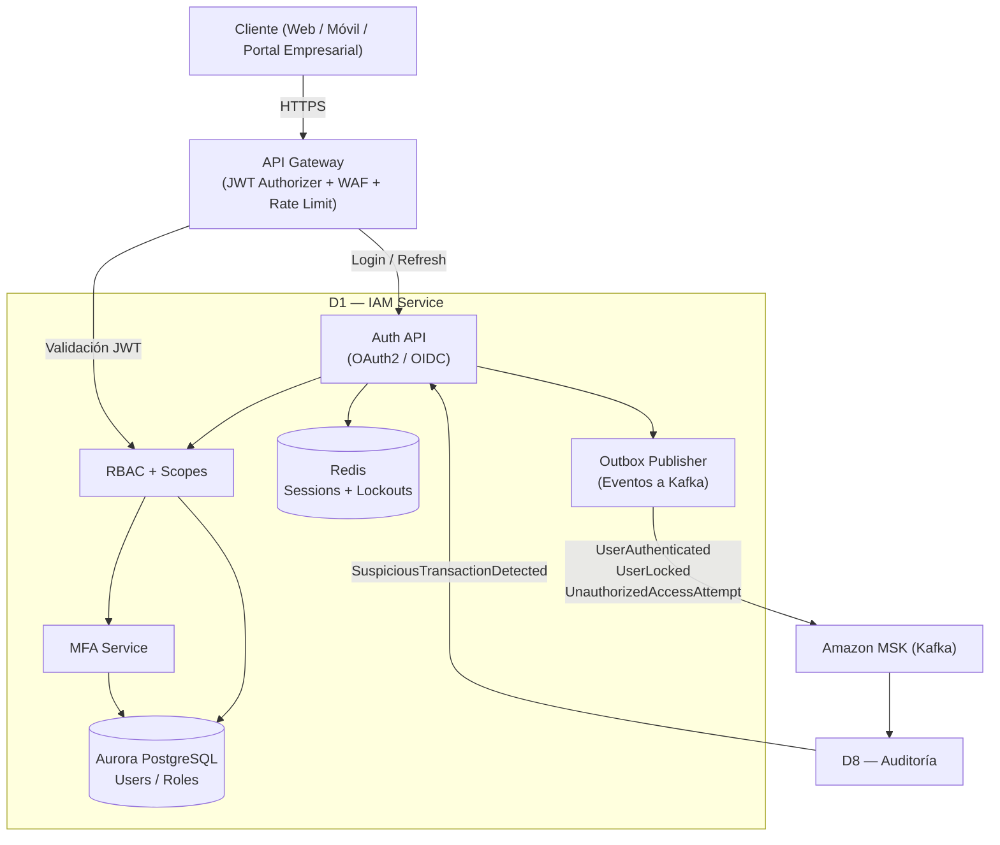
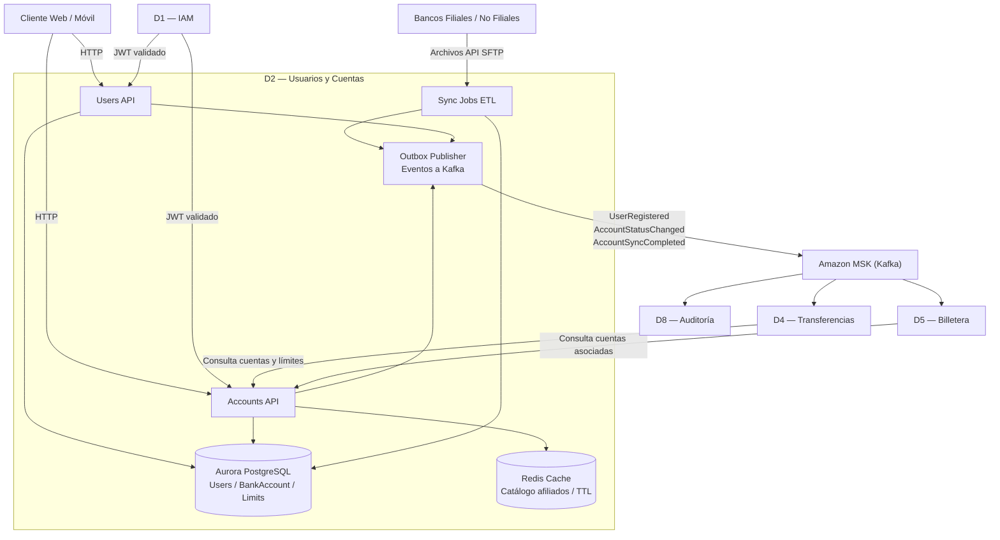
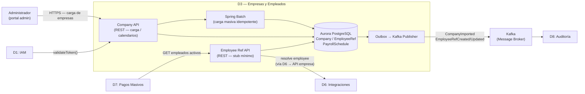
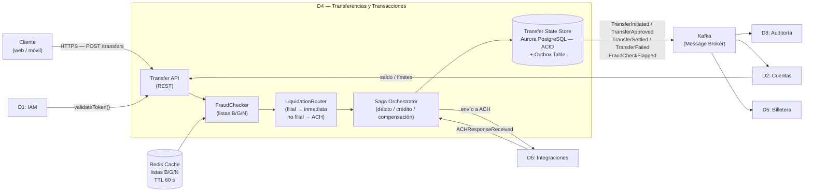
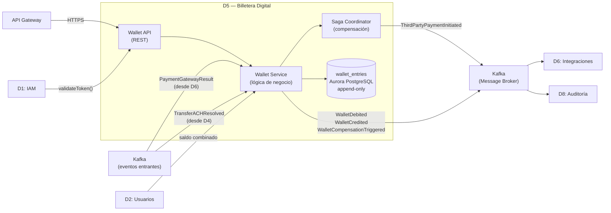
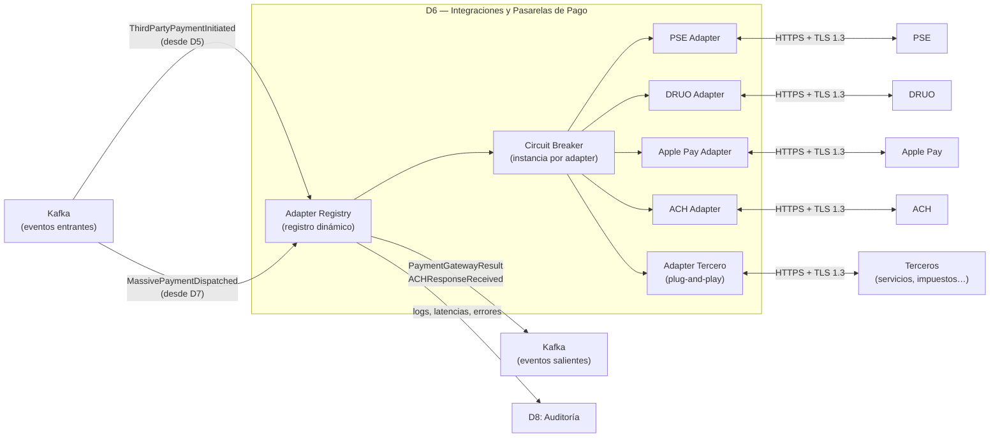
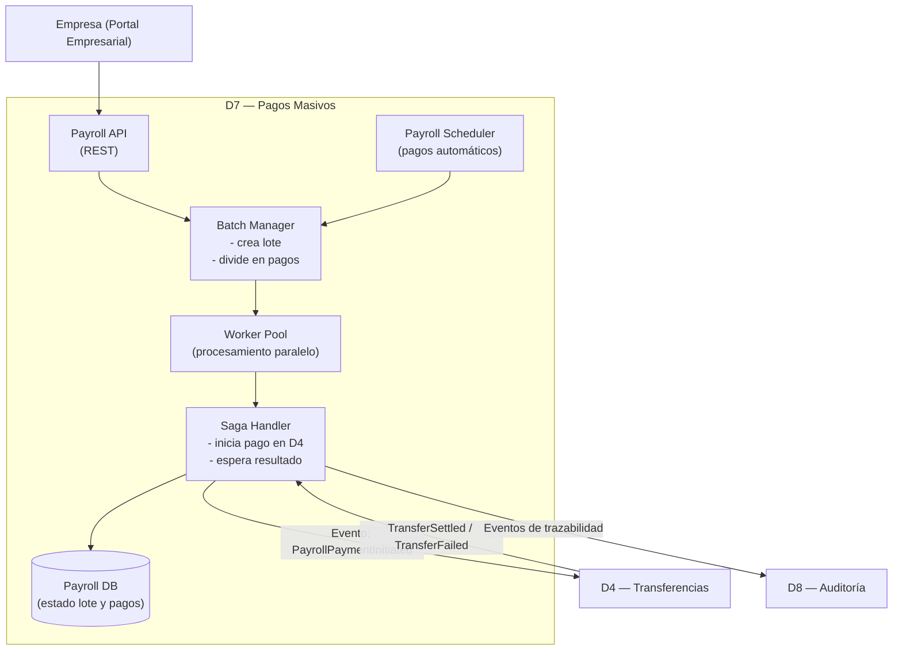
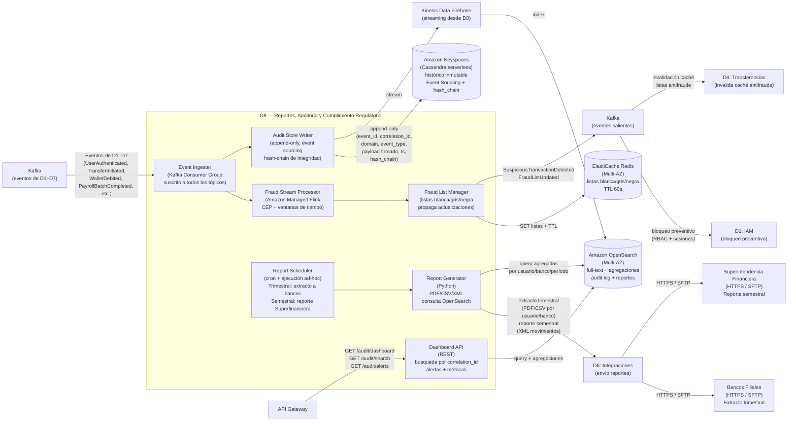

# Sección 3 — Diagrama de la arquitectura (Figura 1)

> **Estado:** 🔄 En construcción  
> **Estilo:** C4 Model — Level 2 (Container Diagram) en Mermaid  
> **Trazabilidad:** Dominios D1–D8 (Sección 1) → RNF (Sección 2) → Stack (Sección 4)

---

## Figura 1 — Diagrama de contexto (C4 Level 2)

---

## Descripción de componentes

### API Gateway
- **Rol:** Único punto de entrada para todos los clientes (web, móvil, tablet).
- **Responsabilidades:** terminación TLS, rate-limiting, enrutamiento a microservicios, inyección de headers de correlación.
- **RNF:** Seguridad (RNF-04), Disponibilidad (RNF-01), Rendimiento (RNF-02).

### D1 — IAM Service
- **Rol:** Proveedor de identidad central.
- **Responsabilidades:** Login MFA, emisión de JWT, gestión de sesiones, RBAC, bloqueo por listas negras.
- **RNF:** Seguridad (RNF-04), Disponibilidad (RNF-01).

### D2 — Usuarios y Cuentas
- **Rol:** Fuente de verdad de personas naturales y sus cuentas bancarias.
- **Responsabilidades:** ETL de bancos, sincronización diaria idempotente, consulta de estado de cuentas.
- **RNF:** Fiabilidad (RNF-07), Consistencia eventual.

### D3 — Empresas y Empleados
- **Rol:** Registro mínimo de empresas aliadas y referencia de sus empleados.
- **Responsabilidades:** Carga masiva de empresas, proxy a API de cada empresa para datos de empleados en tiempo de pago.
- **RNF:** Seguridad / mínimo PII (RNF-04), Fiabilidad (RNF-07).

### D4 — Transferencias y Transacciones
- **Rol:** Núcleo de movimientos de dinero.
- **Responsabilidades:** Transferencias inmediatas entre filiales (síncrono), envío a ACH (asíncrono), coordinación Saga.
- **RNF:** Consistencia (RNF-07), Disponibilidad (RNF-01), Rendimiento < 2 s (RNF-02).

### D5 — Billetera Digital
- **Rol:** Cuenta financiera propia de la Empresa X por usuario.
- **Responsabilidades:** Operaciones de saldo, pagos a terceros, movimientos a cuentas externas.
- **RNF:** Consistencia (RNF-07), Seguridad (RNF-04), Rendimiento (RNF-02).

### D6 — Integraciones y Pasarelas de Pago
- **Rol:** Capa antiCorrupción hacia todos los sistemas externos.
- **Responsabilidades:** Adapter por pasarela/tercero, reintentos, timeout, registro dinámico de adaptadores.
- **RNF:** Extensibilidad (RNF-05), Resiliencia (RNF-07).

### D7 — Pagos Masivos a Empleados
- **Rol:** Procesador de nómina empresarial.
- **Responsabilidades:** Programación y ejecución de lotes, escalado ante picos, trazabilidad por empleado.
- **RNF:** Escalabilidad (RNF-03), Fiabilidad (RNF-07), Trazabilidad (RNF-06).

### D8 — Reportes, Auditoría y Cumplimiento
- **Rol:** Observador pasivo de todos los eventos + generador de obligaciones regulatorias.
- **Responsabilidades:** Event Sourcing, detección de fraude en stream, reportes a bancos y Superfinanciera.
- **RNF:** Trazabilidad/Cumplimiento (RNF-06), Seguridad (RNF-04), Observabilidad (RNF-09).

### Message Broker (Kafka)
- **Rol:** Columna vertebral de comunicación asíncrona.
- **Responsabilidades:** Desacoplamiento entre dominios, garantía de entrega, replay de eventos, particionamiento por volumen.
- **RNF:** Escalabilidad (RNF-03), Fiabilidad (RNF-07), Extensibilidad (RNF-05).

---

## Figura 2 — Detalle interno de D1 (IAM Service)

Este diagrama amplía la Figura 1 mostrando los componentes internos del dominio D1 y sus canales de comunicación con el resto del sistema.

```mermaid
graph TB

    Cliente["Cliente (Web / Móvil / Portal Empresarial)"]
    APIGW["API Gateway\n(JWT Authorizer + WAF + Rate Limit)"]

    subgraph D1["D1 — IAM Service"]
        direction TB

        AuthAPI["Auth API\n(OAuth2 / OIDC)"]
        RBAC["RBAC + Scopes"]
        MFA["MFA Service"]
        DB[("Aurora PostgreSQL\nUsers / Roles")]
        Redis[("Redis\nSessions + Lockouts")]
        Outbox["Outbox Publisher\n(Eventos a Kafka)"]

        AuthAPI --> RBAC
        RBAC --> MFA
        RBAC --> DB
        MFA --> DB
        AuthAPI --> Redis
        AuthAPI --> Outbox
    end

    Kafka["Amazon MSK (Kafka)"]
    D8["D8 — Auditoría"]

    Cliente -->|HTTPS| APIGW
    APIGW -->|Login / Refresh| AuthAPI
    APIGW -->|Validación JWT| RBAC

    Outbox -->|UserAuthenticated\nUserLocked\nUnauthorizedAccessAttempt| Kafka
    Kafka --> D8

    D8 -->|SuspiciousTransactionDetected| AuthAPI
```

### Descripción de componentes — D1

| Componente | Responsabilidad |
|---|---|
| **Auth API (OAuth2/OIDC)** | Punto de entrada para login, refresh token y logout. Implementa flujo Authorization Code para web/móvil y credenciales seguras. Emite JWT firmados con claims: `sub`, `roles`, `scope`, `exp`, `iat`, `jti`. |
| **RBAC + Scopes** | Control de acceso granular por rol y operación. Valida que el token incluya los roles y scopes requeridos para cada endpoint protegido. Los roles se persisten en Aurora PostgreSQL. |
| **MFA Service** | Autenticación multifactor requerida para roles críticos (`ROLE_SECURITY_ADMIN`, `ROLE_PAYROLL_MANAGER`) y accesos de alto riesgo. |
| **Aurora PostgreSQL (Users/Roles)** | Almacena usuarios, roles, asignaciones usuario-rol, intentos de login y revocaciones de token. Cifrado en reposo con AWS KMS. |
| **Redis (Sessions + Lockouts)** | Gestiona sesiones activas, contadores de intentos fallidos (ventana temporal), revocación de tokens (`jti` → blacklist) y bloqueo por IP sospechosa. |
| **Outbox Publisher** | Publica eventos de autenticación a Kafka con Outbox Pattern (entrega garantizada). Eventos: `UserAuthenticated`, `UserLocked`, `UnauthorizedAccessAttempt`. |

**Comunicación clave:**
- **Entrante síncrono:** Cliente (login/refresh vía API Gateway), API Gateway (validación JWT para enrutar a D2–D8)
- **Saliente asíncrono (Kafka):** `UserAuthenticated`, `UserLocked`, `UnauthorizedAccessAttempt` → consumidos por D8 (auditoría)
- **Entrante asíncrono (Kafka):** `SuspiciousTransactionDetected` desde D8 → suspensión o MFA reforzado

---

## Figura 3 — Detalle interno de D2 (Usuarios y Cuentas)

Este diagrama amplía la Figura 1 mostrando los componentes internos del dominio D2 y sus canales de comunicación con el resto del sistema.

```mermaid
graph TB

    Cliente["Cliente Web / Móvil"]
    D1["D1 — IAM"]
    D4["D4 — Transferencias"]
    D5["D5 — Billetera"]
    Bancos["Bancos Filiales / No Filiales"]

    subgraph D2["D2 — Usuarios y Cuentas"]
        direction TB

        UsersAPI["Users API"]
        AccountsAPI["Accounts API"]
        SyncJobs["Sync Jobs ETL"]
        DB[("Aurora PostgreSQL\nUsers / BankAccount / Limits")]
        Redis[("Redis Cache\nCatálogo afiliados / TTL")]
        Outbox["Outbox Publisher\nEventos a Kafka"]

        UsersAPI --> DB
        AccountsAPI --> DB
        AccountsAPI --> Redis
        SyncJobs --> DB
        SyncJobs --> Outbox
        UsersAPI --> Outbox
        AccountsAPI --> Outbox
    end

    Kafka["Amazon MSK (Kafka)"]
    D8["D8 — Auditoría"]

    Cliente -->|HTTP| UsersAPI
    Cliente -->|HTTP| AccountsAPI
    D1 -->|JWT validado| UsersAPI
    D1 -->|JWT validado| AccountsAPI

    D4 -->|Consulta cuentas y límites| AccountsAPI
    D5 -->|Consulta cuentas asociadas| AccountsAPI

    Bancos -->|Archivos API SFTP| SyncJobs

    Outbox -->|UserRegistered\nAccountStatusChanged\nAccountSyncCompleted| Kafka
    Kafka --> D8
    Kafka --> D4
    Kafka --> D5
```

### Descripción de componentes — D2

| Componente | Responsabilidad |
|---|---|
| **Users API** | Punto de entrada REST para alta y gestión de perfil de usuario (persona natural). Protegido por JWT de D1. Publica `UserRegistered` vía Outbox. |
| **Accounts API** | Gestiona la vinculación y consulta de cuentas bancarias por usuario. Provee endpoints de lectura con caché Redis para responder en < 2 s. Consumido por D4 (saldo/límites) y D5 (cuentas asociadas). |
| **Sync Jobs ETL** | Procesos batch containerizados que ejecutan la sincronización diaria idempotente con bancos (vía archivos/API/SFTP). Upsert por clave natural; genera `AccountSyncCompleted` al finalizar. |
| **Aurora PostgreSQL (D2)** | Almacena `User`, `Bank`, `BankAccount`, `AccountLimit` y `SyncJob`. Campos sensibles (`account_number`) cifrados en reposo con AWS KMS. |
| **Redis Cache** | Caché de catálogo de bancos afiliados y lecturas frecuentes de cuentas (TTL configurable). Objetivo: cache hit rate ≥ 80% para mantener P95 < 2 s. |
| **Outbox Publisher** | Publica eventos (`UserRegistered`, `AccountStatusChanged`, `AccountSyncCompleted`, `AffiliateBankRegistryUpdated`) con entrega garantizada at-least-once dentro de la misma transacción ACID. |

**Comunicación clave:**
- **Entrante síncrono:** Cliente (gestión de perfil/cuentas), D1 (autorización JWT), D4 (consulta saldo/límites), D5 (consulta cuentas asociadas)
- **Entrante batch:** Bancos filiales/no filiales (sincronización diaria vía archivos/API/SFTP)
- **Saliente asíncrono (Kafka):** `UserRegistered`, `AccountStatusChanged`, `AccountSyncCompleted` → consumidos por D8, D4, D5

---

## Figura 4 — Detalle interno de D3 (Empresas y Empleados)

Este diagrama amplía la Figura 1 mostrando los componentes internos del dominio D3 y sus canales de comunicación con el resto del sistema.

```mermaid
graph LR
    %% ── Entradas (izquierda) ──────────────────────────────────────
    Admin["Administrador\n(portal admin)"]
    D7["D7: Pagos Masivos"]
    D1["D1: IAM"]

    %% ── D3: Empresas y Empleados (centro) ─────────────────────────
    subgraph D3["D3 — Empresas y Empleados"]
        direction TB
        CompanyAPI["Company API\n(REST — carga / calendarios)"]
        EmployeeRefAPI["Employee Ref API\n(REST — stub mínimo)"]
        BatchJob["Spring Batch\n(carga masiva idempotente)"]
        D3DB[("Aurora PostgreSQL\nCompany / EmployeeRef\nPayrollSchedule")]
        Outbox["Outbox → Kafka Publisher"]

        CompanyAPI --> BatchJob
        CompanyAPI --> D3DB
        EmployeeRefAPI --> D3DB
        BatchJob --> D3DB
        D3DB --> Outbox
    end

    %% ── Salidas (derecha) ─────────────────────────────────────────
    KAFKA["Kafka\n(Message Broker)"]
    D6["D6: Integraciones"]
    D8["D8: Auditoría"]

    %% ── Conexiones entrantes ──────────────────────────────────────
    Admin -->|"HTTPS — carga de empresas"| CompanyAPI
    D7 -->|"GET empleados activos"| EmployeeRefAPI
    D1 -->|"validateToken()"| CompanyAPI

    %% ── Resolución síncrona de datos del empleado ─────────────────
    EmployeeRefAPI -->|"resolve employee\n(vía D6 → API empresa)"| D6

    %% ── Salidas asíncronas (Outbox → Kafka) ──────────────────────
    Outbox -->|"CompanyImported\nEmployeeRefCreated/Updated"| KAFKA
    KAFKA --> D8
```

### Descripción de componentes — D3

| Componente | Responsabilidad |
|---|---|
| **Company API** | Punto de entrada REST para el registro y carga masiva de empresas aliadas. Recibe el archivo estructurado, delega la importación a Spring Batch y gestiona el calendario de nómina por empresa. |
| **Employee Ref API** | Gestiona el stub mínimo del empleado (`employee_ref_id`, `company_id`, `status`). Responde consultas de D7 (lista de empleados activos). Para resolver datos completos en tiempo de pago, invoca D6 sincrónicamente; D6 llama al API de la empresa aliada y retorna los datos en memoria (sin persistirlos). |
| **Spring Batch** | Procesa la carga masiva en chunks de 500 registros con commit transaccional por chunk e idempotencia (`upsert` por `external_emp_id + company_id`). Genera informe de resultado (OK / rechazados / erróneos) mediante el evento `CompanyImported`. |
| **Aurora PostgreSQL (D3)** | Almacena `Company`, `EmployeeRef` y `PayrollSchedule`. Los campos sensibles (`tax_id`, `auth_config`) están cifrados en reposo con AWS KMS. No contiene ninguna columna de PII de empleados (RNF-D3-03). |
| **Outbox → Kafka** | Garantiza entrega *at-least-once* de eventos a D8 (`CompanyImported`, `EmployeeRefCreated/Updated`) dentro de la misma transacción ACID de la operación que los origina, evitando pérdida de eventos ante fallos. |

**Comunicación clave:**
- **Entrante síncrono:** Admin (carga de empresas), D7 (consulta empleados activos), D1 (autorización)
- **Saliente síncrono a D6:** Employee Ref API invoca D6 para resolver datos completos del empleado en tiempo real; D6 llama al API de la empresa aliada y retorna los datos a D3 en memoria (sin persistirlos)
- **Saliente asíncrono (Kafka):** `CompanyImported`, `EmployeeRefCreated/Updated` → consumidos por D8

---

## Figura 5 — Detalle interno de D4 (Transferencias y Transacciones)

Este diagrama amplía la Figura 1 mostrando los componentes internos del dominio D4 y sus canales de comunicación con el resto del sistema.

```mermaid
graph LR
    %% ── Entradas (izquierda) ──────────────────────────────────────
    Client["Cliente\n(web / móvil)"]
    D1["D1: IAM"]
    D2["D2: Cuentas"]
    RedisCache[("Redis Cache\nlistas B/G/N\nTTL 60 s")]

    %% ── D4: Transferencias y Transacciones (centro) ────────────────
    subgraph D4["D4 — Transferencias y Transacciones"]
        direction TB
        TransferAPI["Transfer API\n(REST)"]
        FraudChecker["FraudChecker\n(listas B/G/N)"]
        LiquidationRouter["LiquidationRouter\n(filial → inmediata\nno filial → ACH)"]
        SagaOrch["Saga Orchestrator\n(débito / crédito / compensación)"]
        StateStore[("Transfer State Store\nAurora PostgreSQL — ACID\n+ Outbox Table")]

        TransferAPI --> FraudChecker
        FraudChecker --> LiquidationRouter
        LiquidationRouter --> SagaOrch
        SagaOrch --> StateStore
    end

    %% ── Salidas (derecha) ─────────────────────────────────────────
    KAFKA["Kafka\n(Message Broker)"]
    D6["D6: Integraciones"]
    D8["D8: Auditoría"]
    D5["D5: Billetera"]

    %% ── Conexiones entrantes síncronas ────────────────────────────
    Client -->|"HTTPS — POST /transfers"| TransferAPI
    D1 -->|"validateToken()"| TransferAPI
    D2 -->|"saldo / límites"| TransferAPI
    RedisCache --> FraudChecker

    %% ── Comunicación con D6 (ACH) ─────────────────────────────────
    SagaOrch -->|"envío a ACH"| D6
    D6 -->|"ACHResponseReceived"| SagaOrch

    %% ── Salidas asíncronas (Outbox → Kafka) ──────────────────────
    StateStore -->|"TransferInitiated / TransferApproved\nTransferSettled / TransferFailed\nFraudCheckFlagged"| KAFKA
    KAFKA --> D8
    KAFKA --> D2
    KAFKA --> D5
```

### Descripción de componentes — D4

| Componente | Responsabilidad |
|---|---|
| **Transfer API** | Punto de entrada REST para instrucciones de transferencia (P2P, interbancaria, múltiples destinos). Valida token con D1 y consulta saldo/límites en D2. Retorna confirmación al usuario al llegar a estado `APPROVED`, sin esperar la liquidación. |
| **FraudChecker** | Evalúa en tiempo real las listas blanca/gris/negra desde la caché Redis (TTL 60 s). Lista negra → `REJECTED` inmediato; lista gris → aprueba con flag y alerta a D8/D1; lista blanca → flujo normal (RNF-D4-05). |
| **LiquidationRouter** | Determina el canal de liquidación consultando el registro de bancos filiales (caché Redis, TTL 5 min). Destino filial → `SETTLING` inmediato; destino no filial/internacional → `SENT_TO_ACH` diferido vía ACH (RNF-D4-02). |
| **Saga Orchestrator** | Coordina los pasos del pago (débito en D2, liquidación, crédito en destino) con compensación automática ante cualquier fallo. Registra el progreso en `transfer_saga_state` con lock optimista para evitar race conditions (RNF-D4-01). |
| **Transfer State Store (Aurora)** | Almacena el estado ACID de cada transacción y la tabla outbox. Las transacciones en estado `SETTLED` son inmutables; las devoluciones son nuevas transferencias inversas. La tabla outbox garantiza publicación de eventos con la misma transacción ACID. |

**Comunicación clave:**
- **Entrante síncrono:** Cliente (instrucción de transferencia), D1 (autorización), D2 (saldo y límites), Redis (listas antifraude)
- **Entrante asíncrono:** `ACHResponseReceived` desde D6 → Saga Orchestrator transiciona estado de `SENT_TO_ACH` a `SETTLED` o `FAILED`
- **Saliente síncrono:** Saga Orchestrator → D6 para envío de transferencia a ACH
- **Saliente asíncrono (Kafka):** `TransferInitiated`, `TransferApproved`, `TransferSettled`, `TransferFailed`, `FraudCheckFlagged` → consumidos por D8 (auditoría), D2 (ajuste de saldo), D5 (si billetera es destino)

## Figura 6 — Detalle interno de D5 (Billetera Digital)

Este diagrama amplía la Figura 1 mostrando los componentes internos del dominio D5 y sus canales de comunicación con el resto del sistema.

```mermaid
graph LR
    %% ── Entradas (izquierda) ──────────────────────────────────────
    GW["API Gateway"]
    D1["D1: IAM"]
    D2["D2: Usuarios"]

    %% ── D5: Billetera Digital (centro) ───────────────────────────
    subgraph D5["D5 — Billetera Digital"]
        direction TB
        WalletAPI["Wallet API\n(REST)"]
        WalletService["Wallet Service\n(lógica de negocio)"]
        SagaCoord["Saga Coordinator\n(compensación)"]
        WalletDB[("wallet_entries\nAurora PostgreSQL\nappend-only")]

        WalletAPI --> WalletService
        WalletService --> SagaCoord
        WalletService --> WalletDB
    end

    %% ── Salidas (derecha) ─────────────────────────────────────────
    KAFKA["Kafka\n(Message Broker)"]
    D6["D6: Integraciones"]
    D8["D8: Auditoría"]

    %% ── Eventos entrantes desde Kafka ─────────────────────────────
    KIN["Kafka\n(eventos entrantes)"]
    KIN -->|"PaymentGatewayResult\n(desde D6)"| WalletService
    KIN -->|"TransferACHResolved\n(desde D4)"| WalletService

    %% ── Conexiones entrantes síncronas ────────────────────────────
    GW -->|"HTTPS"| WalletAPI
    D1 -->|"validateToken()"| WalletAPI
    D2 -->|"saldo combinado"| WalletService

    %% ── Conexiones salientes ──────────────────────────────────────
    SagaCoord -->|"ThirdPartyPaymentInitiated"| KAFKA
    WalletService -->|"WalletDebited\nWalletCredited\nWalletCompensationTriggered"| KAFKA
    KAFKA --> D6
    KAFKA --> D8
```

### Descripción de componentes — D5

| Componente | Responsabilidad |
|---|---|
| **Wallet API** | Punto de entrada REST para operaciones de billetera (acreditar, debitar, consultar saldo, pagar a tercero). Valida el token con D1 antes de procesar. |
| **Wallet Service** | Lógica de negocio: verifica saldo disponible, escribe en `wallet_entries` con doble entrada, publica eventos en Kafka. |
| **Saga Coordinator** | Coordina el flujo de pago a tercero: débito → solicitud a D6 → confirmación o compensación automática ante fallo de pasarela (RNF-D5-02). |
| **wallet_entries (Aurora)** | Tabla append-only con columnas `debit` / `credit`. Fuente de verdad del saldo — nunca se modifica ni elimina (RNF-D5-01). |

**Comunicación clave:**
- **Entrante síncrono:** API Gateway (usuario), D1 (autorización), D2 (saldo combinado)
- **Entrante asíncrono (Kafka):** `PaymentGatewayResult` desde D6, `TransferACHResolved` desde D4
- **Saliente asíncrono (Kafka):** `WalletDebited`, `WalletCredited`, `ThirdPartyPaymentInitiated`, `WalletCompensationTriggered` → consumidos por D6 y D8

---

## Figura 7 — Detalle interno de D6 (Integraciones y Pasarelas de Pago)

Este diagrama amplía la Figura 1 mostrando los componentes internos del dominio D6 y sus canales de comunicación con el resto del sistema.

```mermaid
graph LR
    %% ── Entradas (izquierda) ──────────────────────────────────────
    KAFKA_IN["Kafka\n(eventos entrantes)"]
    KAFKA_IN -->|"ThirdPartyPaymentInitiated\n(desde D5)"| AdapterRegistry
    KAFKA_IN -->|"MassivePaymentDispatched\n(desde D7)"| AdapterRegistry

    %% ── D6: Integraciones y Pasarelas (centro) ────────────────────
    subgraph D6["D6 — Integraciones y Pasarelas de Pago"]
        direction TB
        AdapterRegistry["Adapter Registry\n(registro dinámico)"]
        CircuitBreaker["Circuit Breaker\n(instancia por adapter)"]
        PSEAdapter["PSE Adapter"]
        DRUOAdapter["DRUO Adapter"]
        AppleAdapter["Apple Pay Adapter"]
        ACHAdapter["ACH Adapter"]
        PluginAdapter["Adapter Tercero\n(plug-and-play)"]

        AdapterRegistry --> CircuitBreaker
        CircuitBreaker --> PSEAdapter
        CircuitBreaker --> DRUOAdapter
        CircuitBreaker --> AppleAdapter
        CircuitBreaker --> ACHAdapter
        CircuitBreaker --> PluginAdapter
    end

    %% ── Sistemas externos (derecha) ───────────────────────────────
    PSE["PSE"]
    DRUO["DRUO"]
    APPLE["Apple Pay"]
    ACH["ACH"]
    TERCEROS["Terceros\n(servicios, impuestos…)"]

    PSEAdapter <-->|"HTTPS + TLS 1.3"| PSE
    DRUOAdapter <-->|"HTTPS + TLS 1.3"| DRUO
    AppleAdapter <-->|"HTTPS + TLS 1.3"| APPLE
    ACHAdapter <-->|"HTTPS + TLS 1.3"| ACH
    PluginAdapter <-->|"HTTPS + TLS 1.3"| TERCEROS

    %% ── Salidas (abajo) ───────────────────────────────────────────
    KAFKA_OUT["Kafka\n(eventos salientes)"]
    D8["D8: Auditoría"]

    AdapterRegistry -->|"PaymentGatewayResult\nACHResponseReceived"| KAFKA_OUT
    AdapterRegistry -->|"logs, latencias, errores"| D8
```

### Descripción de componentes — D6

| Componente | Responsabilidad |
|---|---|
| **Adapter Registry** | Registro dinámico de adapters activos. Recibe eventos de Kafka, selecciona el adapter correcto y lo invoca. Nuevos adapters se registran en caliente sin reiniciar el servicio (RNF-D6-02). |
| **Circuit Breaker** | Instancia independiente por adapter. Ante errores consecutivos de una pasarela abre el circuito y detiene solicitudes a esa pasarela sin afectar a las demás (RNF-D6-01). |
| **PSE / DRUO / Apple Pay / ACH Adapters** | Traducen el contrato interno del sistema al protocolo de cada pasarela. Manejan reintentos, timeouts e idempotencia del payload. |
| **Adapter Tercero (plug-and-play)** | Plantilla para nuevas integraciones. Se despliega como contenedor independiente y se registra en el Adapter Registry sin modificar los adapters existentes. |

**Comunicación clave:**
- **Entrante asíncrono (Kafka):** `ThirdPartyPaymentInitiated` (desde D5), `MassivePaymentDispatched` (desde D7)
- **Saliente externo:** llamadas HTTPS/TLS 1.3 a PSE, DRUO, Apple Pay, ACH y terceros; recibe callbacks de resultado
- **Saliente asíncrono (Kafka):** `PaymentGatewayResult`, `ACHResponseReceived` → consumidos por D5 y D4
- **Saliente a D8:** logs de integración, latencias, errores y reintentos para auditoría

---

## Figura 8 — Detalle interno de D7 (Pagos Masivos a Empleados)

Este diagrama amplía la Figura 1 mostrando los componentes internos del dominio D7 y sus canales de comunicación con el resto del sistema.

```mermaid
graph TB

    Empresa["Empresa (Portal Empresarial)"]

    subgraph D7["D7 — Pagos Masivos"]
        direction TB

        PayrollAPI["Payroll API\n(REST)"]
        Scheduler["Payroll Scheduler\n(pagos automáticos)"]
        BatchManager["Batch Manager\n- crea lote\n- divide en pagos"]
        WorkerPool["Worker Pool\n(procesamiento paralelo)"]
        SagaHandler["Saga Handler\n- inicia pago en D4\n- espera resultado"]
        PayrollDB[("Payroll DB\n(estado lote y pagos)")]

        PayrollAPI --> BatchManager
        Scheduler --> BatchManager
        BatchManager --> WorkerPool
        WorkerPool --> SagaHandler
        SagaHandler --> PayrollDB
    end

    D4["D4 — Transferencias"]
    D8["D8 — Auditoría"]

    Empresa --> PayrollAPI
    SagaHandler -->|Evento: PayrollPaymentInitiated| D4
    D4 -->|TransferSettled / TransferFailed| SagaHandler
    SagaHandler -->|Eventos de trazabilidad| D8
```

### Descripción de componentes — D7

| Componente | Responsabilidad |
|---|---|
| **Payroll API** | Punto de entrada REST para que la empresa aliada inicie pagos manuales o consulte estado de lotes. Protegido por JWT de D1 con rol `payroll_manager` o `company_admin`. |
| **Payroll Scheduler** | Dispara automáticamente la ejecución de nómina según el calendario configurado por empresa (días 14–16 y 29–31, o cualquier día del mes). Usa lock distribuido para garantizar ejecución única por fecha. |
| **Batch Manager** | Crea el lote (`PayrollBatch`) y lo divide en pagos individuales independientes (`PayrollPayment`). Cada pago es una unidad atómica con su propia saga. |
| **Worker Pool** | Procesa los pagos individuales en paralelo. Escala horizontalmente vía HPA para soportar picos de 20K–30K pagos. Particionamiento por empresa para aislamiento de fallos. |
| **Saga Handler** | Inicia cada pago como transferencia individual en D4 (`PayrollPaymentInitiated`) y espera el resultado (`TransferSettled` / `TransferFailed`). Publica eventos de trazabilidad a D8 por cada pago y al completar el lote. |
| **Payroll DB (Aurora)** | Almacena estado de lotes (`PayrollBatch`) y pagos individuales (`PayrollPayment`). No almacena datos bancarios del empleado; la referencia financiera final se obtiene en D4. |

**Comunicación clave:**
- **Entrante síncrono:** Empresa (portal empresarial → Payroll API), D1 (autorización), D3 (consulta empleados activos)
- **Saliente asíncrono (Kafka):** `PayrollPaymentInitiated` → D4 (ejecuta transferencia individual)
- **Entrante asíncrono (Kafka):** `TransferSettled` / `TransferFailed` desde D4 → Saga Handler actualiza estado del pago
- **Saliente asíncrono (Kafka):** `PayrollBatchCreated`, `PayrollPaymentSucceeded/Failed`, `PayrollBatchCompleted` → D8 (trazabilidad)

---

## Figura 9 — Detalle interno de D8 (Reportes, Auditoría y Cumplimiento)

Este diagrama amplía la Figura 1 mostrando los componentes internos del dominio D8 y sus canales de comunicación con el resto del sistema.

```mermaid

graph LR
  %% ── Entradas (izquierda) ──────────────────────────────────────
  KAFKA_IN["Kafka\n(eventos de D1–D7)"]

  %% ── D8 (centro) ───────────────────────────────────────────────
  subgraph D8["D8 — Reportes, Auditoría y Cumplimiento Regulatorio"]
    direction TB

    EventIngester["Event Ingester\n(Kafka Consumer Group\nsuscrito a todos los tópicos)"]

    FraudStreamProcessor["Fraud Stream Processor\n(Amazon Managed Flink\nCEP + ventanas de tiempo)"]

    FraudListManager["Fraud List Manager\n(listas blanca/gris/negra\npropaga actualizaciones)"]

    AuditStoreWriter["Audit Store Writer\n(append-only, event sourcing\nhash-chain de integridad)"]

    ReportScheduler["Report Scheduler\n(cron + ejecución ad-hoc)\nTrimestral: extracto a bancos\nSemestral: reporte Superfinanciera"]

    ReportGenerator["Report Generator\n(Python)\nPDF/CSV/XML\nconsulta OpenSearch"]

    DashboardAPI["Dashboard API\n(REST)\nbúsqueda por correlation_id\nalertas + métricas"]

    %% Flujo interno
    EventIngester --> FraudStreamProcessor
    FraudStreamProcessor --> FraudListManager
    EventIngester --> AuditStoreWriter
    ReportScheduler --> ReportGenerator
  end

  %% ── Almacenamiento (abajo / derecha-inferior) ──────────────────
  KEYSPACES[("Amazon Keyspaces\n(Cassandra serverless)\nhistórico inmutable\nEvent Sourcing + hash_chain")]

  FIREHOSE["Kinesis Data Firehose\n(streaming desde D8)"]

  OPENSEARCH[("Amazon OpenSearch\n(Multi-AZ)\nfull-text + agregaciones\naudit log + reportes")]

  REDIS[("ElastiCache Redis\n(Multi-AZ)\nlistas blanca/gris/negra\nTTL 60s")]

  %% ── Salidas (derecha) ─────────────────────────────────────────
  KAFKA_OUT["Kafka\n(eventos salientes)"]
  D1["D1: IAM\n(bloqueo preventivo)"]
  D4["D4: Transferencias\n(invalida caché antifraude)"]
  D6["D6: Integraciones\n(envío reportes)"]
  BANCOS["Bancos Filiales\n(HTTPS / SFTP)\nExtracto trimestral"]
  SUPERF["Superintendencia Financiera\n(HTTPS / SFTP)\nReporte semestral"]
  APIGW["API Gateway"]

  %% ── Ingesta desde dominios ────────────────────────────────────
  KAFKA_IN -->|"Eventos de D1–D7\n(UserAuthenticated, TransferInitiated,\nWalletDebited, PayrollBatchCompleted, etc.)"| EventIngester

  %% ── Persistencia + indexación ──────────────────────────────────
  AuditStoreWriter -->|"append-only\n(event_id, correlation_id,\ndomain, event_type,\npayload firmado, ts,\nhash_chain)"| KEYSPACES

  AuditStoreWriter -->|"stream"| FIREHOSE -->|"index"| OPENSEARCH

  %% ── Fraude (listas + eventos) ──────────────────────────────────
  FraudListManager -->|"SET listas + TTL"| REDIS
  FraudListManager -->|"SuspiciousTransactionDetected\nFraudListUpdated"| KAFKA_OUT
  KAFKA_OUT -->|"bloqueo preventivo\n(RBAC + sesiones)"| D1
  KAFKA_OUT -->|"invalidación caché\nlistas antifraude"| D4

  %% ── Reportes regulatorios (vía D6) ─────────────────────────────
  ReportGenerator -->|"extracto trimestral\n(PDF/CSV por usuario/banco)\nreporte semestral\n(XML movimientos)"| D6
  D6 -->|"HTTPS / SFTP"| BANCOS
  D6 -->|"HTTPS / SFTP"| SUPERF

  %% ── Consultas / Dashboard ──────────────────────────────────────
  APIGW -->|"GET /audit/dashboard\nGET /audit/search\nGET /audit/alerts"| DashboardAPI
  DashboardAPI -->|"query + agregaciones"| OPENSEARCH
  ReportGenerator -->|"query agregados\npor usuario/banco/período"| OPENSEARCH

```

### Descripción de componentes — D8

| Componente	| Responsabilidad |
|---|---|
|Event Ingester |	Consumer group de Kafka suscrito a todos los tópicos de eventos de D1-D7. Normaliza cada evento con correlation_id, timestamp y source_domain. Garantiza at-least-once con idempotencia en escritura (deduplicación por event_id). Distribuye cada evento en paralelo al Fraud Stream Processor y al Audit Store Writer. |
|Fraud Stream Processor (Flink) |	Procesador stateful desplegado en Amazon Managed Flink. Aplica reglas CEP (Complex Event Processing) sobre ventanas de tiempo deslizantes: detecta patrones como >5 transferencias al mismo destino en 10 min, montos atípicos respecto al historial del usuario, o actividad desde cuentas en lista gris. Emite SuspiciousTransactionDetected en tiempo real hacia Kafka. |
|Audit Store Writer |	Escribe cada evento recibido en Amazon Keyspaces de forma append-only (nunca se modifica ni elimina un registro). Cada registro incluye: event_id, correlation_id, domain, event_type, payload (firmado digitalmente), timestamp y hash_chain (hash del registro anterior para garantizar integridad). En paralelo, envía el evento a OpenSearch vía Kinesis Data Firehose para indexación full-text. |
|Fraud List Manager |	Mantiene y actualiza las listas blanca/gris/negra en ElastiCache Redis con TTL de 60 s. Se alimenta de las detecciones de Flink y de fuentes regulatorias externas. Publica FraudListUpdated a Kafka para que D1 (bloqueo preventivo en RBAC) y D4 (evaluación antifraude pre-transferencia) sincronicen su caché local. |
|Report Scheduler |	Cron configurable que dispara la generación de reportes regulatorios: extracto trimestral a bancos (cada 3 meses, por usuario y banco) y reporte semestral a la Superintendencia Financiera (cada 6 meses, detalle de todos los movimientos). Soporta ejecución manual para auditorías ad-hoc.|
|Report Generator |	Script Python que consulta OpenSearch con queries de agregación por usuario/banco/período. Genera el extracto o reporte en el formato requerido por el destinatario (PDF/CSV para bancos, XML para Superfinanciera). Envía el resultado a D6 (Integraciones) para distribución a bancos vía HTTPS/SFTP o a Superfinanciera vía HTTPS/SFTP.|
|Dashboard API |	Endpoint REST para consultas operacionales internas expuesto vía API Gateway. Permite buscar transacciones por correlation_id, consultar alertas de fraude activas, ver estado de lotes de nómina y métricas de cumplimiento. Consume OpenSearch como backend de búsqueda y agregación.|

**Comunicación clave:**

- **Entrante asíncrono (Kafka):** Todos los eventos de D1, D2, D3, D4, D5, D6, D7 (es el observador pasivo universal del sistema)
- **Saliente asíncrono (Kafka):** `SuspiciousTransactionDetected`, `FraudListUpdated` → consumidos por D1 (bloqueo preventivo) y D4 (invalidación de caché antifraude)
- **Saliente batch (vía D6):** Extracto trimestral → bancos filiales (HTTPS/SFTP); Reporte semestral → Superintendencia Financiera (HTTPS/SFTP)
- **Saliente síncrono:** Dashboard API para consultas operacionales internas vía API Gateway

## Pendientes

- [ ] Renderizar el diagrama Mermaid y adjuntar imagen en el reporte final (usar mermaid.live o plugin VS Code)
- [ ] Confirmar tecnologías definitivas por componente (alineado con Sección 4)
- [ ] Agregar diagrama C4 Level 1 (System Context) si lo requiere el profesor
- [x] Validar que todos los dominios de Sección 1 aparecen en el diagrama (D1–D8 completos)
