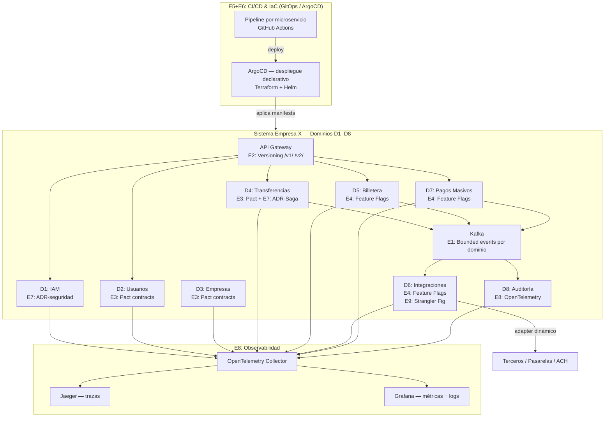

# Sección 5 — Estrategias para facilitar la evolución de la arquitectura

> **Estado:** 🔄 En construcción  
> **Trazabilidad:** Estrategias → RNF-05 (Extensibilidad), RNF-10 (Mantenibilidad), RNF-09 (Observabilidad) → Dominios D1–D8

---

## Introducción

Una arquitectura evolutiva es aquella que **soporta cambio guiado** como primera clase [POR DEFINIR — citar material del curso]. Las estrategias descritas a continuación permiten que el sistema de la Empresa X se adapte a nuevos bancos filiales, pasarelas de pago, regulaciones y volúmenes de usuarios sin incurrir en rediseños completos.

---

## Estrategias identificadas

### E1 — Diseño por Bounded Contexts (DDD)

**Qué es:** Cada dominio (D1–D8) tiene responsabilidad única, modelo de datos propio y base de datos independiente (*Database per Service*).

**Por qué facilita la evolución:** Se puede modificar, versionar o reemplazar un dominio sin impacto en los demás. Ejemplo: migrar D6 (Integraciones) a un nuevo proveedor de pasarela no afecta D4 (Transferencias).

**Dónde aplica:** Todos los dominios (D1–D8).

---

### E2 — Versionado de APIs

**Qué es:** Cada microservicio expone versiones explícitas de su API (`/v1/`, `/v2/`). Los contratos se documentan con OpenAPI 3.x.

**Por qué facilita la evolución:** Permite introducir cambios incompatibles sin romper consumidores existentes. Los clientes migran a nuevas versiones de forma progresiva.

**Dónde aplica:** API Gateway → todos los microservicios. Crítico en D6 (Integraciones) y D4 (Transferencias).

---

### E3 — Consumer-Driven Contract Testing (Pact)

**Qué es:** Los consumidores de una API definen los contratos que el proveedor debe cumplir. Se verifican automáticamente en el pipeline CI/CD.

**Por qué facilita la evolución:** Detecta rupturas de contrato antes de llegar a producción. Permite refactorizar microservicios con confianza.

**Dónde aplica:** Interfaces entre D4↔D6, D5↔D6, D7↔D6 y D2↔Bancos filiales.

---

### E4 — Feature Flags

**Qué es:** Activación/desactivación de funcionalidades en tiempo de ejecución sin redespliegue (ej. LaunchDarkly, OpenFeature).

**Por qué facilita la evolución:** Permite publicar código en producción desactivado, hacer canary releases y revertir funcionalidades sin rollback de despliegue. Especialmente útil al integrar nuevos terceros (D6).

**Dónde aplica:** D6 (activar nuevo tercero/pasarela), D7 (habilitar nuevas ventanas de pago), D5 (nuevas funcionalidades de billetera).

---

### E5 — CI/CD con pipelines por microservicio

**Qué es:** Cada dominio tiene su propio pipeline independiente (build → test → contract test → deploy). Herramientas: GitHub Actions / GitLab CI.

**Por qué facilita la evolución:** Los dominios se despliegan de forma independiente. Un equipo puede entregar D3 sin esperar a D7. Reduce el acoplamiento de despliegue.

**Dónde aplica:** Todos los dominios (D1–D8) + infraestructura (K8s manifests vía GitOps/ArgoCD).

---

### E6 — Infrastructure as Code (IaC)

**Qué es:** Toda la infraestructura (Kubernetes, Kafka, bases de datos, Vault) definida como código versionado (Terraform + Helm charts).

**Por qué facilita la evolución:** Los entornos (dev, staging, prod) son reproducibles y auditables. Escalar o replicar el sistema en una nueva región es un cambio de configuración, no un proceso manual.

**Dónde aplica:** Infraestructura completa del sistema.

---

### E7 — Architecture Decision Records (ADR)

**Qué es:** Documento ligero que registra cada decisión arquitectónica significativa: contexto, decisión, consecuencias y alternativas descartadas.

**Por qué facilita la evolución:** Preserva el razonamiento detrás de cada decisión. Al introducir cambios futuros, el equipo sabe qué restricciones motivaron la arquitectura actual y puede evaluarlas de nuevo.

**Dónde aplica:** Repositorio central del proyecto. Ejemplos: ADR-001 (Kafka sobre RabbitMQ), ADR-002 (Saga sobre 2PC), ADR-003 (Adapter dinámico en D6).

---

### E8 — Observabilidad distribuida (OpenTelemetry)

**Qué es:** Instrumentación estandarizada de trazas, métricas y logs en todos los microservicios. Visualización con Jaeger + Grafana + Loki.

**Por qué facilita la evolución:** Permite identificar cuellos de botella antes de que sean problemas en producción. Al agregar un nuevo dominio, la instrumentación es automática si sigue el estándar OpenTelemetry.

**Dónde aplica:** Todos los dominios (D1–D8) + Kafka + API Gateway.

---

### E9 — Patrón Strangler Fig (para migraciones futuras)

**Qué es:** Cuando un dominio necesita ser reemplazado, se introduce el nuevo servicio en paralelo y se migra el tráfico gradualmente usando el API Gateway como punto de control.

**Por qué facilita la evolución:** Elimina las migraciones "big bang". El sistema sigue operando mientras se migra. Alineado con el requisito de disponibilidad 24/7 (RNF-01).

**Dónde aplica:** Cualquier dominio que requiera reemplazo futuro. Especialmente relevante para D2 (sincronización con bancos) y D6 (integraciones).

---

## Diagrama actualizado — Estrategias de evolución aplicadas

---

## Pendientes

- [ ] Confirmar si el equipo va a implementar alguna de estas estrategias en un prototipo o si es solo diseño
- [ ] [POR DEFINIR] Citar material del curso sobre arquitecturas evolutivas (fitness functions, ADRs, etc.)
- [ ] Validar que el diagrama actualizado es coherente con Figura 1 (Sección 3)
- [ ] Decidir si se incluye la estrategia E9 (Strangler Fig) o se deja como nota futura
